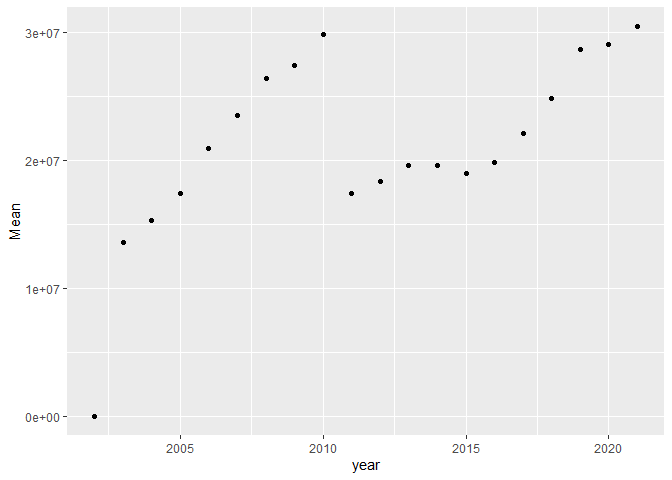
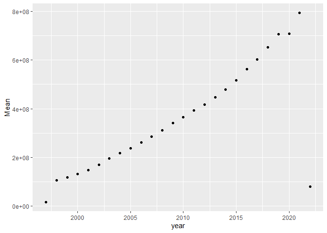

Assigment 1
================

## Downloading the Raw Data

We start by downloading and processing the
[HCRIS](https://github.com/Nixoncandiales/Econ771/tree/main/Assigments/AS%201/Code/HCRIS),
[POS](https://github.com/Nixoncandiales/Econ771/tree/main/Assigments/AS%201/Code/POS),
and
[ACA](https://github.com/Nixoncandiales/Econ771/tree/main/Assigments/AS%201/Code/ACA)
raw data sets. The processed data sets are located in the
[**Output**]((https://github.com/Nixoncandiales/Econ771/tree/main/Assigments/AS%201/Output))
folder under `HCRIS_Data.txt`, `pos_lastyear.v12.dta`, and
`acs_medicare.txt` . We import those data sets in our file and inspect
them as follows.

``` r
if (!exists("data_hcris")) data_hcris <- read.delim(here("Assigments", "As 1", "Output", "HCRIS", "HCRIS_Data.txt"))
ds_screener(data_hcris)
```

    -----------------------------------------------------------------------------------
    |        Column Name         |  Data Type  |  Levels  |  Missing  |  Missing (%)  |
    -----------------------------------------------------------------------------------
    |      provider_number       |   integer   |    NA    |     0     |       0       |
    |          fy_start          |  character  |    NA    |     0     |       0       |
    |           fy_end           |  character  |    NA    |     0     |       0       |
    |       date_processed       |  character  |    NA    |     0     |       0       |
    |        date_created        |  character  |    NA    |     0     |       0       |
    |            beds            |   integer   |    NA    |   2060    |     1.45      |
    |        tot_charges         |   numeric   |    NA    |   5701    |       4       |
    |       tot_discounts        |   numeric   |    NA    |   7961    |     5.59      |
    |     tot_operating_exp      |   numeric   |    NA    |   2686    |     1.88      |
    |         ip_charges         |   numeric   |    NA    |   6283    |     4.41      |
    |        icu_charges         |   numeric   |    NA    |   66719   |     46.82     |
    |     ancillary_charges      |   numeric   |    NA    |   12677   |      8.9      |
    |       tot_discharges       |   numeric   |    NA    |   2300    |     1.61      |
    |      mcare_discharges      |   numeric   |    NA    |   3002    |     2.11      |
    |      mcaid_discharges      |   numeric   |    NA    |   17059   |     11.97     |
    |     tot_mcare_payment      |   numeric   |    NA    |   55548   |     38.98     |
    |  secondary_mcare_payment   |   numeric   |    NA    |   78080   |     54.79     |
    |           street           |  character  |    NA    |    713    |      0.5      |
    |            city            |  character  |    NA    |    286    |      0.2      |
    |           state            |  character  |    NA    |    284    |      0.2      |
    |            zip             |  character  |    NA    |    320    |     0.22      |
    |           county           |  character  |    NA    |   6756    |     4.74      |
    |        uncomp_care         |   numeric   |    NA    |  121914   |     85.55     |
    |       cost_to_charge       |   numeric   |    NA    |   50563   |     35.48     |
    |        new_cap_ass         |   numeric   |    NA    |   25149   |     17.65     |
    |            cash            |   numeric   |    NA    |   10786   |     7.57      |
    |        tot_pat_rev         |   numeric   |    NA    |   5701    |       4       |
    |         allowance          |   numeric   |    NA    |   7961    |     5.59      |
    |        net_pat_rev         |   numeric   |    NA    |   5685    |     3.99      |
    |        hvbp_payment        |   numeric   |    NA    |  113346   |     79.54     |
    |        hrrp_payment        |   numeric   |    NA    |  116285   |     81.6      |
    |  tot_uncomp_care_charges   |   numeric   |    NA    |   95493   |     67.01     |
    |tot_uncomp_care_partial_pmts|   numeric   |    NA    |  117193   |     82.24     |
    |          bad_debt          |   numeric   |    NA    |   93693   |     65.75     |
    |            year            |   integer   |    NA    |     0     |       0       |
    |           source           |  character  |    NA    |     0     |       0       |
    -----------------------------------------------------------------------------------

     Overall Missing Values           1032204 
     Percentage of Missing Values     20.12 %
     Rows with Missing Values         142504 
     Columns With Missing Values      29 

After a quick screening of the HCRIS data we can see the missing values
are significantly high which suggest some variables are recorded
differently across time and forms. It is of particular interest the
variables `uncomp_care` and `tot_uncomp_care_charges` which are of our
main interest. After reviewing the codebook we confirmed in fact these
two variables are the same but coded different across forms.

``` r
if (!exists("data_pos")) data_pos <- read_stata(here("Assigments", "As 1", "Output", "POS", "pos_lastyear.v12.dta"))
ds_screener(data_pos)
```

    --------------------------------------------------------------------------------------------
    |  Column Name   |            Data Type             |  Levels  |  Missing  |  Missing (%)  |
    --------------------------------------------------------------------------------------------
    |       pn       |            character             |    NA    |     0     |       0       |
    |      name      |            character             |    NA    |     0     |       0       |
    |    address     |            character             |    NA    |     0     |       0       |
    |      city      |            character             |    NA    |     0     |       0       |
    |     state      |            character             |    NA    |     0     |       0       |
    |      zip       |             numeric              |    NA    |    270    |     2.13      |
    |      tel       |            character             |    NA    |     0     |       0       |
    |     active     |             numeric              |    NA    |     0     |       0       |
    |    termcode    |haven_labelled, vctrs_vctr, double|    NA    |     0     |       0       |
    |    termdate    |               Date               |    NA    |   7239    |     57.04     |
    |    partdate    |               Date               |    NA    |    65     |     0.51      |
    |    prev_pn     |            character             |    NA    |     0     |       0       |
    |    medaffil    |haven_labelled, vctrs_vctr, double|    NA    |   1348    |     10.62     |
    |  resprog_ada   |             numeric              |    NA    |    86     |     0.68      |
    |  resprog_ama   |             numeric              |    NA    |    86     |     0.68      |
    |  resprog_aoa   |             numeric              |    NA    |    86     |     0.68      |
    |  resprog_oth   |             numeric              |    NA    |    86     |     0.68      |
    |   residents    |             numeric              |    NA    |     0     |       0       |
    |   shortterm    |             numeric              |    NA    |     0     |       0       |
    |      cah       |             numeric              |    NA    |     0     |       0       |
    |provider_subtype|haven_labelled, vctrs_vctr, double|    NA    |   1071    |     8.44      |
    |  typ_control   |haven_labelled, vctrs_vctr, double|    NA    |   1345    |     10.6      |
    |   nonprofit    |             numeric              |    NA    |     0     |       0       |
    |   forprofit    |             numeric              |    NA    |     0     |       0       |
    |      govt      |             numeric              |    NA    |     0     |       0       |
    |    maryland    |             numeric              |    NA    |     0     |       0       |
    |    nonstate    |             numeric              |    NA    |     0     |       0       |
    |   urbancbsa    |             numeric              |    NA    |    466    |     3.67      |
    |    beds_tot    |             numeric              |    NA    |     0     |       0       |
    |   beds_cert    |             numeric              |    NA    |     0     |       0       |
    |    lastyear    |             numeric              |    NA    |     0     |       0       |
    --------------------------------------------------------------------------------------------

     Overall Missing Values           12148 
     Percentage of Missing Values     3.09 %
     Rows with Missing Values         7581 
     Columns With Missing Values      11 

From the provider of services data set we do not evidence missing data
problems. We can observe if a particular POS went out of the market by
either closing or merging and the respectively date of the event. It is
to note the identifier variable is `pn` which is recorded as a character
differs in the HCRIS data set `provider_number` which is coded as
numerical.

``` r
if (!exists("data_aca")) data_aca <- read.delim(here("Assigments", "As 1", "Output", "ACA", "acs_medicaid.txt"))
ds_screener(data_aca)
```

    ----------------------------------------------------------------------
    |  Column Name  |  Data Type  |  Levels  |  Missing  |  Missing (%)  |
    ----------------------------------------------------------------------
    |     State     |  character  |    NA    |     0     |       0       |
    |     year      |   integer   |    NA    |     0     |       0       |
    |   adult_pop   |   integer   |    NA    |     0     |       0       |
    | ins_employer  |   integer   |    NA    |     0     |       0       |
    |  ins_direct   |   integer   |    NA    |     0     |       0       |
    | ins_medicare  |   integer   |    NA    |     0     |       0       |
    | ins_medicaid  |   integer   |    NA    |     0     |       0       |
    |   uninsured   |   integer   |    NA    |     0     |       0       |
    |  expand_ever  |   logical   |    NA    |     8     |     1.92      |
    | date_adopted  |  character  |    NA    |    104    |      25       |
    |  expand_year  |   integer   |    NA    |    104    |      25       |
    |    expand     |   logical   |    NA    |     0     |       0       |
    ----------------------------------------------------------------------

     Overall Missing Values           216 
     Percentage of Missing Values     4.33 %
     Rows with Missing Values         104 
     Columns With Missing Values      3 

Finally, from the medicare data set we see the states that expanded the
mandate and the date of event. Also, it is to note that the state
identifier is not recorded in the same format across data sets.

### Summary Statistics

Provide and discuss a table of simple summary statistics showing the
mean, standard deviation, min, and max of hospital total revenues and
uncompensated care over time.

From the `HCRIS_data.txt` we select the variables `provider_number`,
`year`, `uncomp_care`, `tot_uncomp_care_charges`, `tot_pat_rev`

``` r
data_hcris %>% 
  select(pn=provider_number, year, uncomp_care, tot_uncomp_care_charges, tot_pat_rev) %>% 
  as_tibble()
```

    # A tibble: 142,504 × 5
          pn  year uncomp_care tot_uncomp_care_charges tot_pat_rev
       <int> <int>       <dbl>                   <dbl>       <dbl>
     1 10001  1998          NA                      NA   304888068
     2 10001  1999          NA                      NA   330880661
     3 10001  2000          NA                      NA   359149872
     4 10001  2001          NA                      NA   437847861
     5 10001  2002          NA                      NA   509731719
     6 10001  2003    41267219                      NA   532023593
     7 10001  2004    37413733                      NA   592438087
     8 10001  2005    37457443                      NA   657842984
     9 10001  2006    41670968                      NA   714123644
    10 10001  2007          NA                      NA   772492758
    # … with 142,494 more rows

Then we group by year and calculate the summary statistics.

``` r
sum_unc_care <- data_hcris %>% 
  select(provider_number, year, uncomp_care, tot_uncomp_care_charges, tot_pat_rev) %>%
  mutate(tot_uncomp_care_charges = pmax(tot_uncomp_care_charges,uncomp_care, na.rm=TRUE)) %>%
  group_by(year) %>% 
  summarise(
    Mean = mean(tot_uncomp_care_charges, na.rm = TRUE), 
    SD = sd(tot_uncomp_care_charges, na.rm = TRUE), Min = min(tot_uncomp_care_charges, na.rm = TRUE), 
    Max = max(tot_uncomp_care_charges, na.rm = TRUE)
  ) %>% 
  drop_na(Mean)

sum_unc_care
```

    # A tibble: 20 × 5
        year      Mean        SD       Min        Max
       <int>     <dbl>     <dbl>     <dbl>      <dbl>
     1  2002        1        NA          1          1
     2  2003 13557293. 32036098.   -128490  777987403
     3  2004 15328897. 36661491.         1  820253000
     4  2005 17409739. 37813838.         1  939134000
     5  2006 20958801. 47151668.  -2667140 1074625000
     6  2007 23563868. 51279558.         1 1203374820
     7  2008 26429603. 57062599.         1 1361805561
     8  2009 27437058. 46417931.         1  583975318
     9  2010 29887574. 72408993.         1 2793923000
    10  2011 17394154. 47222987. -28840406 1111027264
    11  2012 18338225. 55879179.        85 1371421445
    12  2013 19648564. 57646114.       216 1403146636
    13  2014 19607345. 63262016.        15 1874409188
    14  2015 19024979. 61755917.        22 1990560423
    15  2016 19810030. 66724247.        84 2231833221
    16  2017 22135100. 69491982.        34 2062118188
    17  2018 24883218. 74503094.         1 2183167185
    18  2019 28705587. 83757685.         2 2495183582
    19  2020 29100316. 82874954.        -2 2245174712
    20  2021 30474261. 90941820.         1 2655216314

``` r
sum_tot_rev <- data_hcris %>% 
  select(provider_number, year, tot_uncomp_care_charges, tot_pat_rev) %>% 
  group_by(year) %>% 
  summarise(
    Mean = mean(tot_pat_rev, na.rm = TRUE), 
    SD = sd(tot_pat_rev, na.rm = TRUE), Min = min(tot_pat_rev, na.rm = TRUE), 
    Max = max(tot_pat_rev, na.rm = TRUE)
  ) %>% 
  drop_na(Mean)

sum_tot_rev
```

    # A tibble: 26 × 5
        year       Mean         SD      Min        Max
       <int>      <dbl>      <dbl>    <dbl>      <dbl>
     1  1997  17406411.  25347614.   239580  128092000
     2  1998 106218796. 169829486.   155387 2255621364
     3  1999 117511354. 189181015.        1 2586692428
     4  2000 131767289. 217132934.        1 2823988041
     5  2001 147463809. 248432404.     2795 3267554934
     6  2002 170499912. 291278067.      347 3957656325
     7  2003 196326204. 339256130. -1757898 4722758791
     8  2004 217080321. 379301539.   154394 5525730727
     9  2005 237498725. 419216031.        1 6398553843
    10  2006 262155653. 464190671.  -104189 7784094716
    # … with 16 more rows

``` r
plot1 <-
  sum_unc_care %>% 
  ggplot(aes(x = year, y = Mean)) + 
  geom_point()
plot1
```

<!-- -->

``` r
plot2 <-
  sum_tot_rev %>% 
  ggplot(aes(x = year, y = Mean)) + 
  geom_point()
plot2
```

<!-- -->

### By Ownership Type

Create a figure showing the mean hospital uncompensated care from 2000
to 2018. Show this trend separately by hospital ownership type (private
not for profit and private for profit).

``` r
data_merged <- 
  left_join(data_hcris %>%
              mutate(unc_care = pmax(tot_uncomp_care_charges,uncomp_care, na.rm=TRUE)) %>% 
              select(pn=provider_number, year, unc_care, hos_rev=tot_pat_rev) %>% 
              as.tibble() %>%
              drop_na(unc_care)
            ,
            data_pos %>%
              select(pn, nonprofit, forprofit, govt) %>%
              mutate_at('pn', as.integer)
            ,
            by="pn") 
```

    ## # A tibble: 68,010 × 7
    ##       pn  year unc_care    hos_rev nonprofit forprofit  govt
    ##    <int> <int>    <dbl>      <dbl>     <dbl>     <dbl> <dbl>
    ##  1 10001  2003 41267219  532023593         0         0     1
    ##  2 10001  2004 37413733  592438087         0         0     1
    ##  3 10001  2005 37457443  657842984         0         0     1
    ##  4 10001  2006 41670968  714123644         0         0     1
    ##  5 10001  2010 90806676 1116894148         0         0     1
    ##  6 10001  2011 22446946 1208331516         0         0     1
    ##  7 10001  2012 25683016 1263055782         0         0     1
    ##  8 10001  2013 23652954 1305720014         0         0     1
    ##  9 10001  2014 24962490 1451185686         0         0     1
    ## 10 10001  2015 20412518 1550672017         0         0     1
    ## # … with 68,000 more rows

``` r
data_merged %>%
  filter(year<=2018, nonprofit==1) %>%
  select(pn, year, unc_care, nonprofit) %>%
  group_by(year) %>%
  summarise(Mean = mean(unc_care, na.rm = TRUE)) %>% 
  ggplot(aes(x = year, y = Mean)) + 
  geom_line() -> plot3
```

<!-- -->

``` r
data_merged %>%
  filter(year<=2018, forprofit==1) %>%
  select(pn, year, unc_care, nonprofit) %>%
  group_by(year) %>%
  summarise(Mean = mean(unc_care, na.rm = TRUE)) %>% 
  ggplot(aes(x = year, y = Mean)) + 
  geom_line() -> plot4
```

<!-- -->
