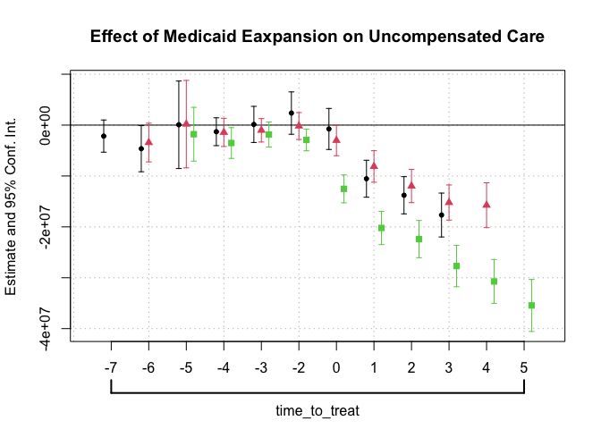
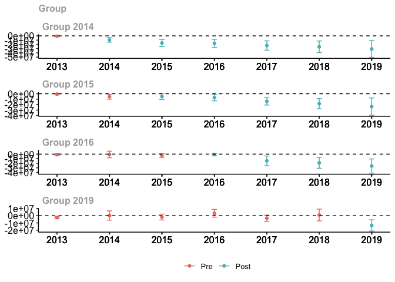
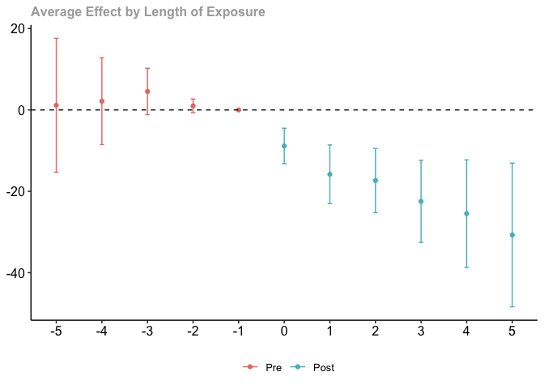

Assigment 1
================

## Downloading the Raw Data

We start by downloading and processing the
[HCRIS](https://github.com/Nixoncandiales/Econ771/tree/main/Assigments/AS%201/Code/HCRIS),
[POS](https://github.com/Nixoncandiales/Econ771/tree/main/Assigments/AS%201/Code/POS),
and
[ACA](https://github.com/Nixoncandiales/Econ771/tree/main/Assigments/AS%201/Code/ACA)
raw data sets. The processed data sets are located in the
[**Output**]((https://github.com/Nixoncandiales/Econ771/tree/main/Assigments/AS%201/Output))
folder under `HCRIS_Data.txt`, `pos_lastyear.v12.dta`, and
`acs_medicare.txt` . We import those data sets in our file and inspect
them as follows.

``` r
ds_screener(data_hcris)
```

    -----------------------------------------------------------------------------------
    |        Column Name         |  Data Type  |  Levels  |  Missing  |  Missing (%)  |
    -----------------------------------------------------------------------------------
    |      provider_number       |   integer   |    NA    |     0     |       0       |
    |          fy_start          |  character  |    NA    |     0     |       0       |
    |           fy_end           |  character  |    NA    |     0     |       0       |
    |       date_processed       |  character  |    NA    |     0     |       0       |
    |        date_created        |  character  |    NA    |     0     |       0       |
    |            beds            |   integer   |    NA    |   2060    |     1.45      |
    |        tot_charges         |   numeric   |    NA    |   5701    |       4       |
    |       tot_discounts        |   numeric   |    NA    |   7961    |     5.59      |
    |     tot_operating_exp      |   numeric   |    NA    |   2686    |     1.88      |
    |         ip_charges         |   numeric   |    NA    |   6283    |     4.41      |
    |        icu_charges         |   numeric   |    NA    |   66719   |     46.82     |
    |     ancillary_charges      |   numeric   |    NA    |   12677   |      8.9      |
    |       tot_discharges       |   numeric   |    NA    |   2300    |     1.61      |
    |      mcare_discharges      |   numeric   |    NA    |   3002    |     2.11      |
    |      mcaid_discharges      |   numeric   |    NA    |   17059   |     11.97     |
    |     tot_mcare_payment      |   numeric   |    NA    |   55548   |     38.98     |
    |  secondary_mcare_payment   |   numeric   |    NA    |   78080   |     54.79     |
    |           street           |  character  |    NA    |    713    |      0.5      |
    |            city            |  character  |    NA    |    286    |      0.2      |
    |           state            |  character  |    NA    |    284    |      0.2      |
    |            zip             |  character  |    NA    |    320    |     0.22      |
    |           county           |  character  |    NA    |   6756    |     4.74      |
    |        uncomp_care         |   numeric   |    NA    |  121914   |     85.55     |
    |       cost_to_charge       |   numeric   |    NA    |   50563   |     35.48     |
    |        new_cap_ass         |   numeric   |    NA    |   25149   |     17.65     |
    |            cash            |   numeric   |    NA    |   10786   |     7.57      |
    |        tot_pat_rev         |   numeric   |    NA    |   5701    |       4       |
    |         allowance          |   numeric   |    NA    |   7961    |     5.59      |
    |        net_pat_rev         |   numeric   |    NA    |   5685    |     3.99      |
    |        hvbp_payment        |   numeric   |    NA    |  113346   |     79.54     |
    |        hrrp_payment        |   numeric   |    NA    |  116285   |     81.6      |
    |  tot_uncomp_care_charges   |   numeric   |    NA    |   95493   |     67.01     |
    |tot_uncomp_care_partial_pmts|   numeric   |    NA    |  117193   |     82.24     |
    |          bad_debt          |   numeric   |    NA    |   93693   |     65.75     |
    |            year            |   integer   |    NA    |     0     |       0       |
    |           source           |  character  |    NA    |     0     |       0       |
    -----------------------------------------------------------------------------------

     Overall Missing Values           1032204 
     Percentage of Missing Values     20.12 %
     Rows with Missing Values         142504 
     Columns With Missing Values      29 

After a quick screening of the HCRIS data we can see the missing values
are significantly high which suggest some variables are recorded
differently across time and forms. It is of particular interest the
variables `uncomp_care` and `tot_uncomp_care_charges` which are of our
main interest. After reviewing the codebook we confirmed in fact these
two variables are the same but coded different across forms.

``` r
ds_screener(data_pos)
```

    --------------------------------------------------------------------------------------------
    |  Column Name   |            Data Type             |  Levels  |  Missing  |  Missing (%)  |
    --------------------------------------------------------------------------------------------
    |       pn       |            character             |    NA    |     0     |       0       |
    |      year      |             numeric              |    NA    |     0     |       0       |
    |      name      |            character             |    NA    |     0     |       0       |
    |    address     |            character             |    NA    |     0     |       0       |
    |      city      |            character             |    NA    |     0     |       0       |
    |     state      |            character             |    NA    |     0     |       0       |
    |      zip       |             numeric              |    NA    |   6650    |     2.48      |
    |      tel       |            character             |    NA    |     0     |       0       |
    |     active     |             numeric              |    NA    |     0     |       0       |
    |    termcode    |haven_labelled, vctrs_vctr, double|    NA    |     0     |       0       |
    |    termdate    |               Date               |    NA    |  178452   |     66.42     |
    |    partdate    |               Date               |    NA    |   18421   |     6.86      |
    |    prev_pn     |            character             |    NA    |     0     |       0       |
    |    medaffil    |haven_labelled, vctrs_vctr, double|    NA    |   27485   |     10.23     |
    |  resprog_ada   |             numeric              |    NA    |   18802   |       7       |
    |  resprog_ama   |             numeric              |    NA    |   18802   |       7       |
    |  resprog_aoa   |             numeric              |    NA    |   18802   |       7       |
    |  resprog_oth   |             numeric              |    NA    |   18802   |       7       |
    |   residents    |             numeric              |    NA    |    414    |     0.15      |
    |   shortterm    |             numeric              |    NA    |     0     |       0       |
    |      cah       |             numeric              |    NA    |     0     |       0       |
    |provider_subtype|haven_labelled, vctrs_vctr, double|    NA    |   14723   |     5.48      |
    |  typ_control   |haven_labelled, vctrs_vctr, double|    NA    |   27452   |     10.22     |
    |   nonprofit    |             numeric              |    NA    |     0     |       0       |
    |   forprofit    |             numeric              |    NA    |     0     |       0       |
    |      govt      |             numeric              |    NA    |     0     |       0       |
    |    maryland    |             numeric              |    NA    |     0     |       0       |
    |    nonstate    |             numeric              |    NA    |     0     |       0       |
    |   urbancbsa    |             numeric              |    NA    |  184738   |     68.76     |
    |    beds_tot    |             numeric              |    NA    |    411    |     0.15      |
    |   beds_cert    |             numeric              |    NA    |    411    |     0.15      |
    --------------------------------------------------------------------------------------------

     Overall Missing Values           534365 
     Percentage of Missing Values     6.42 %
     Rows with Missing Values         234603 
     Columns With Missing Values      14 

From the provider of services data set we do not evidence missing data
problems. We can observe if a particular POS went out of the market by
either closing or merging and the respectively date of the event. It is
to note the identifier variable is `pn` which is recorded as a character
differs in the HCRIS data set `provider_number` which is coded as
numerical.

``` r
ds_screener(data_aca)
```

    ----------------------------------------------------------------------
    |  Column Name  |  Data Type  |  Levels  |  Missing  |  Missing (%)  |
    ----------------------------------------------------------------------
    |     State     |  character  |    NA    |     0     |       0       |
    |     year      |   integer   |    NA    |     0     |       0       |
    |   adult_pop   |   integer   |    NA    |     0     |       0       |
    | ins_employer  |   integer   |    NA    |     0     |       0       |
    |  ins_direct   |   integer   |    NA    |     0     |       0       |
    | ins_medicare  |   integer   |    NA    |     0     |       0       |
    | ins_medicaid  |   integer   |    NA    |     0     |       0       |
    |   uninsured   |   integer   |    NA    |     0     |       0       |
    |  expand_ever  |   logical   |    NA    |     8     |     1.92      |
    | date_adopted  |  character  |    NA    |    104    |      25       |
    |  expand_year  |   integer   |    NA    |    104    |      25       |
    |    expand     |   logical   |    NA    |     0     |       0       |
    ----------------------------------------------------------------------

     Overall Missing Values           216 
     Percentage of Missing Values     4.33 %
     Rows with Missing Values         104 
     Columns With Missing Values      3 

Finally, from the medicare data set we see the states that expanded the
mandate and the date of event. Also, it is to note that the state
identifier is not recorded in the same format across data sets.

## Merging the data

We start by left joining `HCRIS_data.txt` and `pos_lastyear.v12.dta`.
The key to merge these two data set is the indicator `pn`

``` r
#Merged the two data sets
df_1 <- data_hcris %>% #sum up the two variables uncompensated care variables
              filter(year >= 2003 & year <= 2019) %>%
              rowwise() %>% 
              mutate(hosp_rev = tot_pat_rev, 
                     unc_care = sum(tot_uncomp_care_charges,uncomp_care, na.rm=TRUE)) %>%
              mutate_at(c('unc_care'), ~na_if(., 0)) %>%
              select(pn=provider_number, year, unc_care, hosp_rev, state)  %>%
              filter(!(is.na(unc_care) & is.na(hosp_rev))) #discard the observations NA observation for both unc_care and hosp_rev
          
df_2 <- data_pos %>% #force pn as integer and discard those facilities that are not hospitals
              mutate_at('pn', as.integer) %>% 
              select(pn = pn, nonprofit, forprofit, active, State=state) %>% 
              mutate(own_typ = case_when(nonprofit == 0  & forprofit == 0  ~ 'other',
                                         nonprofit == 0  & forprofit == 1  ~ 'forprofit',
                                         nonprofit == 1  & forprofit == 0  ~ 'nonprofit')) %>%
              #filter((own_typ == 'forprofit') | (own_typ == 'nonprofit' )) %>% #only include in the analysis hospitals forprofit and nonprofit
              distinct(pn, own_typ, State)

df <- left_join(df_1, df_2, by='pn') %>%
              mutate_at('own_typ',  replace_na, 'other') %>%
              filter(!(unc_care == 'NA')) %>% # drop all observations that don't contain uncompensated care information
              mutate(state= coalesce(State, state)) %>%
              select(pn, year, state, own_typ, unc_care, hosp_rev)
df 
```

    # A tibble: 79,296 × 6
    # Rowwise: 
          pn  year state own_typ unc_care   hosp_rev
       <int> <int> <chr> <chr>      <dbl>      <dbl>
     1 10001  2003 AL    other   41267219  532023593
     2 10001  2004 AL    other   37413733  592438087
     3 10001  2005 AL    other   37457443  657842984
     4 10001  2006 AL    other   41670968  714123644
     5 10001  2010 AL    other   90806676 1116894148
     6 10001  2011 AL    other   22446946 1208331516
     7 10001  2012 AL    other   25683016 1263055782
     8 10001  2013 AL    other   23652954 1305720014
     9 10001  2014 AL    other   24962490 1451185686
    10 10001  2015 AL    other   20412518 1550672017
    # … with 79,286 more rows

``` r
df_3 <- data_aca %>% # crosswalk the states names to states abbreviations and drop Puerto Rico from the analysis
              #filter(!(State=='Puerto Rico')) %>%
              mutate(state= encodefrom(., State, stcrosswalk, stname, stfips, stabbr)) %>%
              select(!State) %>%
              relocate(state) #make sure the ID variable has the same name on both data sets
```

    Warning in class(val_vec) <- class(cw[[clean]]): NAs introduced by coercion

``` r
df <- left_join(df,# %>% filter(!(state=="PR")), 
                df_3, by=c('state', 'year')) %>% # Filtering out PR since is not in df_3, to avoid future NA
  relocate(pn, year, state, own_typ ,expand_ever, expand, expand_year, unc_care)
```

## Summary Statistics

Provide and discuss a table of simple summary statistics showing the
mean, standard deviation, min, and max of hospital total revenues and
uncompensated care over time.

From the `HCRIS_data.txt` we select the variables `provider_number`,
`year`, `uncomp_care`, `tot_uncomp_care_charges`, `tot_pat_rev`. We
create a new variable that stores the uncompensated care records, then
we group by year and calculate the summary statistics as follows.

``` r
df_1 %>%
  group_by(year) %>%
  summarise_at(c('unc_care', 'hosp_rev'),list(mean = mean, sd = sd, min = min, max = max), na.rm=T) 
```

    # A tibble: 17 × 9
        year unc_care_mean hosp_re…¹ unc_c…² hosp_…³ unc_c…⁴ hosp_…⁵ unc_c…⁶ hosp_…⁷
       <int>         <dbl>     <dbl>   <dbl>   <dbl>   <dbl>   <dbl>   <dbl>   <dbl>
     1  2003     13557293.    1.96e8  3.20e7  3.39e8 -1.28e5 -1.76e6  7.78e8 4.72e 9
     2  2004     15328897.    2.17e8  3.67e7  3.79e8  1   e0  1.54e5  8.20e8 5.53e 9
     3  2005     17409739.    2.37e8  3.78e7  4.19e8  1   e0  1   e0  9.39e8 6.40e 9
     4  2006     20958801.    2.62e8  4.72e7  4.64e8 -2.67e6 -1.04e5  1.07e9 7.78e 9
     5  2007     23563868.    2.86e8  5.13e7  5.08e8  1   e0  6.36e4  1.20e9 8.58e 9
     6  2008     26429603.    3.11e8  5.71e7  5.56e8  1   e0  4   e0  1.36e9 9.29e 9
     7  2009     27437058.    3.42e8  4.64e7  6.13e8  1   e0  1.19e5  5.84e8 9.85e 9
     8  2010     29887574.    3.65e8  7.24e7  6.48e8  1   e0  3.07e5  2.79e9 9.86e 9
     9  2011     17394154.    3.94e8  4.72e7  7.12e8 -2.88e7 -2.76e7  1.11e9 1.06e10
    10  2012     18338225.    4.18e8  5.59e7  7.66e8  8.5 e1 -1.18e7  1.37e9 1.19e10
    11  2013     19648564.    4.46e8  5.76e7  8.34e8  2.16e2  9.49e4  1.40e9 1.28e10
    12  2014     19607345.    4.78e8  6.33e7  9.05e8  1.5 e1  6.62e3  1.87e9 1.34e10
    13  2015     19024979.    5.18e8  6.18e7  9.71e8  2.2 e1  9.37e3  1.99e9 1.41e10
    14  2016     19810030.    5.62e8  6.67e7  1.07e9  8.4 e1 -1.77e8  2.23e9 1.56e10
    15  2017     22135100.    6.03e8  6.95e7  1.17e9  3.4 e1  1.25e5  2.06e9 1.69e10
    16  2018     24883218.    6.52e8  7.45e7  1.28e9  1   e0  2.83e5  2.18e9 1.87e10
    17  2019     28705587.    7.06e8  8.38e7  1.42e9  2   e0  3   e0  2.50e9 2.20e10
    # … with abbreviated variable names ¹​hosp_rev_mean, ²​unc_care_sd, ³​hosp_rev_sd,
    #   ⁴​unc_care_min, ⁵​hosp_rev_min, ⁶​unc_care_max, ⁷​hosp_rev_max

``` r
df %>% ggplot(aes(x = year, y = unc_care, group=year)) + 
  geom_boxplot() + 
  theme_tufte() +
    labs(x="Years", y="Uncompensated Care", 
       title = "Distribution Hospital Uncompensated Care Over Time")-> plot1

df %>% ggplot(aes(x = year, y = hosp_rev, group=year)) + 
  geom_boxplot() + 
  theme_tufte() +
    labs(x="Years", y="Hospital Revenue", 
       title = "Distribution Hospital Total Revenue Over Time") -> plot2

plot <- plot1  / plot2 
```

## By Ownership Type

Create a figure showing the mean hospital uncompensated care from 2000
to 2018. Show this trend separately by hospital ownership type (private
not for profit and private for profit).

``` r
df %>%
  filter(!(own_typ=='other')) %>%
  group_by(year, own_typ) %>%
  summarise_at(c('unc_care'), list(unc_care_mean = mean), na.rm=T) %>%
  ggplot(aes(x=year, y=unc_care_mean, color=own_typ)) +
  geom_point(size = 3) +
  geom_smooth(aes(fill = own_typ), size = 1) +
  geom_vline( xintercept = 2014, color="black") +
  theme_tufte()+ 
  labs(x="Years", y="Total Uncompensated Care", 
       title = "Mean of Hospital Uncompensated Care by Ownership Type", 
       fill = "Ownership type", color = "Ownership type") -> plot3

plot3
```

<!-- -->

## DiD identification strategy

Using a simple DD identification strategy, estimate the effect of
Medicaid expansion on hospital uncompensated care using a traditional
two-way fixed effects (TWFE) estimation: $$
y_{it} = \alpha_{i} + \gamma_{t} + \delta D_{it} + \varepsilon_{it},
$$ where $D_{it}=1(E_{i}\leq t)$ in Equation 1 is an indicator set to 1
when a hospital is in a state that expanded as of year $t$ or earlier,
$\gamma_{t}$ denotes time fixed effects, $\alpha_{i}$ denotes hospital
fixed effects, and $y_{it}$ denotes the hospital’s amount of
uncompensated care in year $t$. Present four estimates from this
estimation in a table: one based on the full sample (regardless of
treatment timing); one when limiting to the 2014 treatment group (with
never treated as the control group); one when limiting to the 2015
treatment group (with never treated as the control group); and one when
limiting to the 2016 treatment group (with never treated as the control
group). Briefly explain any differences.

``` r
#Create dummies for the control groups
df %>% 
  mutate(d = case_when(expand == TRUE ~ 1),
         d_14 = case_when((expand == TRUE & expand_year==2014) ~ 1),
         d_15 = case_when((expand == TRUE & expand_year==2015) ~ 1),
         d_16 = case_when((expand == TRUE & expand_year==2016) ~ 1)) %>%
  mutate(across(d:d_16, ~ifelse(is.na(.),0,.))) -> df
```

``` r
mod.twfe <- lapply(df %>%
                select(d:d_16), #Select the treatments 
              function(Treatment) felm(unc_care ~ Treatment | pn + year | 0 | state, df)) #Apply the specification across the different treatments and store the results in a list

stargazer(mod.twfe, type='text', note="1-4 representes d, d_14,d_15 and d_16 respectevely")
```


    ========================================================================================================
                                                               Dependent variable:                          
                                     -----------------------------------------------------------------------
                                                                    unc_care                                
                                            (1)                (2)               (3)              (4)       
    --------------------------------------------------------------------------------------------------------
    Treatment                        -22,359,115.000*** -20,831,530.000*** -9,220,187.000** -9,412,614.000**
                                      (5,681,719.000)    (5,546,785.000)   (4,642,013.000)  (4,277,786.000) 
                                                                                                            
    --------------------------------------------------------------------------------------------------------
    Observations                           79,296             79,296            79,296           79,296     
    R2                                     0.662              0.661             0.654            0.654      
    Adjusted R2                            0.636              0.634             0.627            0.627      
    Residual Std. Error (df = 73589)   34,978,442.000     35,066,565.000    35,405,652.000   35,413,511.000 
    ========================================================================================================
    Note:                                                                        *p<0.1; **p<0.05; ***p<0.01

    ==================================================
    1-4 representes d, d_14,d_15 and d_16 respectevely
    --------------------------------------------------

## Event Study

Estimate an “event study” version of the specification in part 3: $$
y_{it} = \alpha_{i} + \gamma_{t} +\sum_{\tau < -1} D_{it}^{\tau} \delta_{\tau} + \sum_{\tau>=0} D_{it}^{\tau} \delta_{\tau} + \varepsilon_{it},
$$ where $D_{it}^{\tau} = 1(t-E_{i}=\tau)$ in Equation 2 is essentially
an interaction between the treatment dummy and a relative time dummy. In
this notation and context, $\tau$ denotes years relative to Medicaid
expansion, so that $\tau=-1$ denotes the year before a state expanded
Medicaid, $\tau=0$ denotes the year of expansion, etc. Estimate with two
different samples: one based on the full sample and one based only on
those that expanded in 2014 (with never treated as the control group).

``` r
### Common treatment timing
dat.reg <- df %>% group_by(state) %>% 
            mutate(expand_year=ifelse(is.na(expand_year),0,expand_year)) %>%
            fill(starts_with("exp"), .direction = "up") %>%  # Fill the NA for the years that do not appear in the aca data set.
            mutate(expand_ever=ifelse(is.na(expand_ever),FALSE,expand_ever),
                   expand=ifelse(!is.na(expand),expand,FALSE),
                   treated=ifelse(expand_ever==TRUE,1,0),
                   post_treat=ifelse(expand==TRUE,1,0),
                   D = treated*post_treat) %>% 
            ungroup()

mod.esct <- feols(unc_care~i(year, treated, ref=2013) | state + year,
               cluster=~state,
               data=dat.reg)
esttable(mod.esct)
```

                                                mod.esct
    Dependent Var.:                             unc_care
                                                        
    treated x year = 2003      5,388,215.7 (3,319,491.9)
    treated x year = 2004      5,567,677.9 (3,482,873.5)
    treated x year = 2005     6,130,362.9. (3,179,120.9)
    treated x year = 2006     7,708,302.6. (3,842,116.3)
    treated x year = 2007     5,132,749.9* (2,510,780.7)
    treated x year = 2008      2,880,538.7 (2,598,994.9)
    treated x year = 2009        355,485.8 (2,382,147.4)
    treated x year = 2010       -539,345.3 (2,519,407.2)
    treated x year = 2011     2,255,752.4. (1,144,967.6)
    treated x year = 2012       1,807,625.4* (768,125.6)
    treated x year = 2014   -7,526,123.4** (2,203,730.0)
    treated x year = 2015 -13,564,810.9*** (3,813,847.2)
    treated x year = 2016  -14,135,833.2** (4,122,026.7)
    treated x year = 2017 -20,207,076.2*** (4,762,190.8)
    treated x year = 2018 -24,466,022.0*** (6,004,448.6)
    treated x year = 2019 -31,216,784.9*** (8,332,225.7)
    Fixed-Effects:        ------------------------------
    state                                            Yes
    year                                             Yes
    _____________________ ______________________________
    S.E.: Clustered                            by: state
    Observations                                  79,296
    R2                                           0.07812
    Within R2                                    0.01027
    ---
    Signif. codes: 0 '***' 0.001 '**' 0.01 '*' 0.05 '.' 0.1 ' ' 1

``` r
##### Differential timgin treatment
dat.reg <- df %>% group_by(state) %>% 
            mutate(expand_year=ifelse(is.na(expand_year),0,expand_year)) %>%
            fill(starts_with("exp"), .direction = "up") %>%  # Fill the NA for the years that do not appear in the aca data set.
            mutate(expand_ever=ifelse(is.na(expand_ever),FALSE,expand_ever),
                   expand=ifelse(!is.na(expand),expand,FALSE),
                   treated=ifelse(expand_ever==TRUE,1,0),
                   post_treat=ifelse(expand==TRUE,1,0),
                   dif_timing = ifelse(expand_ever==FALSE, 0, ifelse(expand_year==0,0,year-expand_year)),
                   time_to_treat = ifelse(dif_timing < -7, -7, dif_timing),
                   D = treated*post_treat) %>% 
            ungroup()

mod.esdt <- feols(unc_care~i(time_to_treat, treated, ref=-1) | state + year,
                  cluster=~state,
                  data=dat.reg)

modelsummary(mod.esdt, stars=TRUE)
```

|                              |       Model 1       |
|:-----------------------------|:-------------------:|
| time_to_treat = -7 × treated |     3609940.503     |
|                              |    (2709254.355)    |
| time_to_treat = -6 × treated |     2292768.017     |
|                              |    (2515221.509)    |
| time_to_treat = -5 × treated |     995667.910      |
|                              |    (2262215.098)    |
| time_to_treat = -4 × treated |     -712024.151     |
|                              |    (2028186.163)    |
| time_to_treat = -3 × treated |    -1279776.154     |
|                              |    (2132920.891)    |
| time_to_treat = -2 × treated |     196059.190      |
|                              |    (1096363.086)    |
| time_to_treat = 0 × treated  |     3162363.069     |
|                              |    (2586046.224)    |
| time_to_treat = 1 × treated  | -12871763.634\*\*\* |
|                              |    (2638652.623)    |
| time_to_treat = 2 × treated  | -16175763.942\*\*\* |
|                              |    (3006530.023)    |
| time_to_treat = 3 × treated  | -20859348.654\*\*\* |
|                              |    (3787505.479)    |
| time_to_treat = 4 × treated  | -23550866.220\*\*\* |
|                              |    (4794701.812)    |
| time_to_treat = 5 × treated  | -27136104.401\*\*\* |
|                              |    (6358935.034)    |
| Num.Obs.                     |        79296        |
| R2                           |        0.077        |
| R2 Adj.                      |        0.076        |
| R2 Within                    |        0.009        |
| R2 Within Adj.               |        0.009        |
| AIC                          |      3053622.7      |
| BIC                          |      3053743.4      |
| RMSE                         |     55699404.80     |
| Std.Errors                   |      by: state      |
| FE: state                    |          X          |
| FE: year                     |          X          |

**Note:** ^^ + p \< 0.1, \* p \< 0.05, \*\* p \< 0.01, \*\*\* p \< 0.001

``` r
esttable(mod.esdt)
```

                                                       mod.esdt
    Dependent Var.:                                    unc_care
                                                               
    treated x time_to_treat = -7      3,609,940.5 (2,709,254.4)
    treated x time_to_treat = -6      2,292,768.0 (2,515,221.5)
    treated x time_to_treat = -5        995,667.9 (2,262,215.1)
    treated x time_to_treat = -4       -712,024.2 (2,028,186.2)
    treated x time_to_treat = -3     -1,279,776.2 (2,132,920.9)
    treated x time_to_treat = -2        196,059.2 (1,096,363.1)
    treated x time_to_treat = 0       3,162,363.1 (2,586,046.2)
    treated x time_to_treat = 1  -12,871,763.6*** (2,638,652.6)
    treated x time_to_treat = 2  -16,175,763.9*** (3,006,530.0)
    treated x time_to_treat = 3  -20,859,348.7*** (3,787,505.5)
    treated x time_to_treat = 4  -23,550,866.2*** (4,794,701.8)
    treated x time_to_treat = 5  -27,136,104.4*** (6,358,935.0)
    Fixed-Effects:               ------------------------------
    state                                                   Yes
    year                                                    Yes
    ____________________________ ______________________________
    S.E.: Clustered                                   by: state
    Observations                                         79,296
    R2                                                  0.07723
    Within R2                                           0.00932
    ---
    Signif. codes: 0 '***' 0.001 '**' 0.01 '*' 0.05 '.' 0.1 ' ' 1

## SA specification

Sun and Abraham (SA) show that the $\delta_{\tau}$ coefficients in
Equation 2 can be written as a non-convex average of all other
group-time specific average treatment effects. They propose an
interaction weighted specification: $$
y_{it} = \alpha_{i} + \gamma_{t} +\sum_{e} \sum_{\tau \neq -1} \left(D_{it}^{\tau} \times 1(E_{i}=e)\right) \delta_{e, \tau} + \varepsilon_{it}.
$$ Re-estimate your event study using the SA specification in Equation
3. Show your results for $\hat{\delta}_{e, \tau}$ in a Table, focusing
on states with $E_{i}=2014$, $E_{i}=2015$, and $E_{i}=2016$.

``` r
reg.dat <- df %>% 
            group_by(state) %>% 
            mutate(expand_year=ifelse(is.na(expand_year),0,expand_year)) %>%
            fill(starts_with("exp"), .direction = "up")  %>%  # Fill the NA for the years that do not appear in the aca data set.
            mutate(expand_ever=ifelse(is.na(expand_ever),FALSE,expand_ever),
                   expand=ifelse(!is.na(expand),expand,FALSE))

sa <- function(data, i){
  
  data %>%
      mutate(post = (year>=i), 
      treat=post*expand_ever,
      expand_year = ifelse(expand_ever==FALSE, 10000, ifelse(expand_year>=i,expand_year,100000)),
      time_to_treat = ifelse(expand_ever==FALSE, -1, year-expand_year),
      time_to_treat = ifelse(time_to_treat < ifelse(i==2014,-5,
                                                    ifelse(i==2015, -6 , -7 )), 
                                             ifelse(i==2014,-5, ifelse(i==2015, -6 , -7 )) , 
                             time_to_treat)) -> x

   feols(unc_care~sunab(expand_year, time_to_treat) | pn + year,
                      cluster=~pn,
                      data=x)
}


mod.sa <- list(
  "mod.sa.2014" = sa(reg.dat, 2016),
  "mod.sa.2015" = sa(reg.dat, 2015),
  "mod.sa.2016" = sa(reg.dat, 2014)
)

modelsummary(mod.sa, stars = TRUE, output = "markdown")
```

|                    |     mod.sa.2014     |     mod.sa.2015     |     mod.sa.2016     |
|:-------------------|:-------------------:|:-------------------:|:-------------------:|
| time_to_treat = -7 |    -2162581.301     |                     |                     |
|                    |    (1614025.597)    |                     |                     |
| time_to_treat = -6 |   -4634955.332\*    |    -3432961.850+    |                     |
|                    |    (2313234.533)    |    (1939790.185)    |                     |
| time_to_treat = -5 |      59013.016      |     188372.141      |    -1795894.446     |
|                    |    (4387119.204)    |    (4384754.624)    |    (2695731.699)    |
| time_to_treat = -4 |    -1273091.515     |    -1406380.731     |   -3499831.112\*    |
|                    |    (1395380.665)    |    (4336899.934)    |    (1542535.304)    |
| time_to_treat = -3 |     159555.467      |    -1010659.928     |    -1843399.574     |
|                    |    (1811387.041)    |    (2029966.355)    |    (1252769.647)    |
| time_to_treat = -2 |     2389709.731     |     -170669.197     |  -2903392.237\*\*   |
|                    |    (2124213.541)    |    (1215340.998)    |    (1088452.069)    |
| time_to_treat = 0  |     -732144.218     |    -2995421.903+    | -12520851.510\*\*\* |
|                    |    (2058218.030)    |    (1362697.969)    |    (1395438.827)    |
| time_to_treat = 1  | -10493976.263\*\*\* | -8079385.993\*\*\*  | -20202410.500\*\*\* |
|                    |    (1849620.396)    |    (1891929.296)    |    (1665987.327)    |
| time_to_treat = 2  | -13742296.882\*\*\* | -11962793.255\*\*\* | -22399494.340\*\*\* |
|                    |    (1862283.979)    |    (2133657.920)    |    (1863312.072)    |
| time_to_treat = 3  | -17625966.541\*\*\* | -15204177.303\*\*\* | -27692580.812\*\*\* |
|                    |    (2197066.767)    |    (2062109.826)    |    (2074013.598)    |
| time_to_treat = 4  |                     | -15752073.198\*\*\* | -30718408.491\*\*\* |
|                    |                     |    (4280608.992)    |    (2198386.006)    |
| time_to_treat = 5  |                     |                     | -35431562.169\*\*\* |
|                    |                     |                     |    (2610001.741)    |
| Num.Obs.           |        79296        |        79296        |        79296        |
| R2                 |        0.654        |        0.654        |        0.664        |
| R2 Adj.            |        0.627        |        0.628        |        0.638        |
| R2 Within          |        0.001        |        0.002        |        0.031        |
| R2 Within Adj.     |        0.001        |        0.002        |        0.031        |
| AIC                |      2975828.0      |      2975723.9      |      2973410.2      |
| BIC                |      2975930.0      |      2975826.0      |      2973512.2      |
| RMSE               |     34105563.50     |     34083199.35     |     33589553.47     |
| Std.Errors         |       by: pn        |       by: pn        |       by: pn        |
| FE: pn             |          X          |          X          |          X          |
| FE: year           |          X          |          X          |          X          |

**Note:** ^^ + p \< 0.1, \* p \< 0.05, \*\* p \< 0.01, \*\*\* p \< 0.001

## Event Study - SA specification

Present an event study graph based on the results in part 5. Hint: you
can do this automatically in `R` with the `fixest` package (using the
`sunab` syntax for interactions), or with `eventstudyinteract` in
`Stata`. These packages help to avoid mistakes compared to doing the
tables/figures manually and also help to get the standard errors
correct.

``` r
coefplot(mod.sa)
```

<!-- --> ## Callaway and
Sant’Anna Specification (CS) Callaway and Sant’Anna (CS) offer a
non-parametric solution that effectively calculates a set of group-time
specific differences,
$ATT(g,t)= E[y_{it}(g) - y_{it}(\infty) | G_{i}=g]$, where $g$ reflects
treatment timing and $t$ denotes time. They show that under the standard
DD assumptions of parallel trends and no anticipation,
$ATT(g,t) = E[y_{it} - y_{i, g-1} | G_{i}=g] - E[y_{it} - y_{i,g-1} | G_{i} = \infty]$,
so that $\hat{ATT}(g,t)$ is directly estimable from sample analogs. CS
also propose aggregations of $\hat{ATT}(g,t)$ to form an overall ATT or
a time-specific ATT (e.g., ATTs for $\tau$ periods before/after
treatment). With this framework in mind, provide an alternative event
study using the CS estimator. Hint: check out the `did` package in `R`
or the `csdid` package in `Stata`.

``` r
reg.dat <- df%>% 
  filter(!is.na(expand_ever)) %>%
  mutate(post = (year>=2014), 
         treat=post*expand_ever,
         expand_year=ifelse(is.na(expand_year),0,expand_year)) %>%
  filter(!is.na(unc_care)) %>%
  group_by(state) %>%
  mutate(state_id=cur_group_id()) %>% ungroup()


mod.cs <- att_gt(yname="unc_care", tname="year", idname="state_id",
                 gname="expand_year",
                 data=reg.dat, panel=TRUE, est_method="dr",
                 allow_unbalanced_panel=TRUE)
mod.cs.event <- aggte(mod.cs, type="dynamic")

mod.cs
```


    Call:
    att_gt(yname = "unc_care", tname = "year", idname = "state_id", 
        gname = "expand_year", data = reg.dat, panel = TRUE, allow_unbalanced_panel = TRUE, 
        est_method = "dr")

    Reference: Callaway, Brantly and Pedro H.C. Sant'Anna.  "Difference-in-Differences with Multiple Time Periods." Journal of Econometrics, Vol. 225, No. 2, pp. 200-230, 2021. <https://doi.org/10.1016/j.jeconom.2020.12.001>, <https://arxiv.org/abs/1803.09015> 

    Group-Time Average Treatment Effects:
     Group Time    ATT(g,t) Std. Error [95% Simult.  Conf. Band]  
      2014 2013   -493665.2   693500.3      -2151281   1163950.5  
      2014 2014  -9527039.4  2185047.6     -14749775  -4304303.3 *
      2014 2015 -16868003.0  3539045.0     -25327085  -8408920.6 *
      2014 2016 -17595927.6  4017471.1     -27198552  -7993303.4 *
      2014 2017 -22658524.3  4581181.0     -33608537 -11708511.5 *
      2014 2018 -25699487.7  5730803.4     -39397346 -12001628.9 *
      2014 2019 -30727942.6  8210451.2     -50352696 -11103189.5 *
      2015 2013   -715363.9   626596.5      -2213065    782337.3  
      2015 2014  -5553388.0  1844439.9      -9961998  -1144777.8 *
      2015 2015  -5010301.5  2355827.9     -10641239    620636.4  
      2015 2016  -7113507.7  2490078.4     -13065333  -1161682.0 *
      2015 2017 -13984064.1  2815717.0     -20714236  -7253891.8 *
      2015 2018 -18224614.5  3939889.1     -27641801  -8807428.0 *
      2015 2019 -23598953.9  6606432.2     -39389755  -7808152.8 *
      2016 2013  -1168915.8   858795.8      -3221623    883791.8  
      2016 2014   -797105.0  3026128.5      -8030206   6435996.3  
      2016 2015  -3068484.0  1692153.7      -7113097    976129.1  
      2016 2016   -978149.0  1067514.6      -3529740   1573441.6  
      2016 2017 -14705710.1  4481674.9     -25417882  -3993538.4 *
      2016 2018 -19119082.8  4978956.0     -31019864  -7218301.8 *
      2016 2019 -26158988.5  6481503.1     -41651182 -10666794.9 *
      2019 2013  -2620400.3   637851.9      -4145004  -1095796.3 *
      2019 2014    299906.6  2678112.1      -6101360   6701173.5  
      2019 2015  -1897746.0  1687623.3      -5931531   2136038.5  
      2019 2016   3350466.1  2251178.4      -2030337   8731269.1  
      2019 2017  -3558597.0  1808508.9      -7881324    764130.2  
      2019 2018    954891.2  3422867.5      -7226502   9136284.4  
      2019 2019 -13470755.4  3253619.1     -21247608  -5693902.4 *
    ---
    Signif. codes: `*' confidence band does not cover 0

    Control Group:  Never Treated,  Anticipation Periods:  0
    Estimation Method:  Doubly Robust

``` r
mod.cs.event
```


    Call:
    aggte(MP = mod.cs, type = "dynamic")

    Reference: Callaway, Brantly and Pedro H.C. Sant'Anna.  "Difference-in-Differences with Multiple Time Periods." Journal of Econometrics, Vol. 225, No. 2, pp. 200-230, 2021. <https://doi.org/10.1016/j.jeconom.2020.12.001>, <https://arxiv.org/abs/1803.09015> 


    Overall summary of ATT's based on event-study/dynamic aggregation:  
           ATT    Std. Error     [ 95%  Conf. Int.]  
     -20117917       4607926  -29149285   -11086549 *


    Dynamic Effects:
     Event time    Estimate Std. Error [95% Simult.  Conf. Band]  
             -6  -2620400.3   683920.5      -4193995  -1046806.1 *
             -5    299906.6  2800846.9      -6144404   6744217.2  
             -4  -1897746.0  1740555.0      -5902491   2106998.9  
             -3   1090775.1  1818258.5      -3092753   5274303.4  
             -2  -1551070.8  1326633.5      -4603447   1501305.5  
             -1  -1006362.1   834672.8      -2926814    914089.4  
              0  -8857611.1  1832623.4     -13074191  -4641031.2 *
              1 -15818375.8  3466622.5     -23794532  -7842219.7 *
              2 -17352512.6  3802051.5     -26100438  -8604586.8 *
              3 -22461624.3  4622575.6     -33097448 -11825800.8 *
              4 -25489434.3  5575746.1     -38318354 -12660514.5 *
              5 -30727942.6  8255159.7     -49721774 -11734111.3 *
    ---
    Signif. codes: `*' confidence band does not cover 0

    Control Group:  Never Treated,  Anticipation Periods:  0
    Estimation Method:  Doubly Robust

``` r
ggdid(mod.cs)
```

<!-- -->

``` r
ggdid(mod.cs.event)
```

<!-- -->

## Rambachan and Roth (RR)

Rambachan and Roth (RR) show that traditional tests of parallel
pre-trends may be underpowered, and they provide an alternative
estimator that essentially bounds the treatment effects by the size of
an assumed violation in parallel trends. One such bound RR propose is to
limit the post-treatment violation of parallel trends to be no worse
than some multiple of the pre-treatment violation of parallel trends.
Assuming linear trends, such a violation is reflected by
$$\Delta(\bar{M}) = \left\{ \delta : \forall t \geq 0, \lvert (\delta_{t+1} - \delta_{t}) - (\delta_{t} - \delta_{t-1}) \rvert \leq \bar{M} \times \max_{s<0} \lvert (\delta_{s+1} - \delta_{s}) - (\delta_{s} - \delta_{s-1}) \rvert \right\}.$$
Using the `HonestDiD` package in `R` or `Stata`, present a sensitivity
plot of your CS ATT estimates using $\bar{M} = \{0, 0.5, 1, 1.5, 2\}$.
Check out the GitHub repo [here](https://github.com/pedrohcgs/CS_RR) for
some help in combining the `HonestDiD` package with CS estimates.

``` r
rm(dat.reg, data_aca, data_hcris, )
```

    Error in rm(dat.reg, data_aca, data_hcris, ): attempt to use zero-length variable name

## Discussion

Discuss your findings and compare estimates from different estimators
(e.g., are your results sensitive to different specifications or
estimators? Are your results sensitive to violation of parallel trends
assumptions?).

## Reflections

Reflect on this assignment. What did you find most challenging? What did
you find most surprising?
