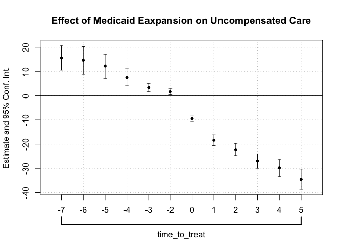
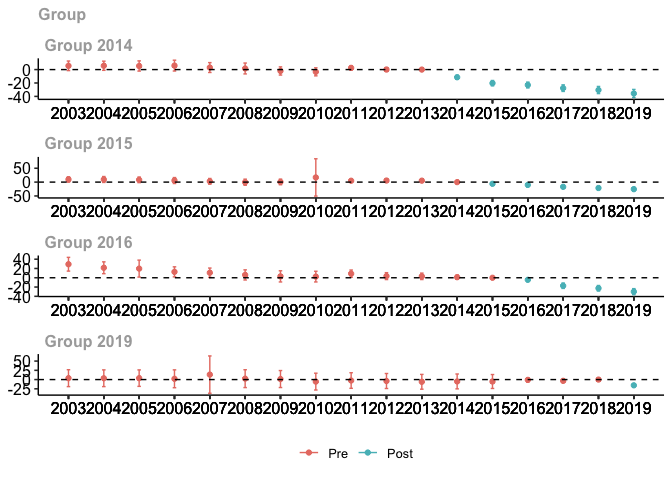

Assigment 1
================

## Downloading the Raw Data

We start by downloading and processing the
[HCRIS](https://github.com/Nixoncandiales/Econ771/tree/main/Assigments/AS%201/Code/HCRIS),
[POS](https://github.com/Nixoncandiales/Econ771/tree/main/Assigments/AS%201/Code/POS),
and
[ACA](https://github.com/Nixoncandiales/Econ771/tree/main/Assigments/AS%201/Code/ACA)
raw data sets. The processed data sets are located in the
[**Output**]((https://github.com/Nixoncandiales/Econ771/tree/main/Assigments/AS%201/Output))
folder under `HCRIS_Data.txt`, `pos_lastyear.v12.dta`, and
`acs_medicare.txt` . We import those data sets in our file and inspect
them as follows.

``` r
ds_screener(data_hcris)
```

    -----------------------------------------------------------------------------------
    |        Column Name         |  Data Type  |  Levels  |  Missing  |  Missing (%)  |
    -----------------------------------------------------------------------------------
    |      provider_number       |   integer   |    NA    |     0     |       0       |
    |          fy_start          |  character  |    NA    |     0     |       0       |
    |           fy_end           |  character  |    NA    |     0     |       0       |
    |       date_processed       |  character  |    NA    |     0     |       0       |
    |        date_created        |  character  |    NA    |     0     |       0       |
    |            beds            |   integer   |    NA    |   2060    |     1.45      |
    |        tot_charges         |   numeric   |    NA    |   5701    |       4       |
    |       tot_discounts        |   numeric   |    NA    |   7961    |     5.59      |
    |     tot_operating_exp      |   numeric   |    NA    |   2686    |     1.88      |
    |         ip_charges         |   numeric   |    NA    |   6283    |     4.41      |
    |        icu_charges         |   numeric   |    NA    |   66719   |     46.82     |
    |     ancillary_charges      |   numeric   |    NA    |   12677   |      8.9      |
    |       tot_discharges       |   numeric   |    NA    |   2300    |     1.61      |
    |      mcare_discharges      |   numeric   |    NA    |   3002    |     2.11      |
    |      mcaid_discharges      |   numeric   |    NA    |   17059   |     11.97     |
    |     tot_mcare_payment      |   numeric   |    NA    |   55548   |     38.98     |
    |  secondary_mcare_payment   |   numeric   |    NA    |   78080   |     54.79     |
    |           street           |  character  |    NA    |    713    |      0.5      |
    |            city            |  character  |    NA    |    286    |      0.2      |
    |           state            |  character  |    NA    |    284    |      0.2      |
    |            zip             |  character  |    NA    |    320    |     0.22      |
    |           county           |  character  |    NA    |   6756    |     4.74      |
    |        uncomp_care         |   numeric   |    NA    |  121914   |     85.55     |
    |       cost_to_charge       |   numeric   |    NA    |   50563   |     35.48     |
    |        new_cap_ass         |   numeric   |    NA    |   25149   |     17.65     |
    |            cash            |   numeric   |    NA    |   10786   |     7.57      |
    |        tot_pat_rev         |   numeric   |    NA    |   5701    |       4       |
    |         allowance          |   numeric   |    NA    |   7961    |     5.59      |
    |        net_pat_rev         |   numeric   |    NA    |   5685    |     3.99      |
    |        hvbp_payment        |   numeric   |    NA    |  113346   |     79.54     |
    |        hrrp_payment        |   numeric   |    NA    |  116285   |     81.6      |
    |  tot_uncomp_care_charges   |   numeric   |    NA    |   95493   |     67.01     |
    |tot_uncomp_care_partial_pmts|   numeric   |    NA    |  117193   |     82.24     |
    |          bad_debt          |   numeric   |    NA    |   93693   |     65.75     |
    |            year            |   integer   |    NA    |     0     |       0       |
    |           source           |  character  |    NA    |     0     |       0       |
    -----------------------------------------------------------------------------------

     Overall Missing Values           1032204 
     Percentage of Missing Values     20.12 %
     Rows with Missing Values         142504 
     Columns With Missing Values      29 

After a quick screening of the HCRIS data we can see the missing values
are significantly high which suggest some variables are recorded
differently across time and forms. It is of particular interest the
variables `uncomp_care` and `tot_uncomp_care_charges` which are of our
main interest. After reviewing the codebook we confirmed in fact these
two variables are the same but coded different across forms.

``` r
ds_screener(data_pos)
```

    --------------------------------------------------------------------------------------------
    |  Column Name   |            Data Type             |  Levels  |  Missing  |  Missing (%)  |
    --------------------------------------------------------------------------------------------
    |       pn       |            character             |    NA    |     0     |       0       |
    |      year      |             numeric              |    NA    |     0     |       0       |
    |      name      |            character             |    NA    |     0     |       0       |
    |    address     |            character             |    NA    |     0     |       0       |
    |      city      |            character             |    NA    |     0     |       0       |
    |     state      |            character             |    NA    |     0     |       0       |
    |      zip       |             numeric              |    NA    |   6650    |     2.48      |
    |      tel       |            character             |    NA    |     0     |       0       |
    |     active     |             numeric              |    NA    |     0     |       0       |
    |    termcode    |haven_labelled, vctrs_vctr, double|    NA    |     0     |       0       |
    |    termdate    |               Date               |    NA    |  178452   |     66.42     |
    |    partdate    |               Date               |    NA    |   18421   |     6.86      |
    |    prev_pn     |            character             |    NA    |     0     |       0       |
    |    medaffil    |haven_labelled, vctrs_vctr, double|    NA    |   27485   |     10.23     |
    |  resprog_ada   |             numeric              |    NA    |   18802   |       7       |
    |  resprog_ama   |             numeric              |    NA    |   18802   |       7       |
    |  resprog_aoa   |             numeric              |    NA    |   18802   |       7       |
    |  resprog_oth   |             numeric              |    NA    |   18802   |       7       |
    |   residents    |             numeric              |    NA    |    414    |     0.15      |
    |   shortterm    |             numeric              |    NA    |     0     |       0       |
    |      cah       |             numeric              |    NA    |     0     |       0       |
    |provider_subtype|haven_labelled, vctrs_vctr, double|    NA    |   14723   |     5.48      |
    |  typ_control   |haven_labelled, vctrs_vctr, double|    NA    |   27452   |     10.22     |
    |   nonprofit    |             numeric              |    NA    |     0     |       0       |
    |   forprofit    |             numeric              |    NA    |     0     |       0       |
    |      govt      |             numeric              |    NA    |     0     |       0       |
    |    maryland    |             numeric              |    NA    |     0     |       0       |
    |    nonstate    |             numeric              |    NA    |     0     |       0       |
    |   urbancbsa    |             numeric              |    NA    |  184738   |     68.76     |
    |    beds_tot    |             numeric              |    NA    |    411    |     0.15      |
    |   beds_cert    |             numeric              |    NA    |    411    |     0.15      |
    --------------------------------------------------------------------------------------------

     Overall Missing Values           534365 
     Percentage of Missing Values     6.42 %
     Rows with Missing Values         234603 
     Columns With Missing Values      14 

From the provider of services data set we do not evidence missing data
problems. We can observe if a particular POS went out of the market by
either closing or merging and the respectively date of the event. It is
to note the identifier variable is `pn` which is recorded as a character
differs in the HCRIS data set `provider_number` which is coded as
numerical.

``` r
ds_screener(data_aca)
```

    ----------------------------------------------------------------------
    |  Column Name  |  Data Type  |  Levels  |  Missing  |  Missing (%)  |
    ----------------------------------------------------------------------
    |     State     |  character  |    NA    |     0     |       0       |
    |     year      |   integer   |    NA    |     0     |       0       |
    |   adult_pop   |   integer   |    NA    |     0     |       0       |
    | ins_employer  |   integer   |    NA    |     0     |       0       |
    |  ins_direct   |   integer   |    NA    |     0     |       0       |
    | ins_medicare  |   integer   |    NA    |     0     |       0       |
    | ins_medicaid  |   integer   |    NA    |     0     |       0       |
    |   uninsured   |   integer   |    NA    |     0     |       0       |
    |  expand_ever  |   logical   |    NA    |     8     |     1.92      |
    | date_adopted  |  character  |    NA    |    104    |      25       |
    |  expand_year  |   integer   |    NA    |    104    |      25       |
    |    expand     |   logical   |    NA    |     0     |       0       |
    ----------------------------------------------------------------------

     Overall Missing Values           216 
     Percentage of Missing Values     4.33 %
     Rows with Missing Values         104 
     Columns With Missing Values      3 

Finally, from the medicare data set we see the states that expanded the
mandate and the date of event. Also, it is to note that the state
identifier is not recorded in the same format across data sets.

## Merging the data

We start by left joining `HCRIS_data.txt` and `pos_lastyear.v12.dta`.
The key to merge these two data set is the indicator `pn`

``` r
#Merged the two data sets
df_1 <- data_hcris %>% #sum up the two variables uncompensated care variables
              filter(year >= 2003 & year <= 2019) %>%
              rowwise() %>% 
              mutate(hosp_rev = tot_pat_rev/1000000,
                     tot_uncomp_care_partial_pmts = tot_uncomp_care_partial_pmts * - 1,
                     tot_unc_care_v2010 = sum(tot_uncomp_care_charges, tot_uncomp_care_partial_pmts, bad_debt, na.rm=TRUE), #Correct way to calculate UNC_CARE after 2010.
                     unc_care = sum(tot_unc_care_v2010 ,uncomp_care, na.rm=TRUE)/1000000) %>%
              mutate_at(c('unc_care'), ~na_if(., 0)) %>%
              select(pn=provider_number, year, unc_care, hosp_rev, state)  %>%
              filter(!(is.na(unc_care) & is.na(hosp_rev))) #discard the observations NA observation for both unc_care and hosp_rev
          
df_2 <- data_pos %>% #coherce PN as integer and discard those facilities that are not hospitals
              filter(year >= 2003) %>%
              mutate_at('pn', as.integer) %>% 
              select(pn = pn, nonprofit, forprofit, active, State=state, year) %>% 
              mutate(own_typ = case_when(nonprofit == 0  & forprofit == 0  ~ 'other',
                                         nonprofit == 0  & forprofit == 1  ~ 'forprofit',
                                         nonprofit == 1  & forprofit == 0  ~ 'nonprofit')) %>%
              distinct(pn, own_typ, State, year, active)


df <- left_join(df_1, df_2, by='pn', 'year') %>%
              filter(!(unc_care == 'NA')) %>% # drop all observations that don't contain uncompensated care information
              mutate(state= coalesce(State, state), year= year.x) %>%
              distinct(pn, state, year, own_typ, unc_care, hosp_rev)
## I do not fully understand the behavior of left_join it creates multiple row, so I am just taking the unique values per PN and YEAR

df 
```

    # A tibble: 79,613 × 6
    # Rowwise: 
          pn unc_care hosp_rev state own_typ  year
       <int>    <dbl>    <dbl> <chr> <chr>   <int>
     1 10001     41.3     532. AL    other    2003
     2 10001     37.4     592. AL    other    2004
     3 10001     37.5     658. AL    other    2005
     4 10001     41.7     714. AL    other    2006
     5 10001     90.8    1117. AL    other    2010
     6 10001    109.     1208. AL    other    2011
     7 10001    119.     1263. AL    other    2012
     8 10001    116.     1306. AL    other    2013
     9 10001    129.     1451. AL    other    2014
    10 10001    111.     1551. AL    other    2015
    # … with 79,603 more rows

``` r
df_3 <- data_aca %>% # crosswalk the states names to states abbreviations and drop Puerto Rico from the analysis
              #filter(!(State=='Puerto Rico')) %>%
              mutate(state= encodefrom(., State, stcrosswalk, stname, stfips, stabbr)) %>%
              select(!State) %>%
              relocate(state) #make sure the ID variable has the same name on both data sets
```

    Warning in class(val_vec) <- class(cw[[clean]]): NAs introduced by coercion

``` r
df <- left_join(df,# %>% filter(!(state=="PR")), 
                df_3, by=c('state', 'year')) %>% # Filtering out PR since is not in df_3, to avoid future NA
  relocate(pn, year, state, own_typ ,expand_ever, expand, expand_year, unc_care)
```

## Summary Statistics

Provide and discuss a table of simple summary statistics showing the
mean, standard deviation, min, and max of hospital total revenues and
uncompensated care over time.

From the `HCRIS_data.txt` we select the variables `provider_number`,
`year`, `uncomp_care`, `tot_uncomp_care_charges`, `tot_pat_rev`. We
create a new variable that stores the uncompensated care records, then
we group by year and calculate the summary statistics as follows.

``` r
df %>% ungroup() %>%
  summarise_at(c("unc_care", "hosp_rev"), list(mean = mean, sd = sd, min = min, max = max), na.rm = TRUE)
```

    # A tibble: 1 × 8
      unc_care_mean hosp_rev_mean unc_care…¹ hosp_…² unc_c…³ hosp_…⁴ unc_c…⁵ hosp_…⁶
              <dbl>         <dbl>      <dbl>   <dbl>   <dbl>   <dbl>   <dbl>   <dbl>
    1     20379870.    560157409.  57983643.  9.67e8 -2.88e7 -1.77e8  2.79e9 2.20e10
    # … with abbreviated variable names ¹​unc_care_sd, ²​hosp_rev_sd, ³​unc_care_min,
    #   ⁴​hosp_rev_min, ⁵​unc_care_max, ⁶​hosp_rev_max

``` r
df_1 %>%
  group_by(year) %>%
  summarise_at(c('unc_care', 'hosp_rev'),list(mean = mean, sd = sd, min = min, max = max), na.rm=T) 
```

    # A tibble: 17 × 9
        year unc_care_mean hosp_…¹ unc_c…² hosp_…³ unc_ca…⁴ hosp_r…⁵ unc_c…⁶ hosp_…⁷
       <int>         <dbl>   <dbl>   <dbl>   <dbl>    <dbl>    <dbl>   <dbl>   <dbl>
     1  2003          13.6    196.    32.0    339. -1.28e-1 -1.76e+0    778.   4723.
     2  2004          15.3    217.    36.7    379.  1   e-6  1.54e-1    820.   5526.
     3  2005          17.4    237.    37.8    419.  1   e-6  1   e-6    939.   6399.
     4  2006          21.0    262.    47.2    464. -2.67e+0 -1.04e-1   1075.   7784.
     5  2007          23.6    286.    51.3    508.  1   e-6  6.36e-2   1203.   8577.
     6  2008          26.4    311.    57.1    556.  1   e-6  4   e-6   1362.   9294.
     7  2009          27.4    342.    46.4    613.  1   e-6  1.19e-1    584.   9846.
     8  2010          29.9    365.    72.4    648.  1   e-6  3.07e-1   2794.   9858.
     9  2011          26.8    394.    63.1    712. -5.43e+1 -2.76e+1   2060.  10572.
    10  2012          29.8    418.    72.5    766. -7.44e+0 -1.18e+1   1883.  11865.
    11  2013          31.9    446.    72.6    834. -4.50e+0  9.49e-2   1653.  12752.
    12  2014          31.8    478.    77.4    905. -2.59e+1  6.62e-3   2025.  13376.
    13  2015          29.8    518.    74.7    971. -3.36e-2  9.37e-3   2054.  14144.
    14  2016          35.5    562.   310.    1070. -1.90e-2 -1.77e+2  20406.  15619.
    15  2017          33.4    603.    87.3   1168. -2.80e-2  1.25e-1   2734.  16863.
    16  2018          35.9    652.    90.5   1284. -6.41e-2  2.83e-1   2606.  18677.
    17  2019          39.8    706.    99.5   1420. -9.73e+1  3   e-6   2648.  22001.
    # … with abbreviated variable names ¹​hosp_rev_mean, ²​unc_care_sd, ³​hosp_rev_sd,
    #   ⁴​unc_care_min, ⁵​hosp_rev_min, ⁶​unc_care_max, ⁷​hosp_rev_max

``` r
df %>% filter(!(pn==151327 & year ==2016)) %>% ggplot(aes(x = year, y = unc_care, group=year)) +
  geom_boxplot() + 
  theme_tufte() +
    labs(x="Years", y="Uncompensated Care Millions", 
       title = "Distribution Hospital Uncompensated Care Over Time")-> plot1

df %>% ggplot(aes(x = year, y = hosp_rev, group=year)) + 
  geom_boxplot() + 
  theme_tufte() +
    labs(x="Years", y="Hospital Revenue Millions", 
       title = "Distribution Hospital Total Revenue Over Time") -> plot2

plot <- plot1  / plot2 
plot
```

<!-- -->

``` r
### Evidence of extreme Outliers, are those misstipying> should I removed them? Ask.
```

## By Ownership Type

Create a figure showing the mean hospital uncompensated care from 2000
to 2018. Show this trend separately by hospital ownership type (private
not for profit and private for profit).

``` r
df %>%  filter(!(pn==151327 & year ==2016)) %>%
  filter(!(own_typ=='other')) %>%
  group_by(year, own_typ) %>%
  summarise_at(c('unc_care'), list(unc_care_mean = mean), na.rm=T) %>%
  ggplot(aes(x=year, y=unc_care_mean, color=own_typ)) +
  geom_point(size = 3) +
  #geom_line(size = 1) +
  geom_smooth(aes(fill = own_typ), size = 1) +
  geom_vline( xintercept = 2014, color="black") +
  theme_tufte()+ 
  labs(x="Years", y="Total Uncompensated Care", 
       title = "Mean of Hospital Uncompensated Care in Millions of Dollars by Ownership Type", 
       fill = "Ownership type", color = "Ownership type") -> plot3

plot3
```

<!-- -->

## DiD identification strategy

Using a simple DD identification strategy, estimate the effect of
Medicaid expansion on hospital uncompensated care using a traditional
two-way fixed effects (TWFE) estimation: $$
y_{it} = \alpha_{i} + \gamma_{t} + \delta D_{it} + \varepsilon_{it},
$$ where $D_{it}=1(E_{i}\leq t)$ in Equation 1 is an indicator set to 1
when a hospital is in a state that expanded as of year $t$ or earlier,
$\gamma_{t}$ denotes time fixed effects, $\alpha_{i}$ denotes hospital
fixed effects, and $y_{it}$ denotes the hospital’s amount of
uncompensated care in year $t$. Present four estimates from this
estimation in a table: one based on the full sample (regardless of
treatment timing); one when limiting to the 2014 treatment group (with
never treated as the control group); one when limiting to the 2015
treatment group (with never treated as the control group); and one when
limiting to the 2016 treatment group (with never treated as the control
group). Briefly explain any differences.

``` r
#Create dummies for the control groups
df %>% filter(!(pn==151327 & year ==2016) & unc_care > 0) %>%
  mutate(d = case_when(expand == TRUE ~ 1),
         d_14 = case_when((expand == TRUE & expand_year==2014) ~ 1),
         d_15 = case_when((expand == TRUE & expand_year==2015) ~ 1),
         d_16 = case_when((expand == TRUE & expand_year==2016) ~ 1)) %>%
  mutate(across(d:d_16, ~ifelse(is.na(.),0,.))) -> df
```

``` r
mod.twfe <- lapply(df %>% 
                select(d:d_16), #Select the treatments 
              function(Treatment) felm(unc_care ~ Treatment | pn + year | 0 | pn, df)) #Apply the specification across the different treatments and store the results in a list

stargazer(mod.twfe, type='text', note="1-4 representes d, d_14,d_15 and d_16 respectevely")
```


    ==========================================================================================================
                                                                Dependent variable:                           
                                     -------------------------------------------------------------------------
                                                                     unc_care                                 
                                            (1)                (2)                (3)               (4)       
    ----------------------------------------------------------------------------------------------------------
    Treatment                        -22,366,299.000*** -20,836,241.000*** -9,226,536.000*** -9,439,230.000***
                                      (1,638,948.000)    (1,574,684.000)    (1,790,135.000)   (1,535,149.000) 
                                                                                                              
    ----------------------------------------------------------------------------------------------------------
    Observations                           79,287             79,287            79,287            79,287      
    R2                                     0.662              0.661              0.654             0.654      
    Adjusted R2                            0.636              0.634              0.627             0.627      
    Residual Std. Error (df = 73580)   34,979,234.000     35,067,492.000    35,406,723.000    35,414,554.000  
    ==========================================================================================================
    Note:                                                                          *p<0.1; **p<0.05; ***p<0.01

    ==================================================
    1-4 representes d, d_14,d_15 and d_16 respectevely
    --------------------------------------------------

## Event Study

Estimate an “event study” version of the specification in part 3: $$
y_{it} = \alpha_{i} + \gamma_{t} +\sum_{\tau < -1} D_{it}^{\tau} \delta_{\tau} + \sum_{\tau>=0} D_{it}^{\tau} \delta_{\tau} + \varepsilon_{it},
$$ where $D_{it}^{\tau} = 1(t-E_{i}=\tau)$ in Equation 2 is essentially
an interaction between the treatment dummy and a relative time dummy. In
this notation and context, $\tau$ denotes years relative to Medicaid
expansion, so that $\tau=-1$ denotes the year before a state expanded
Medicaid, $\tau=0$ denotes the year of expansion, etc. Estimate with two
different samples: one based on the full sample and one based only on
those that expanded in 2014 (with never treated as the control group).

``` r
### Common treatment timing
dat.reg <- df %>% group_by(state) %>% 
            mutate(expand_year=ifelse(is.na(expand_year),0,expand_year)) %>%
            fill(starts_with("exp"), .direction = "up") %>%  # Fill the NA for the years that do not appear in the aca data set.
            mutate(expand_ever=ifelse(is.na(expand_ever),FALSE,expand_ever),
                   expand=ifelse(!is.na(expand),expand,FALSE),
                   treated=ifelse(expand_ever==TRUE,1,0),
                   post_treat=ifelse(expand==TRUE,1,0),
                   D = treated*post_treat) %>% 
            ungroup()

mod.esct <- feols(unc_care~i(year, treated, ref=2013) | pn + year,
               cluster=~pn,
               data=dat.reg)
esttable(mod.esct)
```

                                                mod.esct
    Dependent Var.:                             unc_care
                                                        
    treated x year = 2003  11,093,279.5*** (2,208,916.1)
    treated x year = 2004  10,214,563.9*** (2,149,620.6)
    treated x year = 2005   9,177,771.0*** (2,178,301.0)
    treated x year = 2006  11,463,563.4*** (2,641,381.7)
    treated x year = 2007   9,753,593.5*** (2,899,283.8)
    treated x year = 2008     7,034,713.2* (2,795,735.6)
    treated x year = 2009     4,351,758.2. (2,226,732.2)
    treated x year = 2010      3,166,411.2 (2,345,391.3)
    treated x year = 2011      2,781,091.6** (984,498.6)
    treated x year = 2012       2,021,791.3* (823,355.5)
    treated x year = 2014    -7,890,940.6*** (966,820.4)
    treated x year = 2015 -14,208,021.7*** (1,532,134.7)
    treated x year = 2016 -14,995,300.0*** (1,621,612.5)
    treated x year = 2017 -21,572,540.0*** (1,955,493.0)
    treated x year = 2018 -26,251,868.4*** (2,140,483.9)
    treated x year = 2019 -32,360,092.7*** (2,533,084.3)
    Fixed-Effects:        ------------------------------
    pn                                               Yes
    year                                             Yes
    _____________________ ______________________________
    S.E.: Clustered                               by: pn
    Observations                                  79,287
    R2                                           0.66480
    Within R2                                    0.03213
    ---
    Signif. codes: 0 '***' 0.001 '**' 0.01 '*' 0.05 '.' 0.1 ' ' 1

``` r
iplot(mod.esct)
```

<!-- -->

``` r
##### Differential timgin treatment
dat.reg <- df %>% group_by(state) %>% 
            mutate(expand_year=ifelse(is.na(expand_year),0,expand_year)) %>%
            fill(starts_with("exp"), .direction = "up") %>%  # Fill the NA for the years that do not appear in the aca data set.
            mutate(expand_ever=ifelse(is.na(expand_ever),FALSE,expand_ever),
                   expand=ifelse(!is.na(expand),expand,FALSE),
                   treated=ifelse(expand_ever==TRUE,1,0),
                   post_treat=ifelse(expand==TRUE,1,0),
                   dif_timing = ifelse(expand_ever==FALSE, 0, ifelse(expand_year==0,0,year-expand_year)),
                   time_to_treat = ifelse(dif_timing < -7, -7, dif_timing),
                   D = treated*post_treat) %>% 
            ungroup()

mod.esdt <- feols(unc_care~i(time_to_treat, treated, ref=-1) | pn + year,
                  cluster=~pn,
                  data=dat.reg)

modelsummary(mod.esdt, stars=TRUE)
```

|                              |       Model 1       |
|:-----------------------------|:-------------------:|
| time_to_treat = -7 × treated |  7013001.956\*\*\*  |
|                              |    (1319782.708)    |
| time_to_treat = -6 × treated |  5326112.563\*\*\*  |
|                              |    (1301735.697)    |
| time_to_treat = -5 × treated |    3553206.831\*    |
|                              |    (1499587.407)    |
| time_to_treat = -4 × treated |     691493.172      |
|                              |    (1177581.817)    |
| time_to_treat = -3 × treated |     -363810.952     |
|                              |    (929631.087)     |
| time_to_treat = -2 × treated |     784281.133      |
|                              |    (506089.315)     |
| time_to_treat = 0 × treated  |  4612328.015\*\*\*  |
|                              |    (1255432.064)    |
| time_to_treat = 1 × treated  | -13914985.814\*\*\* |
|                              |    (1001393.303)    |
| time_to_treat = 2 × treated  | -17680320.364\*\*\* |
|                              |    (1219609.894)    |
| time_to_treat = 3 × treated  | -22866971.416\*\*\* |
|                              |    (1448213.098)    |
| time_to_treat = 4 × treated  | -25980744.711\*\*\* |
|                              |    (1632236.272)    |
| time_to_treat = 5 × treated  | -29256197.888\*\*\* |
|                              |    (1936360.178)    |
| Num.Obs.                     |        79287        |
| AIC                          |      2973257.8      |
| BIC                          |      2973378.5      |
| RMSE                         |     33627944.03     |
| Std.Errors                   |       by: pn        |
| FE: pn                       |          X          |
| FE: year                     |          X          |

**Note:** ^^ + p \< 0.1, \* p \< 0.05, \*\* p \< 0.01, \*\*\* p \< 0.001

``` r
esttable(mod.esdt)
```

                                                       mod.esdt
    Dependent Var.:                                    unc_care
                                                               
    treated x time_to_treat = -7   7,013,002.0*** (1,319,782.7)
    treated x time_to_treat = -6   5,326,112.6*** (1,301,735.7)
    treated x time_to_treat = -5     3,553,206.8* (1,499,587.4)
    treated x time_to_treat = -4        691,493.2 (1,177,581.8)
    treated x time_to_treat = -3         -363,811.0 (929,631.1)
    treated x time_to_treat = -2          784,281.1 (506,089.3)
    treated x time_to_treat = 0    4,612,328.0*** (1,255,432.1)
    treated x time_to_treat = 1  -13,914,985.8*** (1,001,393.3)
    treated x time_to_treat = 2  -17,680,320.4*** (1,219,609.9)
    treated x time_to_treat = 3  -22,866,971.4*** (1,448,213.1)
    treated x time_to_treat = 4  -25,980,744.7*** (1,632,236.3)
    treated x time_to_treat = 5  -29,256,197.9*** (1,936,360.2)
    Fixed-Effects:               ------------------------------
    pn                                                      Yes
    year                                                    Yes
    ____________________________ ______________________________
    S.E.: Clustered                                      by: pn
    Observations                                         79,287
    R2                                                  0.66368
    Within R2                                           0.02889
    ---
    Signif. codes: 0 '***' 0.001 '**' 0.01 '*' 0.05 '.' 0.1 ' ' 1

``` r
iplot(mod.esdt)
```

<!-- -->

## SA specification

Sun and Abraham (SA) show that the $\delta_{\tau}$ coefficients in
Equation 2 can be written as a non-convex average of all other
group-time specific average treatment effects. They propose an
interaction weighted specification: $$
y_{it} = \alpha_{i} + \gamma_{t} +\sum_{e} \sum_{\tau \neq -1} \left(D_{it}^{\tau} \times 1(E_{i}=e)\right) \delta_{e, \tau} + \varepsilon_{it}.
$$ Re-estimate your event study using the SA specification in Equation
3. Show your results for $\hat{\delta}_{e, \tau}$ in a Table, focusing
on states with $E_{i}=2014$, $E_{i}=2015$, and $E_{i}=2016$.

``` r
reg.dat <- df %>% 
            group_by(state) %>% 
            mutate(expand_year=ifelse(is.na(expand_year),0,expand_year)) %>%
            fill(starts_with("exp"), .direction = "up")  %>%  # Fill the NA for the years that do not appear in the aca data set.
            mutate(expand_ever=ifelse(is.na(expand_ever),FALSE,expand_ever),
                   expand=ifelse(!is.na(expand),expand,FALSE))

sa <- function(data, i){
  
  data %>%
      mutate(post = (year>=i), 
      treat=post*expand_ever,
      expand_year = ifelse(expand_ever==FALSE, 10000, ifelse(expand_year>=i,expand_year,100000)),
      time_to_treat = ifelse(expand_ever==FALSE, -1, year-expand_year),
      time_to_treat = ifelse(time_to_treat < ifelse(i==2014,-5,
                                                    ifelse(i==2015, -6 , -7 )), 
                                             ifelse(i==2014,-5, ifelse(i==2015, -6 , -7 )) , 
                             time_to_treat)) -> x

   feols(unc_care~sunab(expand_year, time_to_treat) | pn + year,
                      cluster=~pn,
                      data=x)
}


mod.sa <- list(
  "mod.sa.2016" = sa(reg.dat, 2016),
  "mod.sa.2015" = sa(reg.dat, 2015),
  "mod.sa.2014" = sa(reg.dat, 2014)
)

modelsummary(mod.sa, stars = TRUE, output = "markdown")
```

|                    |     mod.sa.2016     |     mod.sa.2015     |     mod.sa.2014     |
|:-------------------|:-------------------:|:-------------------:|:-------------------:|
| time_to_treat = -7 |    -2159647.014     |                     |                     |
|                    |    (1614064.170)    |                     |                     |
| time_to_treat = -6 |   -4631951.548\*    |    -3429692.581+    |                     |
|                    |    (2313262.806)    |    (1939825.876)    |                     |
| time_to_treat = -5 |      61971.145      |     191214.078      |    -1793682.963     |
|                    |    (4387103.792)    |    (4384740.355)    |    (2695757.401)    |
| time_to_treat = -4 |    -1298385.352     |    -1431295.884     |   -3523400.862\*    |
|                    |    (1395545.033)    |    (4336880.525)    |    (1542485.273)    |
| time_to_treat = -3 |     134360.587      |    -1020607.242     |    -1852819.206     |
|                    |    (1811175.989)    |    (2032977.613)    |    (1252593.850)    |
| time_to_treat = -2 |     2363260.248     |     -180863.323     |  -2910733.333\*\*   |
|                    |    (2124114.893)    |    (1215175.162)    |    (1088437.816)    |
| time_to_treat = 0  |     -757765.925     |    -3004416.623+    | -12528573.386\*\*\* |
|                    |    (2057866.856)    |    (1361914.635)    |    (1395436.585)    |
| time_to_treat = 1  | -10540633.734\*\*\* | -8125564.055\*\*\*  | -20215560.372\*\*\* |
|                    |    (1852066.639)    |    (1894761.410)    |    (1666241.628)    |
| time_to_treat = 2  | -13790140.073\*\*\* | -11976156.809\*\*\* | -22407794.321\*\*\* |
|                    |    (1865181.787)    |    (2133548.095)    |    (1863325.092)    |
| time_to_treat = 3  | -17674589.980\*\*\* | -15217314.024\*\*\* | -27700878.757\*\*\* |
|                    |    (2199824.323)    |    (2061832.402)    |    (2074014.696)    |
| time_to_treat = 4  |                     | -15745742.299\*\*\* | -30724229.166\*\*\* |
|                    |                     |    (4280585.613)    |    (2198424.301)    |
| time_to_treat = 5  |                     |                     | -35438826.308\*\*\* |
|                    |                     |                     |    (2610044.515)    |
| Num.Obs.           |        79287        |        79287        |        79287        |
| AIC                |      2975494.1      |      2975390.1      |      2973075.6      |
| BIC                |      2975596.2      |      2975492.2      |      2973177.7      |
| RMSE               |     34106399.67     |     34084042.78     |     33590169.85     |
| Std.Errors         |       by: pn        |       by: pn        |       by: pn        |
| FE: pn             |          X          |          X          |          X          |
| FE: year           |          X          |          X          |          X          |

**Note:** ^^ + p \< 0.1, \* p \< 0.05, \*\* p \< 0.01, \*\*\* p \< 0.001

## Event Study - SA specification

Present an event study graph based on the results in part 5. Hint: you
can do this automatically in `R` with the `fixest` package (using the
`sunab` syntax for interactions), or with `eventstudyinteract` in
`Stata`. These packages help to avoid mistakes compared to doing the
tables/figures manually and also help to get the standard errors
correct.

``` r
coefplot(mod.sa, main="Effect of Medicaid Eaxpansion on Uncompensated Care")
```

<!-- -->

## Callaway and Sant’Anna Specification (CS)

Callaway and Sant’Anna (CS) offer a non-parametric solution that
effectively calculates a set of group-time specific differences,
$ATT(g,t)= E[y_{it}(g) - y_{it}(\infty) | G_{i}=g]$, where $g$ reflects
treatment timing and $t$ denotes time. They show that under the standard
DD assumptions of parallel trends and no anticipation,
$ATT(g,t) = E[y_{it} - y_{i, g-1} | G_{i}=g] - E[y_{it} - y_{i,g-1} | G_{i} = \infty]$,
so that $\hat{ATT}(g,t)$ is directly estimable from sample analogs. CS
also propose aggregations of $\hat{ATT}(g,t)$ to form an overall ATT or
a time-specific ATT (e.g., ATTs for $\tau$ periods before/after
treatment). With this framework in mind, provide an alternative event
study using the CS estimator. Hint: check out the `did` package in `R`
or the `csdid` package in `Stata`.

``` r
reg.dat <- df%>% 
  filter(!is.na(expand_ever)) %>%
  mutate(post = (year>=2014), 
         treat=post*expand_ever,
         expand_year=ifelse(is.na(expand_year),0,expand_year)) %>%
  filter(!is.na(unc_care)) %>%
  group_by(state) %>%
  mutate(state_id=cur_group_id()) %>% ungroup()


mod.cs <- att_gt(yname="unc_care", 
                 tname="year", 
                 idname="state_id",
                 gname="expand_year",
                 data=reg.dat, 
                 panel=TRUE, 
                 est_method="dr",
                 #xformula= xformula,
                 cband=TRUE,
                 bstrap=TRUE,
                 allow_unbalanced_panel=TRUE,
                 base_period="universal")
                 #control_group="nevertreated")
mod.cs.event <- aggte(mod.cs, type="dynamic", min_e = -5, max_e = 5)

mod.cs
```


    Call:
    att_gt(yname = "unc_care", tname = "year", idname = "state_id", 
        gname = "expand_year", data = reg.dat, panel = TRUE, allow_unbalanced_panel = TRUE, 
        bstrap = TRUE, cband = TRUE, est_method = "dr", base_period = "universal")

    Reference: Callaway, Brantly and Pedro H.C. Sant'Anna.  "Difference-in-Differences with Multiple Time Periods." Journal of Econometrics, Vol. 225, No. 2, pp. 200-230, 2021. <https://doi.org/10.1016/j.jeconom.2020.12.001>, <https://arxiv.org/abs/1803.09015> 

    Group-Time Average Treatment Effects:
     Group Time    ATT(g,t) Std. Error [95% Simult.  Conf. Band]  
      2014 2012    493665.2   658448.1      -1099990   2087320.1  
      2014 2013         0.0         NA            NA          NA  
      2014 2014  -9527039.4  2158975.4     -14752450  -4301628.6 *
      2014 2015 -16868003.0  3583344.3     -25540842  -8195164.2 *
      2014 2016 -17595927.6  4102269.4     -27524731  -7667124.2 *
      2014 2017 -22658524.3  4383629.5     -33268309 -12048739.3 *
      2014 2018 -25699487.7  5737065.3     -39585020 -11813955.4 *
      2014 2019 -30727942.6  7886712.5     -49816308 -11639576.8 *
      2015 2012   6268751.8  2069255.0       1260493  11277010.6 *
      2015 2013   5553388.0  1739882.4       1342316   9764459.7 *
      2015 2014         0.0         NA            NA          NA  
      2015 2015  -5010301.5  2352965.2     -10705230    684626.7  
      2015 2016  -7091976.9  2421660.8     -12953170  -1230783.6 *
      2015 2017 -13984064.1  2677791.3     -20465175  -7502953.1 *
      2015 2018 -18224614.5  3952178.7     -27790150  -8659078.6 *
      2015 2019 -23598953.9  6255873.2     -38740167  -8457740.6 *
      2016 2012   5034504.8  4577743.6      -6045098  16114107.9  
      2016 2013   3865589.0  4064631.5      -5972119  13703296.8  
      2016 2014   3068484.0  1722324.6      -1100092   7237060.2  
      2016 2015         0.0         NA            NA          NA  
      2016 2016   -978149.0  1034186.3      -3481210   1524912.5  
      2016 2017 -14705710.1  4183950.5     -24832208  -4579212.2 *
      2016 2018 -19119082.8  4506524.1     -30026312  -8211853.6 *
      2016 2019 -26158988.5  5865045.8     -40354275 -11963702.4 *
      2019 2012   3471479.5  9679961.3     -19957122  26900080.7  
      2019 2013    851079.1  9927539.6     -23176741  24878898.9  
      2019 2014   1150985.7  7327888.3     -16584847  18886818.2  
      2019 2015   -746760.2  6222053.5     -15806119  14312598.4  
      2019 2016   2603705.8  4525269.6      -8348893  13556304.9  
      2019 2017   -954891.2  3236616.9      -8788539   6878756.5  
      2019 2018         0.0         NA            NA          NA  
      2019 2019 -13470755.4  3110737.1     -20999734  -5941777.0 *
    ---
    Signif. codes: `*' confidence band does not cover 0

    Control Group:  Never Treated,  Anticipation Periods:  0
    Estimation Method:  Doubly Robust

``` r
mod.cs.event
```


    Call:
    aggte(MP = mod.cs, type = "dynamic", min_e = -5, max_e = 5)

    Reference: Callaway, Brantly and Pedro H.C. Sant'Anna.  "Difference-in-Differences with Multiple Time Periods." Journal of Econometrics, Vol. 225, No. 2, pp. 200-230, 2021. <https://doi.org/10.1016/j.jeconom.2020.12.001>, <https://arxiv.org/abs/1803.09015> 


    Overall summary of ATT's based on event-study/dynamic aggregation:  
           ATT    Std. Error     [ 95%  Conf. Int.]  
     -20117580       4536603  -29009159   -11226002 *


    Dynamic Effects:
     Event time  Estimate Std. Error [95% Simult.  Conf. Band]  
             -5   1150986  7726296.7     -16122985    18424957  
             -4   2143872  4753028.2      -8482651    12770395  
             -3   4534978  2898654.9      -1945653    11015609  
             -2   1006362   792990.3       -766556     2779280  
             -1         0         NA            NA          NA  
              0  -8857611  2036250.3     -13410132    -4305090 *
              1 -15816357  3234609.0     -23048094    -8584621 *
              2 -17352513  3646068.8     -25504165    -9200860 *
              3 -22461624  4412922.3     -32327760   -12595489 *
              4 -25489434  5704460.9     -38243111   -12735757 *
              5 -30727943  8058685.4     -48745047   -12710838 *
    ---
    Signif. codes: `*' confidence band does not cover 0

    Control Group:  Never Treated,  Anticipation Periods:  0
    Estimation Method:  Doubly Robust

``` r
ggdid(mod.cs)
```

<!-- -->

``` r
ggdid(mod.cs.event, 
      title = "Event-study aggregation \n DiD based on conditional PTA and using never-treated as comparison group")
```

<!-- -->

``` r
CS_never_cond <- mod.cs #id::att_gt(yname="unc_care",
                  #           tname="year",
                  #           idname="state_id",
                  #           gname="expand_year",
                  #           xformla=~1,
                  #           #xformla = xformla,
                  #           control_group="nevertreated",
                  #           data = reg.dat,
                  #           panel = TRUE,
                  #           base_period="universal",
                  #           bstrap = TRUE,
                  #           cband = TRUE,
                  #           allow_unbalanced_panel=TRUE)

# Now, compute event study
CS_es_never_cond <- mod.cs.event #aggte(CS_never_cond, type = "dynamic",
                          #min_e = -5, max_e = 5)
#summary(CS_es_never_cond)
# Plot event study
fig_CS <- ggdid(CS_es_never_cond,
      title = "Event-study aggregation \n DiD based on conditional PTA and using never-treated as comparison group ")

fig_CS
```

<!-- -->

## Rambachan and Roth (RR)

Rambachan and Roth (RR) show that traditional tests of parallel
pre-trends may be underpowered, and they provide an alternative
estimator that essentially bounds the treatment effects by the size of
an assumed violation in parallel trends. One such bound RR propose is to
limit the post-treatment violation of parallel trends to be no worse
than some multiple of the pre-treatment violation of parallel trends.
Assuming linear trends, such a violation is reflected by

$$ 
\Delta(\bar{M}) = { \delta : \forall t \geq 0, \lvert (\delta_{t+1} - \delta_{t}) - (\delta_{t} - \delta_{t-1}) \rvert \leq \bar{M} \times \max_{s<0} \lvert (\delta_{s+1} - \delta_{s}) - (\delta_{s} - \delta_{s-1}) \rvert }.
$$

Using the `HonestDiD` package in `R` or `Stata`, present a sensitivity
plot of your CS ATT estimates using $\bar{M} = \{0, 0.5, 1, 1.5, 2\}$.
Check out the GitHub repo [here](https://github.com/pedrohcgs/CS_RR) for
some help in combining the `HonestDiD` package with CS estimates. 1

``` r
# Install some packages
library(devtools)
install_github("bcallaway11/BMisc", dependencies = TRUE)
```

    Skipping install of 'BMisc' from a github remote, the SHA1 (70e7b615) has not changed since last install.
      Use `force = TRUE` to force installation

``` r
install_github("bcallaway11/did", dependencies = TRUE)
```

    Skipping install of 'did' from a github remote, the SHA1 (df953008) has not changed since last install.
      Use `force = TRUE` to force installation

``` r
install_github("asheshrambachan/HonestDiD", dependencies = TRUE)
```

    Skipping install of 'HonestDiD' from a github remote, the SHA1 (99b7e30c) has not changed since last install.
      Use `force = TRUE` to force installation

``` r
#--------------------------------------------------------------------------
# Load packages
#--------------------------------------------------------------------------
# Libraries
# Load libraries
library(ggplot2)
library(here)
library(foreign)
library(tidyverse)
library(dplyr)
library(did)
library(HonestDiD)

## -----------------------------------------------------------------------------

#' @title honest_did
#'
#' @description a function to compute a sensitivity analysis
#'  using the approach of Rambachan and Roth (2021)
#' @param es an event study
honest_did <- function(es, ...) {
  UseMethod("honest_did", es)
}


#' @title honest_did.AGGTEobj
#'
#' @description a function to compute a sensitivity analysis
#'  using the approach of Rambachan and Roth (2021) when
#'  the event study is estimating using the `did` package
#'
#' @param e event time to compute the sensitivity analysis for.
#'  The default value is `e=0` corresponding to the "on impact"
#'  effect of participating in the treatment.
#' @param type Options are "smoothness" (which conducts a
#'  sensitivity analysis allowing for violations of linear trends
#'  in pre-treatment periods) or "relative_magnitude" (which
#'  conducts a sensitivity analysis based on the relative magnitudes
#'  of deviations from parallel trends in pre-treatment periods).
#' @inheritParams HonestDiD::createSensitivityResults
#' @inheritParams HonestDid::createSensitivityResults_relativeMagnitudes
honest_did.AGGTEobj <- function(es,
                                e=0,
                                type=c("smoothness", "relative_magnitude"),
                                method=NULL,
                                bound="deviation from parallel trends",
                                Mvec=NULL,
                                Mbarvec=NULL,
                                monotonicityDirection=NULL,
                                biasDirection=NULL,
                                alpha=0.05,
                                parallel=FALSE,
                                gridPoints=10^3,
                                grid.ub=NA,
                                grid.lb=NA,
                                ...) {
  
  
  type <- type[1]
  
  # make sure that user is passing in an event study
  if (es$type != "dynamic") {
    stop("need to pass in an event study")
  }
  
  # check if used universal base period and warn otherwise
  if (es$DIDparams$base_period != "universal") {
    warning("it is recommended to use a universal base period for honest_did")
  }
  
  # recover influence function for event study estimates
  es_inf_func <- es$inf.function$dynamic.inf.func.e
  
  # recover variance-covariance matrix
  n <- nrow(es_inf_func)
  V <- t(es_inf_func) %*% es_inf_func / (n*n) 
  
  
  nperiods <- nrow(V)
  npre <- sum(1*(es$egt < 0))
  npost <- nperiods - npre
  
  baseVec1 <- basisVector(index=(e+1),size=npost)
  
  orig_ci <- constructOriginalCS(betahat = es$att.egt,
                                 sigma = V, numPrePeriods = npre,
                                 numPostPeriods = npost,
                                 l_vec = baseVec1)
  
  if (type=="relative_magnitude") {
    if (is.null(method)) method <- "C-LF"
    robust_ci <- createSensitivityResults_relativeMagnitudes(betahat = es$att.egt, sigma = V, 
                                                             numPrePeriods = npre, 
                                                             numPostPeriods = npost,
                                                             bound=bound,
                                                             method=method,
                                                             l_vec = baseVec1,
                                                             Mbarvec = Mbarvec,
                                                             monotonicityDirection=monotonicityDirection,
                                                             biasDirection=biasDirection,
                                                             alpha=alpha,
                                                             gridPoints=100,
                                                             grid.lb=-1,
                                                             grid.ub=1,
                                                             parallel=parallel)
    
  } else if (type=="smoothness") {
    robust_ci <- createSensitivityResults(betahat = es$att.egt,
                                          sigma = V, 
                                          numPrePeriods = npre, 
                                          numPostPeriods = npost,
                                          method=method,
                                          l_vec = baseVec1,
                                          monotonicityDirection=monotonicityDirection,
                                          biasDirection=biasDirection,
                                          alpha=alpha,
                                          parallel=parallel)
  }
  
  list(robust_ci=robust_ci, orig_ci=orig_ci, type=type)
}

# Load data used in Callaway and Sant'Anna (2021) application
min_wage <- mpdta

# Formula for covariates 
#xformla <- ~ region + (medinc + pop ) + I(pop^2) + I(medinc^2)  + white + hs  + pov
#---------------------------------------------------------------------------
# Using covariates and DR DiD with never-treated as comparison group
# Fix the reference time periods
CS_never_cond <- did::att_gt(yname="lemp",
                             tname="year",
                             idname="countyreal",
                             gname="first.treat",
                             xformla=~1,
                             #xformla = xformla,
                             control_group="nevertreated",
                             data = min_wage,
                             panel = TRUE,
                             base_period="universal",
                             bstrap = TRUE,
                             cband = TRUE)
# Now, compute event study
CS_es_never_cond <- aggte(CS_never_cond, type = "dynamic",
                          min_e = -5, max_e = 5)
#summary(CS_es_never_cond)
# Plot event study
fig_CS <- ggdid(CS_es_never_cond,
      title = "Event-study aggregation \n DiD based on conditional PTA and using never-treated as comparison group ")

fig_CS
```

<!-- -->

``` r
# code for running honest_did
hd_cs_smooth_never <- honest_did(CS_es_never_cond,
                           type="smoothness")
hd_cs_smooth_never
```

    $robust_ci
    # A tibble: 10 × 5
            lb       ub method Delta         M
         <dbl>    <dbl> <chr>  <chr>     <dbl>
     1 -0.0482 -0.00296 FLCI   DeltaSD 0      
     2 -0.0462  0.00630 FLCI   DeltaSD 0.00649
     3 -0.0524  0.0125  FLCI   DeltaSD 0.0130 
     4 -0.0588  0.0190  FLCI   DeltaSD 0.0195 
     5 -0.0653  0.0255  FLCI   DeltaSD 0.0260 
     6 -0.0718  0.0320  FLCI   DeltaSD 0.0325 
     7 -0.0783  0.0385  FLCI   DeltaSD 0.0390 
     8 -0.0848  0.0450  FLCI   DeltaSD 0.0454 
     9 -0.0913  0.0514  FLCI   DeltaSD 0.0519 
    10 -0.0978  0.0579  FLCI   DeltaSD 0.0584 

    $orig_ci
    # A tibble: 1 × 4
       lb[,1]  ub[,1] method   Delta
        <dbl>   <dbl> <chr>    <lgl>
    1 -0.0431 0.00325 Original NA   

    $type
    [1] "smoothness"

``` r
hd_cs_rm_never <- honest_did(CS_es_never_cond, type="relative_magnitude")
hd_cs_rm_never
```

    $robust_ci
    # A tibble: 10 × 5
            lb      ub method Delta    Mbar
         <dbl>   <dbl> <chr>  <chr>   <dbl>
     1 -0.0303 -0.0101 C-LF   DeltaRM 0    
     2 -0.0303 -0.0101 C-LF   DeltaRM 0.222
     3 -0.0505  0.0101 C-LF   DeltaRM 0.444
     4 -0.0505  0.0101 C-LF   DeltaRM 0.667
     5 -0.0505  0.0303 C-LF   DeltaRM 0.889
     6 -0.0707  0.0303 C-LF   DeltaRM 1.11 
     7 -0.0707  0.0505 C-LF   DeltaRM 1.33 
     8 -0.0909  0.0505 C-LF   DeltaRM 1.56 
     9 -0.0909  0.0707 C-LF   DeltaRM 1.78 
    10 -0.111   0.0707 C-LF   DeltaRM 2    

    $orig_ci
    # A tibble: 1 × 4
       lb[,1]  ub[,1] method   Delta
        <dbl>   <dbl> <chr>    <lgl>
    1 -0.0431 0.00325 Original NA   

    $type
    [1] "relative_magnitude"

``` r
# Drop 0 as that is not really allowed.
hd_cs_rm_never$robust_ci <- hd_cs_rm_never$robust_ci[-1,]

## -----------------------------------------------------------------------------
# make sensitivity analysis plots
cs_HDiD_smooth <- createSensitivityPlot(hd_cs_smooth_never$robust_ci,
                      hd_cs_smooth_never$orig_ci)


cs_HDiD_relmag <- createSensitivityPlot_relativeMagnitudes(hd_cs_rm_never$robust_ci,
                                         hd_cs_rm_never$orig_ci)
```

``` r
cs_HDiD_smooth
```

<!-- -->

``` r
cs_HDiD_relmag
```

<!-- -->

## Discussion

Discuss your findings and compare estimates from different estimators
(e.g., are your results sensitive to different specifications or
estimators? Are your results sensitive to violation of parallel trends
assumptions?).

``` r
## Write results, tables plots etc to use in the PDF file.
## Save plots
#ggsave(here("plots","cs_HDiD_smooth.png"),
#       cs_HDiD_smooth,  
#       dpi = 500,
#       width = 14, 
#       height = 7)


# Save plots
#ggsave(here("plots","cs_HDiD_relmag.png"),
#       cs_HDiD_relmag,  
#       dpi = 500,
#       width = 14, 
#       height = 7)
```

## Reflections

Reflect on this assignment. What did you find most challenging? What did
you find most surprising?
