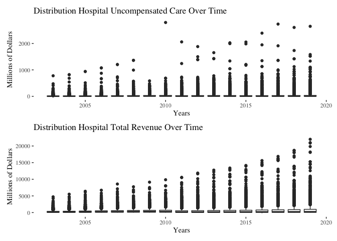
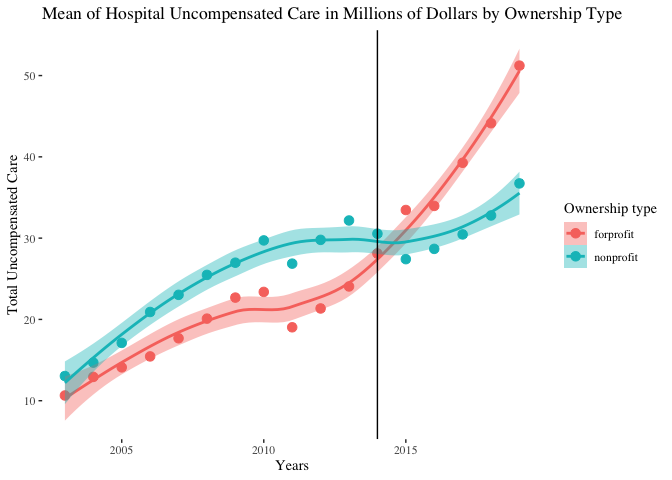

Assigment 1
================

## Downloading the Raw Data

We start by downloading and processing the
[HCRIS](https://github.com/Nixoncandiales/Econ771/tree/main/Assigments/AS%201/Code/HCRIS),
[POS](https://github.com/Nixoncandiales/Econ771/tree/main/Assigments/AS%201/Code/POS),
and
[ACA](https://github.com/Nixoncandiales/Econ771/tree/main/Assigments/AS%201/Code/ACA)
raw data sets. The processed data sets are located in the
[**Output**]((https://github.com/Nixoncandiales/Econ771/tree/main/Assigments/AS%201/Output))
folder under `HCRIS_Data.txt`, `pos_lastyear.v12.dta`, and
`acs_medicare.txt` . We import those data sets in our file and inspect
them as follows.

``` r
ds_screener(data_hcris)
```

    -----------------------------------------------------------------------------------
    |        Column Name         |  Data Type  |  Levels  |  Missing  |  Missing (%)  |
    -----------------------------------------------------------------------------------
    |      provider_number       |   integer   |    NA    |     0     |       0       |
    |          fy_start          |  character  |    NA    |     0     |       0       |
    |           fy_end           |  character  |    NA    |     0     |       0       |
    |       date_processed       |  character  |    NA    |     0     |       0       |
    |        date_created        |  character  |    NA    |     0     |       0       |
    |            beds            |   integer   |    NA    |   2060    |     1.45      |
    |        tot_charges         |   numeric   |    NA    |   5701    |       4       |
    |       tot_discounts        |   numeric   |    NA    |   7961    |     5.59      |
    |     tot_operating_exp      |   numeric   |    NA    |   2686    |     1.88      |
    |         ip_charges         |   numeric   |    NA    |   6283    |     4.41      |
    |        icu_charges         |   numeric   |    NA    |   66719   |     46.82     |
    |     ancillary_charges      |   numeric   |    NA    |   12677   |      8.9      |
    |       tot_discharges       |   numeric   |    NA    |   2300    |     1.61      |
    |      mcare_discharges      |   numeric   |    NA    |   3002    |     2.11      |
    |      mcaid_discharges      |   numeric   |    NA    |   17059   |     11.97     |
    |     tot_mcare_payment      |   numeric   |    NA    |   55548   |     38.98     |
    |  secondary_mcare_payment   |   numeric   |    NA    |   78080   |     54.79     |
    |           street           |  character  |    NA    |    713    |      0.5      |
    |            city            |  character  |    NA    |    286    |      0.2      |
    |           state            |  character  |    NA    |    284    |      0.2      |
    |            zip             |  character  |    NA    |    320    |     0.22      |
    |           county           |  character  |    NA    |   6756    |     4.74      |
    |        uncomp_care         |   numeric   |    NA    |  121914   |     85.55     |
    |       cost_to_charge       |   numeric   |    NA    |   50563   |     35.48     |
    |        new_cap_ass         |   numeric   |    NA    |   25149   |     17.65     |
    |            cash            |   numeric   |    NA    |   10786   |     7.57      |
    |        tot_pat_rev         |   numeric   |    NA    |   5701    |       4       |
    |         allowance          |   numeric   |    NA    |   7961    |     5.59      |
    |        net_pat_rev         |   numeric   |    NA    |   5685    |     3.99      |
    |        hvbp_payment        |   numeric   |    NA    |  113346   |     79.54     |
    |        hrrp_payment        |   numeric   |    NA    |  116285   |     81.6      |
    |  tot_uncomp_care_charges   |   numeric   |    NA    |   95493   |     67.01     |
    |tot_uncomp_care_partial_pmts|   numeric   |    NA    |  117193   |     82.24     |
    |          bad_debt          |   numeric   |    NA    |   93693   |     65.75     |
    |            year            |   integer   |    NA    |     0     |       0       |
    |           source           |  character  |    NA    |     0     |       0       |
    -----------------------------------------------------------------------------------

     Overall Missing Values           1032204 
     Percentage of Missing Values     20.12 %
     Rows with Missing Values         142504 
     Columns With Missing Values      29 

After a quick screening of the HCRIS data we can see the missing values
are significantly high which suggest some variables are recorded
differently across time and forms. It is of particular interest the
variables `uncomp_care` and `tot_uncomp_care_charges` which are of our
main interest. After reviewing the codebook we confirmed in fact these
two variables are the same but coded different across forms.

``` r
ds_screener(data_pos)
```

    --------------------------------------------------------------------------------------------
    |  Column Name   |            Data Type             |  Levels  |  Missing  |  Missing (%)  |
    --------------------------------------------------------------------------------------------
    |       pn       |            character             |    NA    |     0     |       0       |
    |      name      |            character             |    NA    |     0     |       0       |
    |    address     |            character             |    NA    |     0     |       0       |
    |      city      |            character             |    NA    |     0     |       0       |
    |     state      |            character             |    NA    |     0     |       0       |
    |      zip       |             numeric              |    NA    |    270    |     2.13      |
    |      tel       |            character             |    NA    |     0     |       0       |
    |     active     |             numeric              |    NA    |     0     |       0       |
    |    termcode    |haven_labelled, vctrs_vctr, double|    NA    |     0     |       0       |
    |    termdate    |               Date               |    NA    |   7239    |     57.04     |
    |    partdate    |               Date               |    NA    |    65     |     0.51      |
    |    prev_pn     |            character             |    NA    |     0     |       0       |
    |    medaffil    |haven_labelled, vctrs_vctr, double|    NA    |   1348    |     10.62     |
    |  resprog_ada   |             numeric              |    NA    |    86     |     0.68      |
    |  resprog_ama   |             numeric              |    NA    |    86     |     0.68      |
    |  resprog_aoa   |             numeric              |    NA    |    86     |     0.68      |
    |  resprog_oth   |             numeric              |    NA    |    86     |     0.68      |
    |   residents    |             numeric              |    NA    |     0     |       0       |
    |   shortterm    |             numeric              |    NA    |     0     |       0       |
    |      cah       |             numeric              |    NA    |     0     |       0       |
    |provider_subtype|haven_labelled, vctrs_vctr, double|    NA    |   1071    |     8.44      |
    |  typ_control   |haven_labelled, vctrs_vctr, double|    NA    |   1345    |     10.6      |
    |   nonprofit    |             numeric              |    NA    |     0     |       0       |
    |   forprofit    |             numeric              |    NA    |     0     |       0       |
    |      govt      |             numeric              |    NA    |     0     |       0       |
    |    maryland    |             numeric              |    NA    |     0     |       0       |
    |    nonstate    |             numeric              |    NA    |     0     |       0       |
    |   urbancbsa    |             numeric              |    NA    |    466    |     3.67      |
    |    beds_tot    |             numeric              |    NA    |     0     |       0       |
    |   beds_cert    |             numeric              |    NA    |     0     |       0       |
    |    lastyear    |             numeric              |    NA    |     0     |       0       |
    --------------------------------------------------------------------------------------------

     Overall Missing Values           12148 
     Percentage of Missing Values     3.09 %
     Rows with Missing Values         7581 
     Columns With Missing Values      11 

From the provider of services data set we do not evidence missing data
problems. We can observe if a particular POS went out of the market by
either closing or merging and the respectively date of the event. It is
to note the identifier variable is `pn` which is recorded as a character
differs in the HCRIS data set `provider_number` which is coded as
numerical.

``` r
ds_screener(data_aca)
```

    ----------------------------------------------------------------------
    |  Column Name  |  Data Type  |  Levels  |  Missing  |  Missing (%)  |
    ----------------------------------------------------------------------
    |     State     |  character  |    NA    |     0     |       0       |
    |     year      |   integer   |    NA    |     0     |       0       |
    |   adult_pop   |   integer   |    NA    |     0     |       0       |
    | ins_employer  |   integer   |    NA    |     0     |       0       |
    |  ins_direct   |   integer   |    NA    |     0     |       0       |
    | ins_medicare  |   integer   |    NA    |     0     |       0       |
    | ins_medicaid  |   integer   |    NA    |     0     |       0       |
    |   uninsured   |   integer   |    NA    |     0     |       0       |
    |  expand_ever  |   logical   |    NA    |     8     |     1.92      |
    | date_adopted  |  character  |    NA    |    104    |      25       |
    |  expand_year  |   integer   |    NA    |    104    |      25       |
    |    expand     |   logical   |    NA    |     0     |       0       |
    ----------------------------------------------------------------------

     Overall Missing Values           216 
     Percentage of Missing Values     4.33 %
     Rows with Missing Values         104 
     Columns With Missing Values      3 

Finally, from the medicare data set we see the states that expanded the
mandate and the date of event. Also, it is to note that the state
identifier is not recorded in the same format across data sets.

## Merging the data

We start by left joining `HCRIS_data.txt` and `pos_lastyear.v12.dta`.
The key to merge these two data set is the indicator `pn`

``` r
#Merged the two data sets
df_1 <- data_hcris %>% #sum up the two variables uncompensated care variables
              filter(year >= 2003 & year <= 2019) %>%
              rowwise() %>% 
              mutate(hosp_rev = tot_pat_rev, 
                     unc_care = sum(tot_uncomp_care_charges,uncomp_care, na.rm=TRUE)) %>%
              mutate_at(c('unc_care'), ~na_if(., 0)) %>%
              select(pn=provider_number, year, unc_care, hosp_rev )  %>%
              filter(!(is.na(unc_care) & is.na(hosp_rev))) #discard the observations NA observation for both unc_care and hosp_rev
          
df_2 <- data_pos %>% #force pn as integer and discard those facilities that are not hospitals
              mutate_at('pn', as.integer) %>% 
              select(pn = pn, nonprofit, forprofit, active, state) %>% 
              mutate(own_typ = case_when(nonprofit == 0  & forprofit == 0  ~ 'other',
                                         nonprofit == 0  & forprofit == 1  ~ 'forprofit',
                                         nonprofit == 1  & forprofit == 0  ~ 'nonprofit')) #%>%
             # filter((own_typ == 'forprofit') | (own_typ == 'nonprofit' )) #only include in the analysis hospitals forprofit and nonprofit

df <- left_join(df_1, df_2, by='pn') %>%
              mutate_at('own_typ',  replace_na, 'other') %>%
              relocate(pn, year, state, own_typ) %>%
              filter(!(unc_care == 'NA')) # drop all observations not contain uncompensated care information
df
```

    ## # A tibble: 60,051 × 9
    ## # Rowwise: 
    ##       pn  year state own_typ unc_care   hosp_rev nonprofit forprofit active
    ##    <int> <int> <chr> <chr>      <dbl>      <dbl>     <dbl>     <dbl>  <dbl>
    ##  1 10001  2003 AL    other   41267219  532023593         0         0      1
    ##  2 10001  2004 AL    other   37413733  592438087         0         0      1
    ##  3 10001  2005 AL    other   37457443  657842984         0         0      1
    ##  4 10001  2006 AL    other   41670968  714123644         0         0      1
    ##  5 10001  2010 AL    other   90806676 1116894148         0         0      1
    ##  6 10001  2011 AL    other   22446946 1208331516         0         0      1
    ##  7 10001  2012 AL    other   25683016 1263055782         0         0      1
    ##  8 10001  2013 AL    other   23652954 1305720014         0         0      1
    ##  9 10001  2014 AL    other   24962490 1451185686         0         0      1
    ## 10 10001  2015 AL    other   20412518 1550672017         0         0      1
    ## # … with 60,041 more rows

``` r
df_3 <- data_aca %>% # crosswalk the states names to states abbreviations and drop Puerto Rico from the analysis
              filter(!(State=='Puerto Rico')) %>%
              mutate(state= encodefrom(., State, stcrosswalk, stname, stfips, stabbr)) %>%
              select(!State) %>%
              relocate(state) #make sure the ID variable has the same name on both data sets

df <- left_join(df, df_3, by=c('state', 'year')) %>% 
  relocate(pn, year, state, own_typ ,expand_ever, expand, expand_year, unc_care)

df #<- df %>% group_by(state) %>% mutate(expand_year=ifelse(is.na(expand_year),0,expand_year)) %>%
```

    # A tibble: 60,051 × 19
    # Rowwise: 
          pn  year state own_typ expand_ever expand expand…¹ unc_c…² hosp_…³ nonpr…⁴
       <int> <int> <chr> <chr>   <lgl>       <lgl>     <int>   <dbl>   <dbl>   <dbl>
     1 10001  2003 AL    other   NA          NA           NA  4.13e7  5.32e8       0
     2 10001  2004 AL    other   NA          NA           NA  3.74e7  5.92e8       0
     3 10001  2005 AL    other   NA          NA           NA  3.75e7  6.58e8       0
     4 10001  2006 AL    other   NA          NA           NA  4.17e7  7.14e8       0
     5 10001  2010 AL    other   NA          NA           NA  9.08e7  1.12e9       0
     6 10001  2011 AL    other   NA          NA           NA  2.24e7  1.21e9       0
     7 10001  2012 AL    other   FALSE       FALSE        NA  2.57e7  1.26e9       0
     8 10001  2013 AL    other   FALSE       FALSE        NA  2.37e7  1.31e9       0
     9 10001  2014 AL    other   FALSE       FALSE        NA  2.50e7  1.45e9       0
    10 10001  2015 AL    other   FALSE       FALSE        NA  2.04e7  1.55e9       0
    # … with 60,041 more rows, 9 more variables: forprofit <dbl>, active <dbl>,
    #   adult_pop <int>, ins_employer <int>, ins_direct <int>, ins_medicare <int>,
    #   ins_medicaid <int>, uninsured <int>, date_adopted <chr>, and abbreviated
    #   variable names ¹​expand_year, ²​unc_care, ³​hosp_rev, ⁴​nonprofit

``` r
   #fill(starts_with("exp"), .direction = "up") # Fill the NA for the years that do not appear in the aca data set.
```

## Summary Statistics

Provide and discuss a table of simple summary statistics showing the
mean, standard deviation, min, and max of hospital total revenues and
uncompensated care over time.

From the `HCRIS_data.txt` we select the variables `provider_number`,
`year`, `uncomp_care`, `tot_uncomp_care_charges`, `tot_pat_rev`. We
create a new variable that stores the uncompensated care records, then
we group by year and calculate the summary statistics as follows.

``` r
df_1 %>%
  group_by(year) %>%
  summarise_at(c('unc_care', 'hosp_rev'),list(mean = mean, sd = sd, min = min, max = max), na.rm=T) %>%
  knitr::kable()
```

| year | unc_care_mean | hosp_rev_mean | unc_care_sd | hosp_rev_sd | unc_care_min | hosp_rev_min | unc_care_max | hosp_rev_max |
|-----:|--------------:|--------------:|------------:|------------:|-------------:|-------------:|-------------:|-------------:|
| 2003 |      13557293 |     196326204 |    32036098 |   339256130 |      -128490 |     -1757898 |    777987403 |   4722758791 |
| 2004 |      15328897 |     217080321 |    36661491 |   379301539 |            1 |       154394 |    820253000 |   5525730727 |
| 2005 |      17409739 |     237498725 |    37813838 |   419216031 |            1 |            1 |    939134000 |   6398553843 |
| 2006 |      20958801 |     262155653 |    47151668 |   464190671 |     -2667140 |      -104189 |   1074625000 |   7784094716 |
| 2007 |      23563868 |     285967064 |    51279558 |   508039587 |            1 |        63650 |   1203374820 |   8577046126 |
| 2008 |      26429603 |     311240216 |    57062599 |   555733346 |            1 |            4 |   1361805561 |   9293788259 |
| 2009 |      27437058 |     341918436 |    46417931 |   613209280 |            1 |       119236 |    583975318 |   9846464732 |
| 2010 |      29887574 |     365195409 |    72408993 |   647958858 |            1 |       306861 |   2793923000 |   9857534601 |
| 2011 |      17394154 |     393805140 |    47222987 |   712227455 |    -28840406 |    -27582223 |   1111027264 |  10572291195 |
| 2012 |      18338225 |     417753037 |    55879179 |   765536407 |           85 |    -11799711 |   1371421445 |  11865320139 |
| 2013 |      19648564 |     446296883 |    57646114 |   833905151 |          216 |        94880 |   1403146636 |  12751708196 |
| 2014 |      19607345 |     478119813 |    63262016 |   905191126 |           15 |         6624 |   1874409188 |  13376352387 |
| 2015 |      19024979 |     517619678 |    61755917 |   970877276 |           22 |         9368 |   1990560423 |  14143533186 |
| 2016 |      19810030 |     562218133 |    66724247 |  1070376474 |           84 |   -177031923 |   2231833221 |  15618749067 |
| 2017 |      22135100 |     603003321 |    69491982 |  1167558591 |           34 |       124513 |   2062118188 |  16863431079 |
| 2018 |      24883218 |     651712556 |    74503094 |  1283839130 |            1 |       282914 |   2183167185 |  18677245214 |
| 2019 |      28705587 |     706457120 |    83757685 |  1419791246 |            2 |            3 |   2495183582 |  22000932119 |

``` r
df %>%
  ggplot(aes(x = year, y = unc_care, group=year)) + 
  geom_boxplot() + 
  theme_tufte() -> plot1

df %>%
  ggplot(aes(x = year, y = hosp_rev, group=year)) + 
  geom_boxplot() + 
  theme_tufte()  -> plot2

plot1 / plot2
```

<!-- -->

## By Ownership Type

Create a figure showing the mean hospital uncompensated care from 2000
to 2018. Show this trend separately by hospital ownership type (private
not for profit and private for profit).

``` r
df %>%
  filter(!(own_typ=='other')) %>%
  group_by(year, own_typ) %>%
  summarise_at(c('unc_care'), list(unc_care_mean = mean), na.rm=T) %>%
  ggplot(aes(x=year, y=unc_care_mean, color=own_typ)) +
  geom_point(size = 1) +
  geom_smooth(aes(fill = own_typ), size = 1) +
  theme_tufte() -> plot3

plot3
```

<!-- -->

## DiD identification strategy

Using a simple DD identification strategy, estimate the effect of
Medicaid expansion on hospital uncompensated care using a traditional
two-way fixed effects (TWFE) estimation: $$
y_{it} = \alpha_{i} + \gamma_{t} + \delta D_{it} + \varepsilon_{it},
$$ where $D_{it}=1(E_{i}\leq t)$ in Equation 1 is an indicator set to 1
when a hospital is in a state that expanded as of year $t$ or earlier,
$\gamma_{t}$ denotes time fixed effects, $\alpha_{i}$ denotes hospital
fixed effects, and $y_{it}$ denotes the hospital’s amount of
uncompensated care in year $t$. Present four estimates from this
estimation in a table: one based on the full sample (regardless of
treatment timing); one when limiting to the 2014 treatment group (with
never treated as the control group); one when limiting to the 2015
treatment group (with never treated as the control group); and one when
limiting to the 2016 treatment group (with never treated as the control
group). Briefly explain any differences.

``` r
#Create dummies for the control groups
df %>% 
  mutate(d = case_when(expand == TRUE ~ 1),
         d_14 = case_when(expand == TRUE & expand_year==2014 ~ 1),
         d_15 = case_when(expand == TRUE & expand_year==2015 ~ 1),
         d_16 = case_when(expand == TRUE & expand_year==2016 ~ 1)) %>%
  mutate(across(d:d_16, ~ifelse(is.na(.),0,.))) -> df
```

``` r
mod.twfe <- lapply(df %>%
                select(d:d_16), #Select the treatments 
              function(D) felm(unc_care ~ D | pn + year | 0 | pn, df)) #Apply the specification across the different treatments and store the results in a list
```

``` r
#Another Way of achiving the model
#prueba <- map(df %>%
#                   select(d:d_16),  # Select the treatments
#                function(D){
#                    felm(unc_care ~ D | pn + year | 0 | pn, df) #Apply the specification across the different treatments and store the results in a list
#                  })
stargazer(mod.twfe, type='text')
```


    ==========================================================================================================
                                                                Dependent variable:                           
                                     -------------------------------------------------------------------------
                                                                     unc_care                                 
                                            (1)                (2)                (3)               (4)       
    ----------------------------------------------------------------------------------------------------------
    D                                -23,096,830.000*** -21,408,743.000*** -9,234,499.000*** -9,195,354.000***
                                      (1,687,564.000)    (1,595,346.000)    (2,161,944.000)   (1,291,924.000) 
                                                                                                              
    ----------------------------------------------------------------------------------------------------------
    Observations                           60,051             60,051            60,051            60,051      
    R2                                     0.666              0.664              0.658             0.657      
    Adjusted R2                            0.631              0.629              0.622             0.621      
    Residual Std. Error (df = 54344)   36,627,710.000     36,717,923.000    37,071,210.000    37,080,506.000  
    ==========================================================================================================
    Note:                                                                          *p<0.1; **p<0.05; ***p<0.01

## Event Study

Estimate an “event study” version of the specification in part 3: $$
y_{it} = \alpha_{i} + \gamma_{t} +\sum_{\tau < -1} D_{it}^{\tau} \delta_{\tau} + \sum_{\tau>=0} D_{it}^{\tau} \delta_{\tau} + \varepsilon_{it},
$$ where $D_{it}^{\tau} = 1(t-E_{i}=\tau)$ in Equation 2 is essentially
an interaction between the treatment dummy and a relative time dummy. In
this notation and context, $\tau$ denotes years relative to Medicaid
expansion, so that $\tau=-1$ denotes the year before a state expanded
Medicaid, $\tau=0$ denotes the year of expansion, etc. Estimate with two
different samples: one based on the full sample and one based only on
those that expanded in 2014 (with never treated as the control group).

``` r
### Common treatment timing
reg.dat <- df %>%
  filter(expand_year==2014 | is.na(expand_year), !is.na(expand_ever)) %>%
  mutate(post = (year>=2014), 
         treat=post*expand_ever)

mod.esct <- feols(unc_care~i(year, expand_ever, ref=2013) | state + year,
                  cluster=~state,
                  data=reg.dat)
modelsummary(mod.esct, stars=TRUE)
```

|                           |       Model 1       |
|:--------------------------|:-------------------:|
| year = 2012 × expand_ever |     606656.346      |
|                           |    (736000.310)     |
| year = 2014 × expand_ever | -11349326.923\*\*\* |
|                           |    (2446929.315)    |
| year = 2015 × expand_ever | -19069190.299\*\*\* |
|                           |    (3970737.518)    |
| year = 2016 × expand_ever | -19880266.352\*\*\* |
|                           |    (4454306.467)    |
| year = 2017 × expand_ever | -25430092.505\*\*\* |
|                           |    (4920498.564)    |
| year = 2018 × expand_ever | -29970055.347\*\*\* |
|                           |    (6117436.578)    |
| year = 2019 × expand_ever | -36779385.801\*\*\* |
|                           |    (8672153.754)    |
| Num.Obs.                  |        27609        |
| AIC                       |      1075429.1      |
| BIC                       |      1075494.9      |
| RMSE                      |     69499579.25     |
| Std.Errors                |      by: state      |
| FE: state                 |          X          |
| FE: year                  |          X          |

**Note:** ^^ + p \< 0.1, \* p \< 0.05, \*\* p \< 0.01, \*\*\* p \< 0.001

``` r
coefplot(mod.esct)
```

<!-- -->

``` r
##### Diferential timgin treatment
reg.dat <- df %>% 
  filter(!is.na(expand_ever)) %>%
  mutate(post = (year>=2014), 
         treat = post*expand_ever,
         time_to_treat = ifelse(expand_ever==FALSE, 0, year-expand_year),
         time_to_treat = ifelse(time_to_treat < -3, -3, time_to_treat))
mod.esdt <- feols(unc_care~i(time_to_treat, expand_ever, ref=-1) | state + year,
                  cluster=~state,
                  data=reg.dat)
modelsummary(mod.esdt, stars=TRUE)
```

|                                  |       Model 1       |
|:---------------------------------|:-------------------:|
| time_to_treat = -3 × expand_ever |    8318789.135+     |
|                                  |    (4495101.309)    |
| time_to_treat = -2 × expand_ever |     1750614.982     |
|                                  |    (1082155.430)    |
| time_to_treat = 0 × expand_ever  | -8093928.948\*\*\*  |
|                                  |    (1868567.540)    |
| time_to_treat = 1 × expand_ever  | -15269115.759\*\*\* |
|                                  |    (2896167.821)    |
| time_to_treat = 2 × expand_ever  | -18338232.342\*\*\* |
|                                  |    (3331227.092)    |
| time_to_treat = 3 × expand_ever  | -22973987.114\*\*\* |
|                                  |    (4185561.817)    |
| time_to_treat = 4 × expand_ever  | -26807054.922\*\*\* |
|                                  |    (5447351.263)    |
| time_to_treat = 5 × expand_ever  | -32095680.197\*\*\* |
|                                  |    (7563320.491)    |
| Num.Obs.                         |        34994        |
| AIC                              |      1357301.7      |
| BIC                              |      1357377.9      |
| RMSE                             |     63984630.31     |
| Std.Errors                       |      by: state      |
| FE: state                        |          X          |
| FE: year                         |          X          |

**Note:** ^^ + p \< 0.1, \* p \< 0.05, \*\* p \< 0.01, \*\*\* p \< 0.001

``` r
coefplot(mod.esdt)
```

<!-- -->

## SA specification

Sun and Abraham (SA) show that the $\delta_{\tau}$ coefficients in
Equation 2 can be written as a non-convex average of all other
group-time specific average treatment effects. They propose an
interaction weighted specification: $$
y_{it} = \alpha_{i} + \gamma_{t} +\sum_{e} \sum_{\tau \neq -1} \left(D_{it}^{\tau} \times 1(E_{i}=e)\right) \delta_{e, \tau} + \varepsilon_{it}.
$$ Re-estimate your event study using the SA specification in Equation
3. Show your results for $\hat{\delta}_{e, \tau}$ in a Table, focusing
on states with $E_{i}=2014$, $E_{i}=2015$, and $E_{i}=2016$.

``` r
reg.dat <- df %>% 
  filter(!is.na(expand_ever)) %>%
  mutate(post = (year>=2014), 
         treat=post*expand_ever,
         expand_year = ifelse(expand_ever==FALSE, 10000, expand_year),
         time_to_treat = ifelse(expand_ever==FALSE, -1, year-expand_year),
         time_to_treat = ifelse(time_to_treat < -4, -4, time_to_treat))
mod.sa <- feols(unc_care~sunab(expand_year, time_to_treat) | state + year,
                  cluster=~state,
                  data=reg.dat)

modelsummary(mod.sa, stars=TRUE)
```

|                    |       Model 1       |
|:-------------------|:-------------------:|
| time_to_treat = -4 |     2254060.462     |
|                    |    (6440029.269)    |
| time_to_treat = -3 |    4972790.905\*    |
|                    |    (2390384.901)    |
| time_to_treat = -2 |     947629.295      |
|                    |    (752446.447)     |
| time_to_treat = 0  | -9422803.262\*\*\*  |
|                    |    (1946003.074)    |
| time_to_treat = 1  | -16182492.000\*\*\* |
|                    |    (3060068.477)    |
| time_to_treat = 2  | -17984421.175\*\*\* |
|                    |    (3544587.462)    |
| time_to_treat = 3  | -22859556.599\*\*\* |
|                    |    (4216211.688)    |
| time_to_treat = 4  | -26391688.844\*\*\* |
|                    |    (5479789.254)    |
| time_to_treat = 5  | -32194732.162\*\*\* |
|                    |    (7671172.406)    |
| Num.Obs.           |        34994        |
| AIC                |      1357309.8      |
| BIC                |      1357394.5      |
| RMSE               |     63990215.48     |
| Std.Errors         |      by: state      |
| FE: state          |          X          |
| FE: year           |          X          |

**Note:** ^^ + p \< 0.1, \* p \< 0.05, \*\* p \< 0.01, \*\*\* p \< 0.001

``` r
coefplot(mod.sa)
```

<!-- -->

## Event Study - SA specification

Present an event study graph based on the results in part 5. Hint: you
can do this automatically in `R` with the `fixest` package (using the
`sunab` syntax for interactions), or with `eventstudyinteract` in
`Stata`. These packages help to avoid mistakes compared to doing the
tables/figures manually and also help to get the standard errors
correct.

## Callaway and Sant’Anna Specification (CS)

Callaway and Sant’Anna (CS) offer a non-parametric solution that
effectively calculates a set of group-time specific differences,
$ATT(g,t)= E[y_{it}(g) - y_{it}(\infty) | G_{i}=g]$, where $g$ reflects
treatment timing and $t$ denotes time. They show that under the standard
DD assumptions of parallel trends and no anticipation,
$ATT(g,t) = E[y_{it} - y_{i, g-1} | G_{i}=g] - E[y_{it} - y_{i,g-1} | G_{i} = \infty]$,
so that $\hat{ATT}(g,t)$ is directly estimable from sample analogs. CS
also propose aggregations of $\hat{ATT}(g,t)$ to form an overall ATT or
a time-specific ATT (e.g., ATTs for $\tau$ periods before/after
treatment). With this framework in mind, provide an alternative event
study using the CS estimator. Hint: check out the `did` package in `R`
or the `csdid` package in `Stata`.

``` r
reg.dat <- df %>% 
  filter(!is.na(expand_ever)) %>%
  mutate(post = (year>=2014), 
         treat=post*expand_ever,
         expand_year=ifelse(is.na(expand_year),0,expand_year)) %>%
  filter(!is.na(unc_care)) %>%
  group_by(state) %>%
  mutate(stategroup=cur_group_id()) %>% ungroup()

mod.cs <- att_gt(yname="unc_care", tname="year", idname="stategroup",
                 gname="expand_year",
                 data=reg.dat, panel=TRUE, est_method="dr",
                 allow_unbalanced_panel=TRUE)
mod.cs.event <- aggte(mod.cs, type="dynamic")

mod.cs
```


    Call:
    att_gt(yname = "unc_care", tname = "year", idname = "stategroup", 
        gname = "expand_year", data = reg.dat, panel = TRUE, allow_unbalanced_panel = TRUE, 
        est_method = "dr")

    Reference: Callaway, Brantly and Pedro H.C. Sant'Anna.  "Difference-in-Differences with Multiple Time Periods." Journal of Econometrics, Vol. 225, No. 2, pp. 200-230, 2021. <https://doi.org/10.1016/j.jeconom.2020.12.001>, <https://arxiv.org/abs/1803.09015> 

    Group-Time Average Treatment Effects:
     Group Time     ATT(g,t) Std. Error [95% Simult.  Conf. Band]  
      2014 2013    -90972.84   689286.1      -1774684   1592738.4  
      2014 2014 -10565419.66  2376551.3     -16370594  -4760245.5 *
      2014 2015 -18015362.28  3783754.1     -27257895  -8772830.1 *
      2014 2016 -18966402.35  4505859.6     -29972813  -7959991.4 *
      2014 2017 -23793640.87  4735038.0     -35359863 -12227418.4 *
      2014 2018 -27356365.15  6058397.2     -42155142 -12557588.6 *
      2014 2019 -32733208.60  8317208.7     -53049558 -12416859.3 *
      2015 2013   -499823.23   612662.8      -1996368    996721.2  
      2015 2014  -5778021.58  1892126.1     -10399896  -1156147.1 *
      2015 2015  -5279304.60  2729197.8     -11945884   1387275.3  
      2015 2016  -8057629.56  2554238.2     -14296838  -1818421.6 *
      2015 2017 -14734710.84  2650581.0     -21209254  -8260167.3 *
      2015 2018 -19622906.49  3787787.1     -28875290 -10370522.9 *
      2015 2019 -24889412.85  6657040.0     -41150487  -8628338.4 *
      2016 2013   -771428.04   806951.7      -2742560   1199703.6  
      2016 2014  -1882337.81  2286246.8      -7466926   3702250.7  
      2016 2015  -3348845.54  1632761.9      -7337174    639483.1  
      2016 2016  -1278855.68  1054368.0      -3854348   1296636.9  
      2016 2017 -13955183.13  2941348.8     -21139982  -6770384.5 *
      2016 2018 -19010500.67  3586988.0     -27772395 -10248606.7 *
      2016 2019 -26163238.67  5834905.8     -40416095 -11910381.9 *
      2019 2013  -2776386.53   809537.9      -4753835   -798937.7 *
      2019 2014     86753.66  2619776.8      -6312545   6486052.2  
      2019 2015  -2683746.77  1559623.9      -6493422   1125928.6  
      2019 2016   3782299.68  2246519.5      -1705248   9269846.9  
      2019 2017  -2928346.03  1843680.8      -7431884   1575191.7  
      2019 2018    301040.99  3034676.5      -7111728   7713810.2  
      2019 2019 -14275606.53  3352652.5     -22465092  -6086121.1 *
    ---
    Signif. codes: `*' confidence band does not cover 0

    Control Group:  Never Treated,  Anticipation Periods:  0
    Estimation Method:  Doubly Robust

``` r
ggdid(mod.cs)
```

<!-- -->

``` r
mod.cs.event
```


    Call:
    aggte(MP = mod.cs, type = "dynamic")

    Reference: Callaway, Brantly and Pedro H.C. Sant'Anna.  "Difference-in-Differences with Multiple Time Periods." Journal of Econometrics, Vol. 225, No. 2, pp. 200-230, 2021. <https://doi.org/10.1016/j.jeconom.2020.12.001>, <https://arxiv.org/abs/1803.09015> 


    Overall summary of ATT's based on event-study/dynamic aggregation:  
           ATT    Std. Error     [ 95%  Conf. Int.]  
     -21427515       4610442  -30463815   -12391215 *


    Dynamic Effects:
     Event time     Estimate Std. Error [95% Simult.  Conf. Band]  
             -6  -2776386.53   836466.1      -4677784   -874989.5 *
             -5     86753.66  2766302.2      -6201413   6374920.7  
             -4  -2683746.77  1550261.6      -6207694    840200.7  
             -3   1505435.82  1996293.9      -3032402   6043273.3  
             -2  -1588691.05  1112253.1      -4116988    939605.9  
             -1   -761351.19   869360.6      -2737522   1214819.2  
              0  -9770975.56  2308703.8     -15018962  -4522989.5 *
              1 -16828063.64  3224418.3     -24157588  -9498538.8 *
              2 -18572437.41  4061360.1     -27804441  -9340434.3 *
              3 -23550734.39  4796797.1     -34454482 -12646986.6 *
              4 -27109669.92  6306754.8     -41445749 -12773590.7 *
              5 -32733208.60  8207629.2     -51390224 -14076193.0 *
    ---
    Signif. codes: `*' confidence band does not cover 0

    Control Group:  Never Treated,  Anticipation Periods:  0
    Estimation Method:  Doubly Robust

``` r
ggdid(mod.cs.event)
```

<!-- -->

``` r
#coefplot(mod.cs.event)
```

## Rambachan and Roth (RR)

Rambachan and Roth (RR) show that traditional tests of parallel
pre-trends may be underpowered, and they provide an alternative
estimator that essentially bounds the treatment effects by the size of
an assumed violation in parallel trends. One such bound RR propose is to
limit the post-treatment violation of parallel trends to be no worse
than some multiple of the pre-treatment violation of parallel trends.
Assuming linear trends, such a violation is reflected by
$$\Delta(\bar{M}) = \left\{ \delta : \forall t \geq 0, \lvert (\delta_{t+1} - \delta_{t}) - (\delta_{t} - \delta_{t-1}) \rvert \leq \bar{M} \times \max_{s<0} \lvert (\delta_{s+1} - \delta_{s}) - (\delta_{s} - \delta_{s-1}) \rvert \right\}.$$
Using the `HonestDiD` package in `R` or `Stata`, present a sensitivity
plot of your CS ATT estimates using $\bar{M} = \{0, 0.5, 1, 1.5, 2\}$.
Check out the GitHub repo [here](https://github.com/pedrohcgs/CS_RR) for
some help in combining the `HonestDiD` package with CS estimates.

## Discussion

Discuss your findings and compare estimates from different estimators
(e.g., are your results sensitive to different specifications or
estimators? Are your results sensitive to violation of parallel trends
assumptions?).

## Reflections

Reflect on this assignment. What did you find most challenging? What did
you find most surprising?
