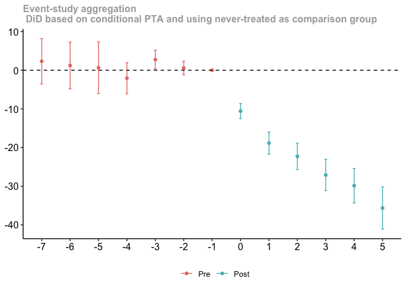
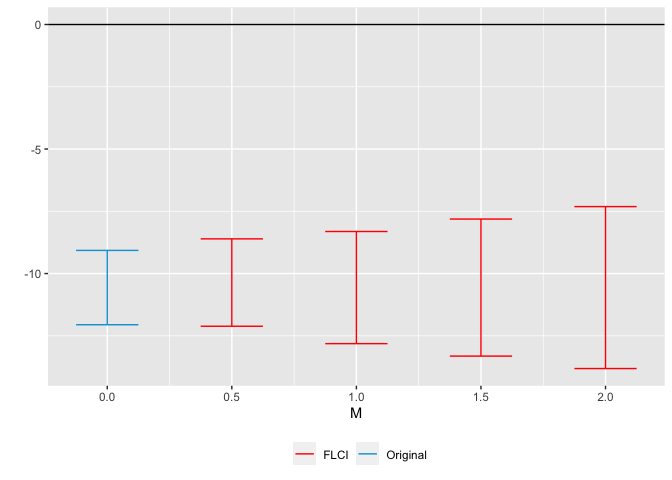
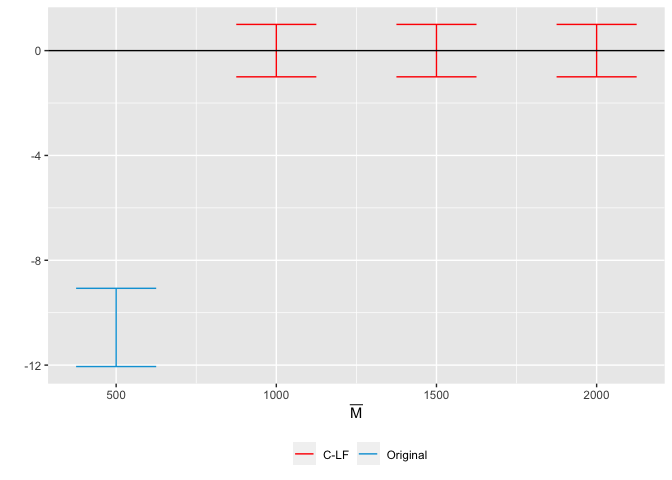

Assigment 1
================

## Downloading the Raw Data

We start by downloading and processing the
[HCRIS](https://github.com/Nixoncandiales/Econ771/tree/main/Assigments/AS%201/Code/HCRIS),
[POS](https://github.com/Nixoncandiales/Econ771/tree/main/Assigments/AS%201/Code/POS),
and
[ACA](https://github.com/Nixoncandiales/Econ771/tree/main/Assigments/AS%201/Code/ACA)
raw data sets. The processed data sets are located in the
[**Output**]((https://github.com/Nixoncandiales/Econ771/tree/main/Assigments/AS%201/Output))
folder under `HCRIS_Data.txt`, `pos_lastyear.v12.dta`, and
`acs_medicare.txt` . We import those data sets in our file and inspect
them as follows.

After a quick screening of the HCRIS data we can see the missing values
are significantly high which suggest some variables are recorded
differently across time and forms. It is of particular interest the
variables `uncomp_care` and `tot_uncomp_care_charges` which are of our
main interest. After reviewing the codebook we confirmed in fact these
two variables are the same but coded different across forms.

From the provider of services data set we do not evidence missing data
problems. We can observe if a particular POS went out of the market by
either closing or merging and the respectively date of the event. It is
to note the identifier variable is `pn` which is recorded as a character
differs in the HCRIS data set `provider_number` which is coded as
numerical.

Finally, from the medicare data set we see the states that expanded the
mandate and the date of event. Also, it is to note that the state
identifier is not recorded in the same format across data sets.

## Merging the data

We start by left joining `HCRIS_data.txt` and `pos_lastyear.v12.dta`.
The key to merge these two data set is the indicator `pn`

``` r
#Merged the two data sets
df_1 <- data_hcris %>% #sum up the two variables uncompensated care variables
              filter(year >= 2003 & year <= 2019) %>%
              rowwise() %>% 
              mutate(hosp_rev = tot_pat_rev/1000000,
                     tot_uncomp_care_partial_pmts = tot_uncomp_care_partial_pmts * - 1,
                     tot_unc_care_v2010 = sum(tot_uncomp_care_charges, tot_uncomp_care_partial_pmts, bad_debt, na.rm=TRUE), #Correct way to calculate UNC_CARE after 2010.
                     unc_care = sum(tot_unc_care_v2010 ,uncomp_care, na.rm=TRUE)/1000000) %>%
              mutate_at(c('unc_care'), ~na_if(., 0)) %>%
              select(pn=provider_number, year, unc_care, hosp_rev, state)  %>%
              filter(!(is.na(unc_care) & is.na(hosp_rev))) #discard the observations NA observation for both unc_care and hosp_rev
          
df_2 <- data_pos %>% #coherce PN as integer and discard those facilities that are not hospitals
              filter(year >= 2003) %>%
              mutate_at('pn', as.integer) %>% 
              select(pn = pn, nonprofit, forprofit, active, State=state, year) %>% 
              mutate(own_typ = case_when(nonprofit == 0  & forprofit == 0  ~ 'other',
                                         nonprofit == 0  & forprofit == 1  ~ 'forprofit',
                                         nonprofit == 1  & forprofit == 0  ~ 'nonprofit')) %>%
              distinct(pn, own_typ, State, year, active)


df <- left_join(df_1, df_2, by='pn', 'year') %>%
              filter(!(unc_care == 'NA')) %>% # drop all observations that don't contain uncompensated care information
              mutate(state= coalesce(State, state), year= year.x) %>%
              distinct(pn, state, year, own_typ, unc_care, hosp_rev)

df 
```

    # A tibble: 79,613 × 6
    # Rowwise: 
          pn unc_care hosp_rev state own_typ  year
       <int>    <dbl>    <dbl> <chr> <chr>   <int>
     1 10001     41.3     532. AL    other    2003
     2 10001     37.4     592. AL    other    2004
     3 10001     37.5     658. AL    other    2005
     4 10001     41.7     714. AL    other    2006
     5 10001     90.8    1117. AL    other    2010
     6 10001    109.     1208. AL    other    2011
     7 10001    119.     1263. AL    other    2012
     8 10001    116.     1306. AL    other    2013
     9 10001    129.     1451. AL    other    2014
    10 10001    111.     1551. AL    other    2015
    # … with 79,603 more rows

``` r
df_3 <- data_aca %>% # crosswalk the states names to states abbreviations and drop Puerto Rico from the analysis
              #filter(!(State=='Puerto Rico')) %>%
              mutate(state= encodefrom(., State, stcrosswalk, stname, stfips, stabbr)) %>%
              select(!State) %>%
              relocate(state) #make sure the ID variable has the same name on both data sets

df <- left_join(df,# %>% filter(!(state=="PR")), 
                df_3, by=c('state', 'year')) %>% # Filtering out PR since is not in df_3, to avoid future NA
  relocate(pn, year, state, own_typ ,expand_ever, expand, expand_year, unc_care)
```

## Summary Statistics

Provide and discuss a table of simple summary statistics showing the
mean, standard deviation, min, and max of hospital total revenues and
uncompensated care over time.

From the `HCRIS_data.txt` we select the variables `provider_number`,
`year`, `uncomp_care`, `tot_uncomp_care_charges`, `tot_pat_rev`. We
create a new variable that stores the uncompensated care records, then
we group by year and calculate the summary statistics as follows.

``` r
df %>%
    ungroup() %>%
    summarise_at(c("unc_care", "hosp_rev"), list(mean = mean, sd = sd, min = min,
        max = max), na.rm = TRUE) -> table1

df %>%
    group_by(year) %>%
    summarise_at(c("unc_care", "hosp_rev"), list(mean = mean, sd = sd, min = min,
        max = max), na.rm = T) %>%
    relocate(starts_with("unc"), starts_with("hosp")) -> table2

table1
```

    # A tibble: 1 × 8
      unc_care_mean hosp_rev_mean unc_care…¹ hosp_…² unc_c…³ hosp_…⁴ unc_c…⁵ hosp_…⁶
              <dbl>         <dbl>      <dbl>   <dbl>   <dbl>   <dbl>   <dbl>   <dbl>
    1          28.2          546.       124.    960.   -97.3   -177.  20406.  22001.
    # … with abbreviated variable names ¹​unc_care_sd, ²​hosp_rev_sd, ³​unc_care_min,
    #   ⁴​hosp_rev_min, ⁵​unc_care_max, ⁶​hosp_rev_max

``` r
table2
```

    # A tibble: 17 × 9
       unc_care_mean unc_c…¹ unc_ca…² unc_c…³ hosp_…⁴ hosp_…⁵ hosp_r…⁶ hosp_…⁷  year
               <dbl>   <dbl>    <dbl>   <dbl>   <dbl>   <dbl>    <dbl>   <dbl> <int>
     1          13.3    30.7 -1.28e-1    778.    284.    384.    1.66    4723.  2003
     2          15.2    37.5  1   e-6    820.    317.    430.    0.269   5526.  2004
     3          17.3    39.9  1   e-6    939.    365.    495.    1.14    6399.  2005
     4          20.5    49.1 -2.67e+0   1075.    416.    541.    1.33    6718.  2006
     5          22.9    52.3  1   e-6   1203.    462.    623.    0.988   8577.  2007
     6          25.8    58.6  1   e-6   1362.    492.    634.    0.969   7743.  2008
     7          26.5    44.9  1   e-6    584.    527.    688.    0.890   9139.  2009
     8          28.6    67.3  1   e-6   2794.    549.    749.    0.837   9858.  2010
     9          25.1    59.2 -5.43e+1   2060.    450.    744.  -27.6    10572.  2011
    10          28.0    67.7 -7.44e+0   1883.    473.    796.    0.850  11865.  2012
    11          30.1    68.9 -4.50e+0   1653.    507.    869.    0.952  12752.  2013
    12          30.3    74.0 -2.59e+1   2025.    545.    950.    1.09   13376.  2014
    13          28.6    71.7 -3.36e-2   2054.    589.   1013.    1.05   14144.  2015
    14          36.6   380.  -1.90e-2  20406.    641.   1119. -177.     15619.  2016
    15          32.1    84.5 -2.80e-2   2734.    689.   1221.    0.998  16863.  2017
    16          34.7    88.2 -6.41e-2   2606.    743.   1341.    1.07   18677.  2018
    17          38.6    97.9 -9.73e+1   2648.    814.   1488.    0.723  22001.  2019
    # … with abbreviated variable names ¹​unc_care_sd, ²​unc_care_min, ³​unc_care_max,
    #   ⁴​hosp_rev_mean, ⁵​hosp_rev_sd, ⁶​hosp_rev_min, ⁷​hosp_rev_max

``` r
df <- df %>%
    filter(!(pn == 151327 & year == 2016) & unc_care > 0)

df %>%
    ggplot(aes(x = year, y = unc_care, group = year)) + geom_boxplot() + theme_tufte() +
    labs(x = "Years", y = "Millions of Dollars", title = "Distribution Hospital Uncompensated Care Over Time") ->
        plot1

df %>%
    ggplot(aes(x = year, y = hosp_rev, group = year)) + geom_boxplot() + theme_tufte() +
    labs(x = "Years", y = "Millions of Dollars", title = "Distribution Hospital Total Revenue Over Time") ->
        plot2

plot <- plot1/plot2

plot
```

<!-- -->

## By Ownership Type

Create a figure showing the mean hospital uncompensated care from 2000
to 2018. Show this trend separately by hospital ownership type (private
not for profit and private for profit).

``` r
df %>%
  filter(!(own_typ=='other')) %>%
  group_by(year, own_typ) %>%
  summarise_at(c('unc_care'), list(unc_care_mean = mean), na.rm=T) %>%
  ggplot(aes(x=year, y=unc_care_mean, color=own_typ)) +
  geom_point(size = 3) +
  #geom_line(size = 1) +
  geom_smooth(aes(fill = own_typ), size = 1) +
  geom_vline( xintercept = 2014, color="black") +
  theme_tufte()+ 
  labs(x="Years", y="Total Uncompensated Care", 
       title = "Mean of Hospital Uncompensated Care in Millions of Dollars by Ownership Type", 
       fill = "Ownership type", color = "Ownership type") -> plot3
plot3
```

<!-- -->

## DiD identification strategy

Using a simple DD identification strategy, estimate the effect of
Medicaid expansion on hospital uncompensated care using a traditional
two-way fixed effects (TWFE) estimation: $$
y_{it} = \alpha_{i} + \gamma_{t} + \delta D_{it} + \varepsilon_{it},
$$ where $D_{it}=1(E_{i}\leq t)$ in Equation 1 is an indicator set to 1
when a hospital is in a state that expanded as of year $t$ or earlier,
$\gamma_{t}$ denotes time fixed effects, $\alpha_{i}$ denotes hospital
fixed effects, and $y_{it}$ denotes the hospital’s amount of
uncompensated care in year $t$. Present four estimates from this
estimation in a table: one based on the full sample (regardless of
treatment timing); one when limiting to the 2014 treatment group (with
never treated as the control group); one when limiting to the 2015
treatment group (with never treated as the control group); and one when
limiting to the 2016 treatment group (with never treated as the control
group). Briefly explain any differences.

``` r
 df %>% group_by(pn) %>% 
           fill(starts_with("exp"), .direction = "up")  %>%  # Fill the NA for the years that do not appear in the aca data set.
           mutate(expand_year=ifelse(is.na(expand_year),0,expand_year)) %>%
           mutate(expand_ever=ifelse(is.na(expand_ever),FALSE,expand_ever),
                  expand=ifelse(!is.na(expand),expand,FALSE)) %>%
           ungroup()%>%
           mutate(treatment_year = ifelse(expand_year<=2019, expand_year,0),
                  treated = ifelse(expand_year<=2019, expand_ever*1,0),
                  post = (year>=treatment_year & !(treatment_year==0) ),
                  D = treated*post,
                  D14 = ifelse(treatment_year<2014, 0, ifelse(treatment_year>2014, 999, treated*post)),
                  D15 = ifelse(treatment_year<2015, 0, ifelse(treatment_year>2015, 999, treated*post)),
                  D16 = ifelse(treatment_year<2016, 0, ifelse(treatment_year>2016, 999, treated*post)))-> df

 replace_with_na(df, list(D14=999,D15=999,D16=999)) -> df
```

``` r
mod.twfe <- lapply(df %>% 
                select(D:D16), #Select the treatments 
              function(Treatment) felm(unc_care ~ Treatment | pn + year | 0 | pn, df)) #Apply the specification across the different treatments and store the results in a list
stargazer(mod.twfe, type='text', note="1-4 representes D, D14,D15 and D16 respectevely")
```


    ===================================================================================================
                                                      Dependent variable:                              
                        -------------------------------------------------------------------------------
                                                           unc_care                                    
                                (1)                 (2)                 (3)                 (4)        
    ---------------------------------------------------------------------------------------------------
    Treatment               -28.363***          -31.518***          -12.173***          -12.153***     
                              (1.893)             (2.185)             (1.848)             (1.550)      
                                                                                                       
    ---------------------------------------------------------------------------------------------------
    Observations              79,557              69,824              74,768              77,624       
    R2                         0.699               0.708               0.690               0.691       
    Adjusted R2                0.675               0.684               0.666               0.667       
    Residual Std. Error 39.695 (df = 73725) 40.504 (df = 64631) 41.021 (df = 69253) 40.425 (df = 71920)
    ===================================================================================================
    Note:                                                                   *p<0.1; **p<0.05; ***p<0.01

    ===============================================
    1-4 representes D, D14,D15 and D16 respectevely
    -----------------------------------------------

## Event Study

Estimate an “event study” version of the specification in part 3: $$
y_{it} = \alpha_{i} + \gamma_{t} +\sum_{\tau < -1} D_{it}^{\tau} \delta_{\tau} + \sum_{\tau>=0} D_{it}^{\tau} \delta_{\tau} + \varepsilon_{it},
$$ where $D_{it}^{\tau} = 1(t-E_{i}=\tau)$ in Equation 2 is essentially
an interaction between the treatment dummy and a relative time dummy. In
this notation and context, $\tau$ denotes years relative to Medicaid
expansion, so that $\tau=-1$ denotes the year before a state expanded
Medicaid, $\tau=0$ denotes the year of expansion, etc. Estimate with two
different samples: one based on the full sample and one based only on
those that expanded in 2014 (with never treated as the control group).

``` r
### Common treatment timing
reg.dat <- df %>%
    filter(!is.na(D14))

mod.esct <- feols(unc_care ~ i(year, treated, ref = 2013) | pn + year, cluster = ~pn,
    data = reg.dat)
esttable(mod.esct)
```

                                    mod.esct
    Dependent Var.:                 unc_care
                                            
    treated x year = 2003   12.20*** (2.978)
    treated x year = 2004   14.05*** (2.840)
    treated x year = 2005   14.56*** (2.936)
    treated x year = 2006   16.85*** (3.294)
    treated x year = 2007   16.31*** (3.373)
    treated x year = 2008   14.23*** (3.324)
    treated x year = 2009   10.90*** (2.492)
    treated x year = 2010   8.781*** (2.309)
    treated x year = 2011    3.213** (1.033)
    treated x year = 2012     1.204 (0.7974)
    treated x year = 2014 -10.30*** (0.8919)
    treated x year = 2015  -19.52*** (1.331)
    treated x year = 2016  -22.62*** (1.438)
    treated x year = 2017  -27.46*** (1.700)
    treated x year = 2018  -30.32*** (1.838)
    treated x year = 2019  -34.99*** (2.191)
    Fixed-Effects:        ------------------
    pn                                   Yes
    year                                 Yes
    _____________________ __________________
    S.E.: Clustered                   by: pn
    Observations                      69,824
    R2                               0.71014
    Within R2                        0.04164
    ---
    Signif. codes: 0 '***' 0.001 '**' 0.01 '*' 0.05 '.' 0.1 ' ' 1

``` r
iplot(mod.esct)
```<!-- -->

```r
##### Differential timgin treatment
df %>%
    mutate(dif_timing = ifelse(expand_ever == FALSE, 0, ifelse(expand_year == 0,
        0, year - expand_year)), time_to_treat = ifelse(dif_timing < -7, -7, dif_timing)) %>%
    ungroup() -> df

mod.esdt <- feols(unc_care ~ i(time_to_treat, treated, ref = -1) | pn + year, cluster = ~pn,
    data = df)
esttable(mod.esdt)
```

                                           mod.esdt
    Dependent Var.:                        unc_care
                                                   
    treated x time_to_treat = -7   14.55*** (2.611)
    treated x time_to_treat = -6   12.29*** (2.547)
    treated x time_to_treat = -5   10.85*** (2.542)
    treated x time_to_treat = -4    5.346** (1.674)
    treated x time_to_treat = -3  3.606*** (0.8419)
    treated x time_to_treat = -2   1.750** (0.5480)
    treated x time_to_treat = 0  -9.201*** (0.6217)
    treated x time_to_treat = 1   -18.92*** (1.067)
    treated x time_to_treat = 2   -23.69*** (1.287)
    treated x time_to_treat = 3   -28.24*** (1.526)
    treated x time_to_treat = 4   -30.93*** (1.730)
    treated x time_to_treat = 5   -35.12*** (2.088)
    Fixed-Effects:               ------------------
    pn                                          Yes
    year                                        Yes
    ____________________________ __________________
    S.E.: Clustered                          by: pn
    Observations                             79,557
    R2                                      0.70219
    Within R2                               0.04102
    ---
    Signif. codes: 0 '***' 0.001 '**' 0.01 '*' 0.05 '.' 0.1 ' ' 1

``` r
iplot(mod.esdt)
```<!-- -->

## SA specification
Sun and Abraham (SA) show that the $\delta_{\tau}$ coefficients in Equation 2 can be written as a non-convex average of all other group-time specific average treatment effects. They propose an interaction weighted specification:
$$
y_{it} = \alpha_{i} + \gamma_{t} +\sum_{e} \sum_{\tau \neq -1} \left(D_{it}^{\tau} \times 1(E_{i}=e)\right) \delta_{e, \tau} + \varepsilon_{it}.
$$
Re-estimate your event study using the SA specification in Equation 3. Show your results for $\hat{\delta}_{e, \tau}$ in a Table, focusing on states with $E_{i}=2014$, $E_{i}=2015$, and $E_{i}=2016$.


```r
dat.reg <- df %>%
    mutate(treatment_year = ifelse(treatment_year < 2014 | treatment_year > 2016,
        10000, treatment_year), time_to_treat = ifelse(treated == 0, -1, year - treatment_year),
        time_to_treat = ifelse(time_to_treat < -7, -7, time_to_treat))

mod.sa <- feols(unc_care ~ sunab(treatment_year, time_to_treat) | pn + year, cluster = ~pn,
    data = dat.reg)

esttable(mod.sa)
```

                                   mod.sa
    Dependent Var.:              unc_care
                                         
    time_to_treat = -7   15.55*** (2.563)
    time_to_treat = -6   14.64*** (2.875)
    time_to_treat = -5   12.23*** (2.528)
    time_to_treat = -4   7.590*** (1.767)
    time_to_treat = -3  3.401*** (0.8954)
    time_to_treat = -2   1.638** (0.6336)
    time_to_treat = 0  -9.411*** (0.7227)
    time_to_treat = 1   -18.36*** (1.129)
    time_to_treat = 2   -22.20*** (1.280)
    time_to_treat = 3   -26.97*** (1.528)
    time_to_treat = 4   -29.78*** (1.729)
    time_to_treat = 5   -34.46*** (2.107)
    Fixed-Effects:     ------------------
    pn                                Yes
    year                              Yes
    __________________ __________________
    S.E.: Clustered                by: pn
    Observations                   79,557
    R2                            0.70238
    Within R2                     0.04163
    ---
    Signif. codes: 0 '***' 0.001 '**' 0.01 '*' 0.05 '.' 0.1 ' ' 1

## Event Study - SA specification

Present an event study graph based on the results in part 5. Hint: you
can do this automatically in `R` with the `fixest` package (using the
`sunab` syntax for interactions), or with `eventstudyinteract` in
`Stata`. These packages help to avoid mistakes compared to doing the
tables/figures manually and also help to get the standard errors
correct.

``` r
coefplot(mod.sa, main = "Effect of Medicaid Eaxpansion on Uncompensated Care")
```

<!-- -->

## Callaway and Sant’Anna Specification (CS)

Callaway and Sant’Anna (CS) offer a non-parametric solution that
effectively calculates a set of group-time specific differences,
$ATT(g,t)= E[y_{it}(g) - y_{it}(\infty) | G_{i}=g]$, where $g$ reflects
treatment timing and $t$ denotes time. They show that under the standard
DD assumptions of parallel trends and no anticipation,
$ATT(g,t) = E[y_{it} - y_{i, g-1} | G_{i}=g] - E[y_{it} - y_{i,g-1} | G_{i} = \infty]$,
so that $\hat{ATT}(g,t)$ is directly estimable from sample analogs. CS
also propose aggregations of $\hat{ATT}(g,t)$ to form an overall ATT or
a time-specific ATT (e.g., ATTs for $\tau$ periods before/after
treatment). With this framework in mind, provide an alternative event
study using the CS estimator. Hint: check out the `did` package in `R`
or the `csdid` package in `Stata`.

``` r
df %>%
    group_by(state) %>%
    mutate(state_id = cur_group_id()) %>%
    group_by(pn) %>%
    mutate(pn_id = cur_group_id()) %>%
    ungroup() %>%
    distinct(pn_id, year, .keep_all = TRUE) -> df

mod.cs <- att_gt(yname = "unc_care", tname = "year", idname = "pn_id", gname = "treatment_year",
    data = df, panel = TRUE, est_method = "dr", cband = TRUE, bstrap = TRUE, allow_unbalanced_panel = TRUE,
    base_period = "universal")

mod.cs.event <- aggte(mod.cs, type = "dynamic", min_e = -7, max_e = 6)
mod.cs
```


    Call:
    att_gt(yname = "unc_care", tname = "year", idname = "pn_id", 
        gname = "treatment_year", data = df, panel = TRUE, allow_unbalanced_panel = TRUE, 
        bstrap = TRUE, cband = TRUE, est_method = "dr", base_period = "universal")

    Reference: Callaway, Brantly and Pedro H.C. Sant'Anna.  "Difference-in-Differences with Multiple Time Periods." Journal of Econometrics, Vol. 225, No. 2, pp. 200-230, 2021. <https://doi.org/10.1016/j.jeconom.2020.12.001>, <https://arxiv.org/abs/1803.09015> 

    Group-Time Average Treatment Effects:
     Group Time ATT(g,t) Std. Error [95% Simult.  Conf. Band]  
      2014 2003   5.6192     2.3748       -1.5204     12.7588  
      2014 2004   5.7112     2.2744       -1.1267     12.5491  
      2014 2005   5.3735     2.5304       -2.2340     12.9811  
      2014 2006   5.9217     2.6845       -2.1490     13.9924  
      2014 2007   3.0297     2.4494       -4.3342     10.3937  
      2014 2008   1.6383     2.6986       -6.4749      9.7514  
      2014 2009  -2.0672     2.0257       -8.1573      4.0229  
      2014 2010  -3.3648     1.9913       -9.3516      2.6220  
      2014 2011   2.5299     1.0865       -0.7367      5.7965  
      2014 2012   0.0899     0.9390       -2.7333      2.9130  
      2014 2013   0.0000         NA            NA          NA  
      2014 2014 -11.4463     0.9603      -14.3334     -8.5592 *
      2014 2015 -20.2496     1.3186      -24.2140    -16.2853 *
      2014 2016 -23.0160     1.4377      -27.3385    -18.6935 *
      2014 2017 -27.6878     1.6332      -32.5979    -22.7776 *
      2014 2018 -30.4916     1.7748      -35.8275    -25.1557 *
      2014 2019 -35.6393     2.0044      -41.6655    -29.6130 *
      2015 2003   9.5808     3.1597        0.0812     19.0803 *
      2015 2004   9.4442     3.5567       -1.2489     20.1373  
      2015 2005   8.1753     3.3486       -1.8921     18.2426  
      2015 2006   5.6449     3.5828       -5.1267     16.4166  
      2015 2007   2.8146     3.4043       -7.4204     13.0495  
      2015 2008  -0.3988     3.6758      -11.4500     10.6524  
      2015 2009   0.6050     3.3570       -9.4878     10.6978  
      2015 2010  16.8458    22.3885      -50.4641     84.1556  
      2015 2011   4.9246     1.8282       -0.5719     10.4212  
      2015 2012   5.6749     1.2511        1.9135      9.4363 *
      2015 2013   5.1918     1.2819        1.3378      9.0458 *
      2015 2014   0.0000         NA            NA          NA  
      2015 2015  -6.0852     1.7157      -11.2434     -0.9271 *
      2015 2016 -10.1573     1.4946      -14.6509     -5.6638 *
      2015 2017 -17.0134     1.8132      -22.4648    -11.5621 *
      2015 2018 -21.3070     1.9444      -27.1528    -15.4612 *
      2015 2019 -25.4598     2.1351      -31.8789    -19.0407 *
      2016 2003  29.1577     4.9266       14.3460     43.9693 *
      2016 2004  21.5291     4.2438        8.7703     34.2879 *
      2016 2005  19.7231     6.0808        1.4413     38.0049 *
      2016 2006  12.7556     3.5898        1.9632     23.5481 *
      2016 2007  10.8258     3.3535        0.7436     20.9080 *
      2016 2008   6.1267     3.6347       -4.8010     17.0543  
      2016 2009   2.9957     4.0084       -9.0553     15.0468  
      2016 2010   2.4761     3.8344       -9.0519     14.0042  
      2016 2011   8.9162     2.5752        1.1741     16.6582 *
      2016 2012   3.5341     2.4687       -3.8880     10.9562  
      2016 2013   3.0857     2.3064       -3.8483     10.0197  
      2016 2014   1.2187     1.4717       -3.2058      5.6432  
      2016 2015   0.0000         NA            NA          NA  
      2016 2016  -4.4206     1.0270       -7.5084     -1.3329 *
      2016 2017 -17.2194     1.9219      -22.9976    -11.4413 *
      2016 2018 -22.6046     1.9710      -28.5303    -16.6789 *
      2016 2019 -29.9560     2.1605      -36.4513    -23.4607 *
      2019 2003   3.7922     7.6009      -19.0595     26.6438  
      2019 2004   3.5795     7.5242      -19.0416     26.2006  
      2019 2005   3.8811     7.4048      -18.3811     26.1433  
      2019 2006   2.0881     8.0389      -22.0805     26.2566  
      2019 2007  13.4554    16.7821      -36.9992     63.9100  
      2019 2008   2.4852     8.0364      -21.6759     26.6464  
      2019 2009   1.4213     7.6349      -21.5326     24.3752  
      2019 2010  -5.4836     7.5658      -28.2298     17.2626  
      2019 2011  -2.5689     7.0067      -23.6343     18.4965  
      2019 2012  -3.8833     6.7461      -24.1652     16.3985  
      2019 2013  -6.0175     6.6563      -26.0293     13.9943  
      2019 2014  -5.0336     6.6862      -25.1353     15.0682  
      2019 2015  -5.2270     6.2649      -24.0621     13.6081  
      2019 2016  -0.8489     1.8175       -6.3130      4.6152  
      2019 2017  -3.4290     1.4770       -7.8696      1.0116  
      2019 2018   0.0000         NA            NA          NA  
      2019 2019 -15.5440     1.4904      -20.0248    -11.0632 *
    ---
    Signif. codes: `*' confidence band does not cover 0

    P-value for pre-test of parallel trends assumption:  0
    Control Group:  Never Treated,  Anticipation Periods:  0
    Estimation Method:  Doubly Robust

``` r
mod.cs.event
```


    Call:
    aggte(MP = mod.cs, type = "dynamic", min_e = -7, max_e = 6)

    Reference: Callaway, Brantly and Pedro H.C. Sant'Anna.  "Difference-in-Differences with Multiple Time Periods." Journal of Econometrics, Vol. 225, No. 2, pp. 200-230, 2021. <https://doi.org/10.1016/j.jeconom.2020.12.001>, <https://arxiv.org/abs/1803.09015> 


    Overall summary of ATT's based on event-study/dynamic aggregation:  
         ATT    Std. Error     [ 95%  Conf. Int.]  
     -24.047        1.2696   -26.5353    -21.5587 *


    Dynamic Effects:
     Event time Estimate Std. Error [95% Simult.  Conf. Band]  
             -7   2.3326     2.2613       -3.5347      8.1998  
             -6   1.2350     2.3362       -4.8267      7.2966  
             -5   0.6533     2.5749       -6.0276      7.3343  
             -4  -2.0599     1.5491       -6.0792      1.9594  
             -3   2.7693     0.9440        0.3200      5.2186 *
             -2   0.5810     0.6802       -1.1839      2.3460  
             -1   0.0000         NA            NA          NA  
              0 -10.5624     0.7534      -12.5174     -8.6075 *
              1 -18.8515     1.1026      -21.7125    -15.9906 *
              2 -22.2806     1.3049      -25.6663    -18.8949 *
              3 -27.0931     1.5576      -31.1346    -23.0516 *
              4 -29.8550     1.7213      -34.3212    -25.3888 *
              5 -35.6393     2.1080      -41.1089    -30.1696 *
    ---
    Signif. codes: `*' confidence band does not cover 0

    Control Group:  Never Treated,  Anticipation Periods:  0
    Estimation Method:  Doubly Robust

``` r
ggdid(mod.cs)
```

<!-- -->

``` r
ggdid(mod.cs.event, title = "Event-study aggregation \n DiD based on conditional PTA and using never-treated as comparison group")
```

<!-- -->

## Rambachan and Roth (RR)

Rambachan and Roth (RR) show that traditional tests of parallel
pre-trends may be underpowered, and they provide an alternative
estimator that essentially bounds the treatment effects by the size of
an assumed violation in parallel trends. One such bound RR propose is to
limit the post-treatment violation of parallel trends to be no worse
than some multiple of the pre-treatment violation of parallel trends.
Assuming linear trends, such a violation is reflected by

$$ 
\Delta(\bar{M}) = { \delta : \forall t \geq 0, \lvert (\delta_{t+1} - \delta_{t}) - (\delta_{t} - \delta_{t-1}) \rvert \leq \bar{M} \times \max_{s<0} \lvert (\delta_{s+1} - \delta_{s}) - (\delta_{s} - \delta_{s-1}) \rvert }.
$$

Using the `HonestDiD` package in `R` or `Stata`, present a sensitivity
plot of your CS ATT estimates using $\bar{M} = \{0, 0.5, 1, 1.5, 2\}$.
Check out the GitHub repo [here](https://github.com/pedrohcgs/CS_RR) for
some help in combining the `HonestDiD` package with CS estimates. 1

``` r
hd_cs_smooth_never <- honest_did(mod.cs.event, type = "smoothness", Mvec = c(0.5,
    1, 1.5, 2))
hd_cs_smooth_never
```

    $robust_ci
    # A tibble: 4 × 5
         lb    ub method Delta       M
      <dbl> <dbl> <chr>  <chr>   <dbl>
    1 -12.1 -8.61 FLCI   DeltaSD   0.5
    2 -12.8 -8.31 FLCI   DeltaSD   1  
    3 -13.3 -7.81 FLCI   DeltaSD   1.5
    4 -13.8 -7.31 FLCI   DeltaSD   2  

    $orig_ci
    # A tibble: 1 × 4
      lb[,1] ub[,1] method   Delta
       <dbl>  <dbl> <chr>    <lgl>
    1  -12.1  -9.07 Original NA   

    $type
    [1] "smoothness"

``` r
hd_cs_rm_never <- honest_did(mod.cs.event, type = "relative_magnitude", Mbarvec = c(500,
    1000, 1500, 2000))
hd_cs_rm_never
```

    $robust_ci
    # A tibble: 4 × 5
         lb    ub method Delta    Mbar
      <dbl> <dbl> <chr>  <chr>   <dbl>
    1    -1     1 C-LF   DeltaRM   500
    2    -1     1 C-LF   DeltaRM  1000
    3    -1     1 C-LF   DeltaRM  1500
    4    -1     1 C-LF   DeltaRM  2000

    $orig_ci
    # A tibble: 1 × 4
      lb[,1] ub[,1] method   Delta
       <dbl>  <dbl> <chr>    <lgl>
    1  -12.1  -9.07 Original NA   

    $type
    [1] "relative_magnitude"

``` r
hd_cs_rm_never$robust_ci <- hd_cs_rm_never$robust_ci[-1, ]

cs_HDiD_smooth <- createSensitivityPlot(hd_cs_smooth_never$robust_ci, hd_cs_smooth_never$orig_ci)
cs_HDiD_relmag <- createSensitivityPlot_relativeMagnitudes(hd_cs_rm_never$robust_ci,
    hd_cs_rm_never$orig_ci)
```

``` r
cs_HDiD_smooth
```

<!-- -->

``` r
cs_HDiD_relmag
```

<!-- -->

## Discussion

Discuss your findings and compare estimates from different estimators
(e.g., are your results sensitive to different specifications or
estimators? Are your results sensitive to violation of parallel trends
assumptions?).

## Reflections

Reflect on this assignment. What did you find most challenging? What did
you find most surprising?
