```{r setup, include=FALSE}
knitr::opts_chunk$set(echo = FALSE)
```

## Motivation

> -   Examine the dynamics of firm interaction with consumers on the Medicare Part D prescription drug insurance exchange.

> -   Part D program receives government subsidies \~ \$40 billion annually and covers + 24 million people.

> -   Medicare Part D established a marketplace in which firms compete to provide prescription drug insurance plans, a competitive insurance exchange.

> -   Premium growth in recent years has outpaced growth in drug cost.

## Motivation

-   Strategic firm responses to \textcolor{blue}{inertia} can explain this pattern.

## Research Question

**How do firms interact with consumers on an insurance exchange (Stand-Alone Prescription Drug Plans) in the presence of inertia?**

> -   **Theory:** firm pricing when individuals are subject to switching frictions.

> -   Test for inertia:
>     -   Data from 2006 trough 2010 showing evidence of inertia on Stand-Alone PDPs. **past prices predict market share**. (\~ 48% of the market)
>
>     -   **Regression discontinuity** design to test for inertia among LIS recipients. (\~ 52% of the market falls into Low-Income Subsidy Program)

> -   Tests the predictions of the theory for firm pricing.

## Contribution

> -   Shows evidence of "Invest-then-Harvest" pricing behavior in Medicare Part D.

> -   In the presence of switching frictions initial defaults have lasting effects in the Medicare Part D prescription drug insurance exchange.

## Preview of Findings

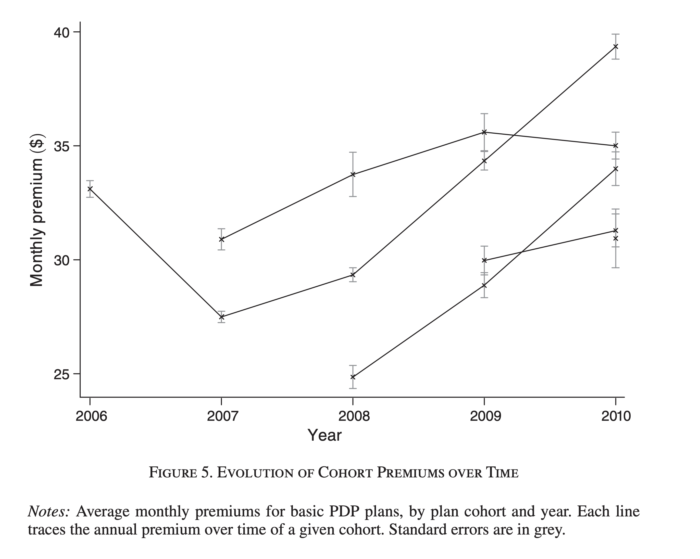

## Preview of Findings

-   Since firms cannot commit to future prices, they should respond to inertia by raising prices on existing enrollees, while introducing cheaper alternative plans.
-   Older plans in this market are about 10% more expensive than comparable newly introduced plans.

## Theory: Individual Choice

> -   Switching frictions $\implies$ inertia in individual's choice of plan.

> -   Individuals are more sensitive to price during initial enrollment than in later periods.

> -   Assume optimal choice at initial enrollment.

> -   Switching occurs if the gain outweighs friction: $F(\Delta U)$.

> -   two sources of inertia:
>     -   switching costs $\rightarrow$ reduce welfare. (learning new rules, paperwork)
>     -   physicological frictions $\nrightarrow$ reduce welfare. (Procrastination, Forget to switch)

## Theory: Individual Choice

**The inaction leads to take the default option set up by policymakers.**

::: columns
::: {.column width="50%"}
### Stand-Alone PDPs

> -   stay in the same plan from year-to-year regardless of firm price changes.
:::

::: {.column width="50%"}
### LIS

> -   defaulted into plans selected at random from the set of plans below a price benchmark.
:::
:::

## Theory: Firm Responses

> -   Farrell and Klemperer (2007): If consumers display inertia in choice, firms will rationally respond by setting prices following two motives:

> -   Investment $\rightarrow$ acquire market share for the future.

> -   Harvesting $\rightarrow$ maximize profits in the current period on new and existing consumers.

## Theory: Firm Responses

-   Farrell and Klemperer (2007), If consumers display inertia in choice firms will rationally respond by setting prices.

-   Investment $\rightarrow$ acquire market share for the future.

-   Harvesting $\rightarrow$ maximize profits in the current period on new and existing consumers.

Expected behavior: "bargains-then-profits" pattern. Products initially sold at low (even below marginal) cost. $\Rightarrow$ jack up the prices in later periods.

## Market Regulations

> -   Insurers must issue a policy to anyone who request it.

> -   Charge all enrollees same price for a given plan.

> -   Risk adjustment, transfer for enrollees with higher expected costs $\Rightarrow$ individuals do not vary in cost by age.

> -   Form of the insurance contract is fixed \~ basic plans.

> -   Firms offer policies for one period. No commitment to future premiums levels.

## Model

Firms seek to maximize the expected discounted present value of profits $V_{jt}$

$$ \max_{p_{jt}} V_{j t}=\left(p_{j t}-c_{j t}\right) s_{j t}+\delta V_{j t+1}\left(s_{j t}\right) $$

-   Value of the firm is given by flow profits and future profits in the recursive equation

-   firms are infinitely lived with discount factor $\delta$.

## Model

Firms seek to maximize the expected discounted present value of profits $V_{jt}$

$$
\max_{p_{jt}} \textcolor{blue}{V_{j t}} =\left(p_{j t}-c_{j t}\right) s_{j t}+\delta V_{j t+1}\left(s_{j t}\right)
$$

> -   $\textcolor{blue}{V_{j t}} \Rightarrow$ Value of the firm $j$ at time $t$

## Model

Firms seek to maximize the expected discounted present value of profits $V_{jt}$

$$
\max_{p_{jt}} V_{j t} =\left(\textcolor{blue}{p_{j t}}-c_{j t}\right) s_{j t}+\delta V_{j t+1}\left(s_{j t}\right)
$$

> -   $\textcolor{blue}{p_{j t}} \Rightarrow$ Price of firm's $j$ plan at time $t$

## Model

Firms seek to maximize the expected discounted present value of profits $V_{jt}$

$$
\max_{p_{jt}} V_{j t} =\left(p_{j t}-\textcolor{blue}{c_{j t}}\right) s_{j t}+\delta V_{j t+1}\left(s_{j t}\right)
$$

> -   $\textcolor{blue}{c_{j t}} \Rightarrow$ Expected cost of enrollee, net of risk adjustment, of firm's $j$ at time $t$

## Model

Firms seek to maximize the expected discounted present value of profits $V_{jt}$

$$
\max_{p_{jt}} V_{j t} =\left(p_{j t}-c_{j t}\right) \textcolor{blue}{s_{j t}}+\delta V_{j t+1}\left(\textcolor{blue}{s_{j t}}\right)
$$

::: incremental
-   $\textcolor{blue}{s_{j t}} \Rightarrow$ Quantity sold, function of current and past market share, of firm's $j$ at time $t$
:::

## First-Oder Condition for Optimal Pricing

> $$
> p_{j t}-c_{j t}=\frac{s_{j t}}{-d s_{j t} / d p_{j t}}-\delta \frac{d V_{j t+1}\left(s_{j t}\right)}{d s_{j t}}
> $$

::: incremental
-   $d s_{j t} / d p_{j t} \Rightarrow$ firm's demand curve, which is the sum of three types of individual's demand

::: columns
::: {.column width="33%"}
(I) Potential repeated costumers
:::

::: {.column width="33%"}
(II) Potential switchers from other plans
:::

::: {.column width="33%"}
(III) New enrollees entering the market
:::
:::

. . .

> -   Potential repeated costumers likely have relatively inelastic demand. Thus, older plans will face more inelastic demand and optimally set higher prices than newer plans.
:::

## Data

::: columns
::: {.column width="50%"}
::: incremental
-   CMS on plan premiums, characteristics, and aggregate enrollment

-   PDP on premiums and characteristics for each year from 2006 - 2010

    -   2464 plans into cohorts based on first offered year.

    -   Enrollment available from July 1 of the year.
:::
:::

::: {.column width="50%"}
::: incremental
-   Observables:

    -   premium, deductible, benefit type.

    -   firm and plan name

-   Example

    -   In 2006 Humana offered the *Humana PDP Complete* plan for \$767 per year in Ohio and \$575 in New York.

-   Variation:

    -   Premiums for basic plans
:::
:::
:::

## Data

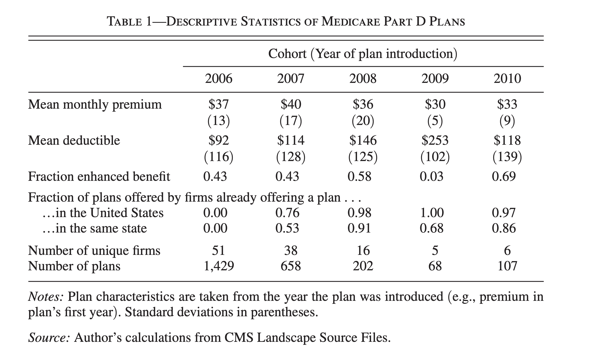

## Data

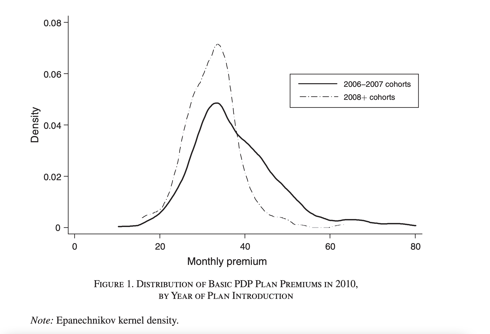

## Data

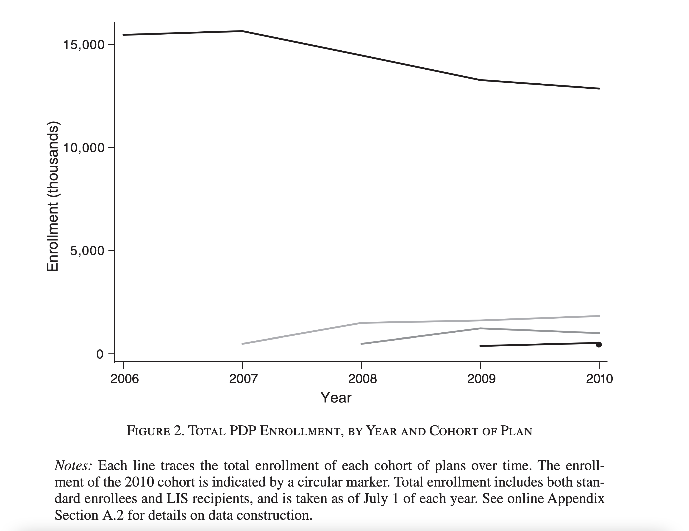

## Identification: First half of the market {.build}

$$
\ln s_{j t m}=x_{j t m} \beta_1+\alpha_1 p_{j t m}+x_{j t-1 m} \beta_2+\alpha_2 p_{j t-1 m}+v_{t m},
$$

::: incremental
-   $\ln s_{jtm} \Rightarrow$ is plan j's log market share in market m at time t.

-   $p_{jtm} \Rightarrow$ plan's premium.

-   $x_{jtm} \Rightarrow$ observed characteristics.

-   $v_{tm} \Rightarrow$ State fixed effects.

    . . .
:::

Inertia predicts: $\alpha_2 < 0$. Higher past prices induce lower enrollment, which persists into later periods.

## Identification: First half of the market

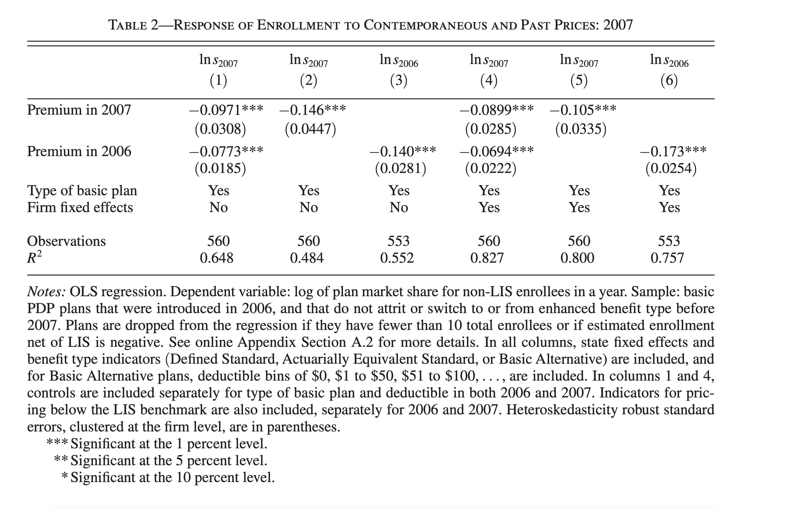

## Identification: Low-Income Subsidy Inertia

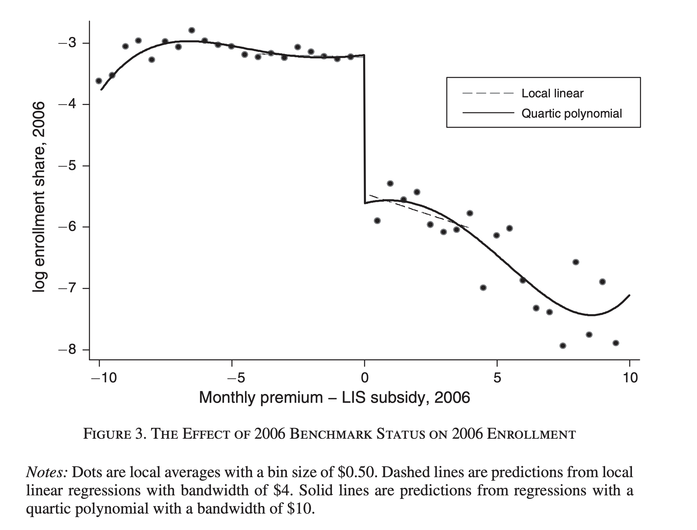

## Identification: Low-Income Subsidy Inertia

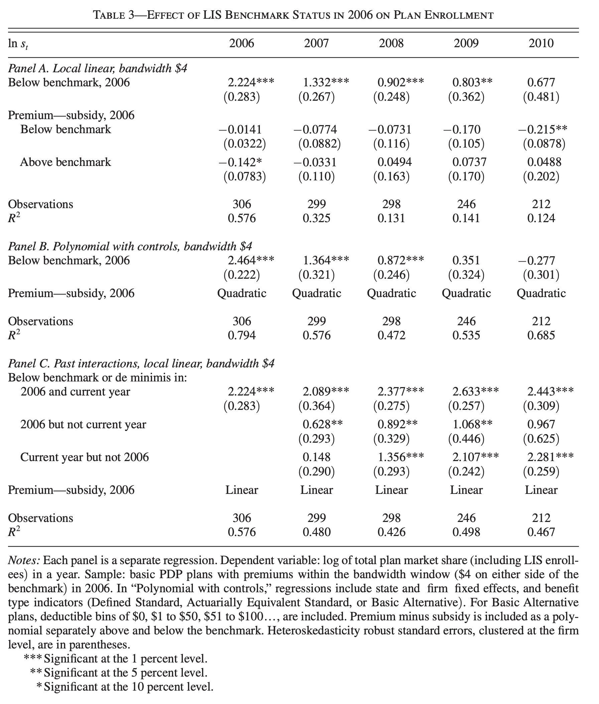

## Identification: Low-Income Subsidy Inertia

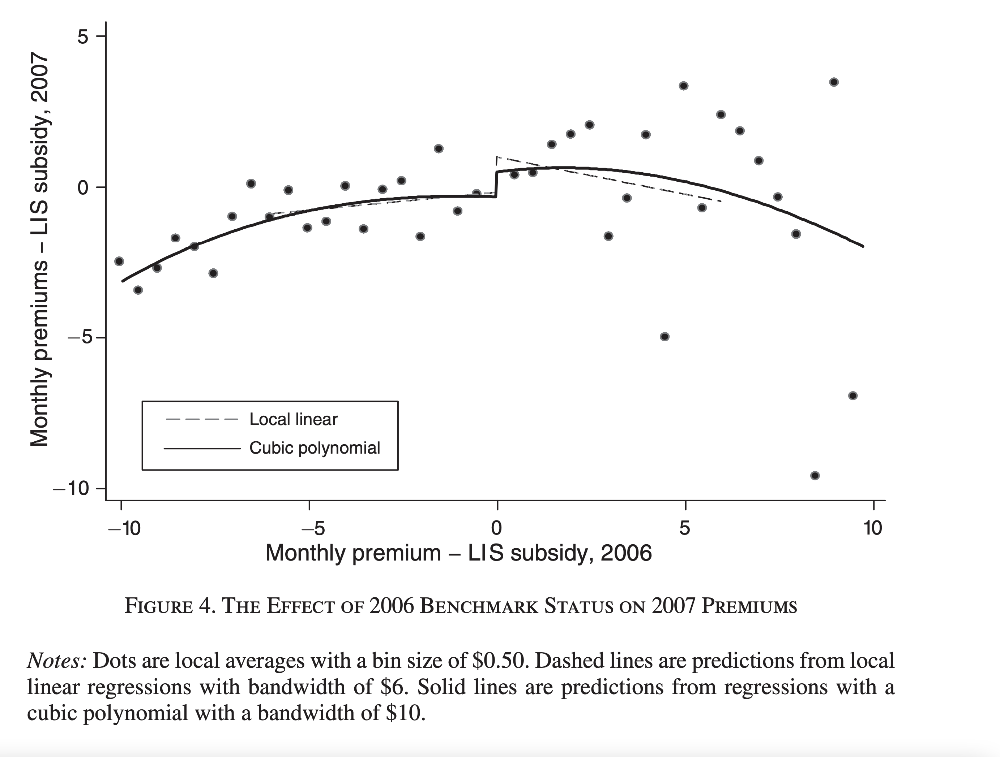

## Threats to Identification: Testing for discontinuity at the forcing variable

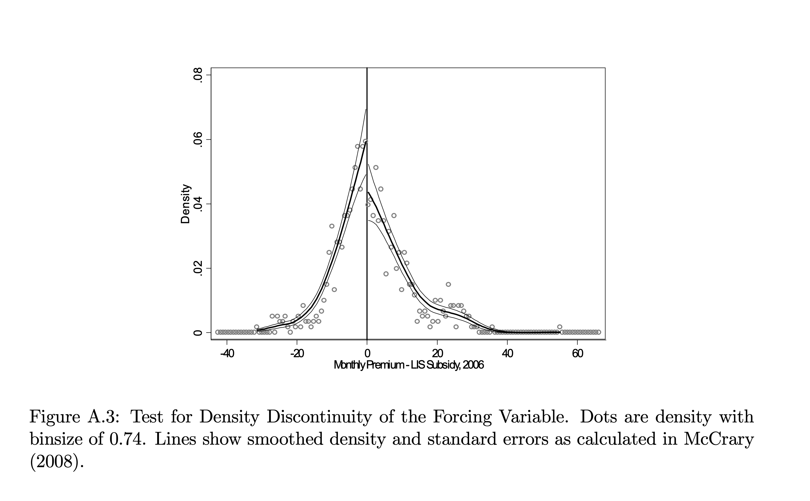

## Threats to Identification: Testing for discontinuity at the forcing variable

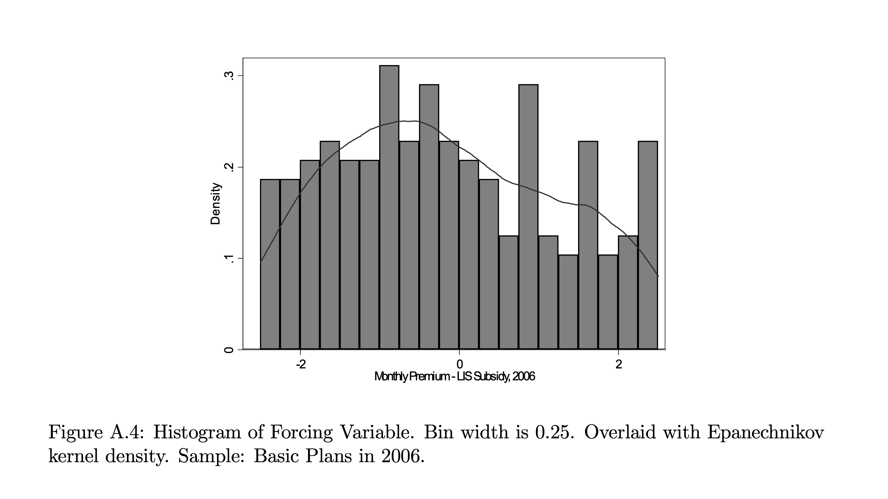

## Results


## Results

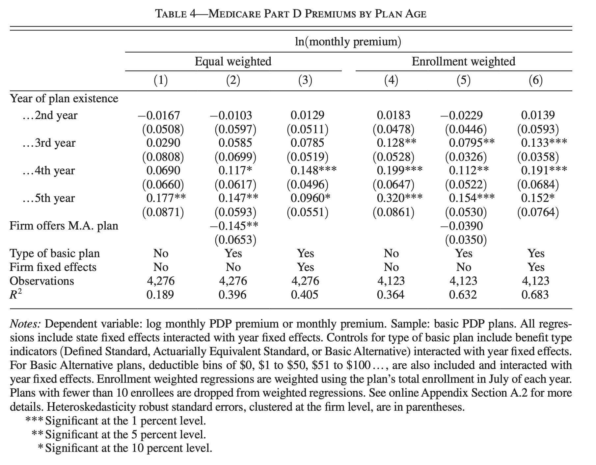

## Threats to Identification: Sources of variation in cost

The price difference between young and old plans can be decomposed into a difference in average costs and markups between cohorts:

$$
\Delta p = \Delta c + \Delta m
$$

. . .

How much is attributable to difference in \textcolor{red}{costs?}

. . .

Limitation: absence of firm cost data. Thus, cannot directly identify $\Delta c.$

## Plausible sources of cost variation

> -   Due to Risk-Adjustment Failures $\implies$ Given the lack of diagnostic and claim history, uses a simple model on age and sex. There is no evidence of risk-adjustment failure in the simpler model.
>
> -   Due to the LIS program $\implies$ Estimated effects of plan age actually underestimate the increases in prices that would occur if risk adjustment were perfect.
>
> -   Due to Negotiated Prices $\implies$ bias against . Bargaining power lower costs suggesting the markup is even higher than the observed $\Delta p$.

## Discussion

> -   Are firm's strategic responses to inertia relevant for market design in domains other than health?

> -   How much of the switching is driven by consumer preferences opposed to price changes?

> -   Which change in the current contract structure will allow for higher efficiency gains?

> -   How to set these defaults to achieve a more efficient equilibrium?

> -   More informed enrollees who can switch to cheaper plans will effectively be cross-subsidized by enrollees stuck in place more expensive plans. Are there any equity implications to be considered?
