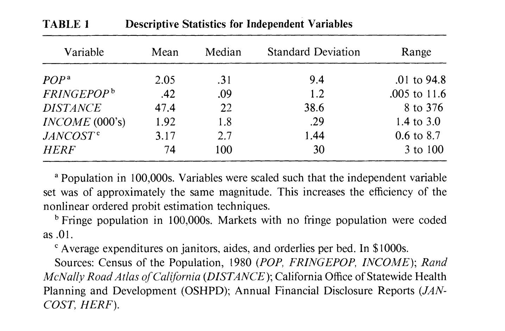

```{r setup, include=FALSE}
knitr::opts_chunk$set(echo = FALSE)
```

## Motivation {.incremental}

::: incremental
-   At the time the literature hypothesize consumers do not benefit from competition among hospitals (Robinson and Luft, 1985; Luft et al., 1986; Kopit and McCann, 1988; McLaughlin, 1988; and McManis,1990).
-   **Main Hypothesis:** Hospital compete by providing \textcolor{red}{too many high-tech} medical services.
-   Competition $\implies$ duplication of capital-intensive services \newline $\therefore$ raising costs of care.
-   Duplication of services $\implies$ quality of care to fall \newline $\because$ providers cannot take advantage of scales and learning effects.
:::

## Motivation {.incremental}

This wasteful competition is referred to as the "medical arms race". (Henceforth, \textcolor{blue}{MAR})

::: incremental
-   **hypothesis:** competition among hospitals is bad.
-   MAR was embraced by the media at the time.
-   Motivated calls to nationalize the provision of hospital services.
-   Played a role in hospital antitrust decisions.
    -   Courts seems to incorporate this hypothesis in their decisions on mergers.
:::

## Research Question

**Alternative hypothesis:** the number of providers of a particular high-tech service will be determined by the *"extent of the market."*

## Research Question {.incremental}

Reexamining the empirical evidence for the MAR and contrast it against the alternative hypothesis.

::: incremental
-   Controlling for the extent of the market, does the MAR matter on the margin?
-   Is the magnitude of the MAR sufficient to warrant policy interest?
:::

## Research Question {.incremental}

Approach:

::: incremental
-   Identify 11 high-tech hospital service categories associated with MAR

    -   Modelling the supply of specialized services

-   Estimate the empirical relation between the number of providers in a market, supply and demands factors, and competitive structure.
:::

## Preview of Findings {.incremental}

::: incremental
1.  There is an identifiable MAR effect when jointly considering the 11 specialized services.
2.  MAR has a small economic effect.
3.  Separating MAR effect from the extent of the market pose econometric challenges:
    -   MAR arises from the degree of competition.
    -   Competition is instrumented by market structure.
    -   Market structure is endogenous to the extent of the market.
4.  The extent of the market matters.
    -   Local population, proximate population, distance to market \newline $\Rightarrow$ predict patterns of service provision.
5.  Estimation results consistent with Bresnahan and Reiss (1991). \newline
:::

## Challenging the MAR hypothesis.

1.  Most empirical work focuses on costs.
2.  Inadequate attention to market definitions.
3.  Scale and scope are not explored as alternative explanations for the observed differences in costs and specialized service supply across markets.

## Econometrics and Identification

What determines the number of providers of specialized services in local markets?

::: block
### Ordered probit model

For each specialized service, $i$, in each market, $j$: $$
\left.N_{i, j}=f \text { (Demand Shifters, Supply Shifters, Competition }\right) 
$$
:::

-   $N_{i, j}$, is the number of providers of \textcolor{blue}{service} $i$ in \textcolor{red}{market} $j$.

-   The number of providers is a categorical variable with $\mathbf{M}$ response categories, $m_1, m_2, \ldots m_M$.

-   $\mathbf{F}(\cdot)$ and let $\mu_1=0$. Then,

$$\operatorname{Pr}\left[m_k\right]=\mathbf{F}\left[\mu_k-\mathbf{X} \boldsymbol{\beta}\right]-\mathbf{F}\left[\mu_{k-1}-\mathbf{X} \boldsymbol{\beta}\right] .$$

MLE yields the parameters $\mu_1 \ldots \mu_{m-1}$ and the coefficient vector $\beta$.

## Data

Using 1983 data from the California Office of Statewide Health Planning,

\textcolor{red}{Market:} urbanized area and all cities with population \> 5000.\\ not in an urbanized area

::: incremental
-   87 local markets (not counting LA and SF and 16 markets without hospitals)

-   98% community hospitals in California (+ 100 beds each)
:::

::: columns
::: {.column .incremental width="50%"}
**Previous work**

-   "15-mile radius" market definition

-   Government-defined geographic boundaries
:::

::: {.column .incremental width="50%"}
**Authors**

-   Augment by including potential patient flows by including measures of nearby population (FRINGEPOP) and nearby service availability (DISTANCE).
:::
:::

::: incremental
-   Using 1989 Rand McNally Road Atlas to determine highway distance between cities or distance to the nearest larger urbanized area.
:::

## Data

Using 1983 data from the California Office of Statewide Health Planning,

\textcolor{blue}{Specialized Service:} subset from the 171 hospital services that are high-tech and associated with MAR. Each of these categories has substantial fixed costs so that duplication would be economically wasteful.

\centering

{width="200" height="200"}

## Econometrics and Identification

The unit of analysis is the market.

::: block
### Ordered probit model

$$
\begin{aligned}
N_{i, j}=\beta_0+\beta_1 P O P & +\beta_2 F R I N G E P O P+\beta_3 D I S T A N C E  \\ &+\beta_4 I N C O M E +\beta_5 \text { LABORCOST }+\beta_6 H E R F^*
\end{aligned}
$$
:::

-   $N_{i, j}$, is the number of hospitals in \textcolor{red}{market} $i$ that are defined to be a specialized provider of \textcolor{blue}{service} $j$.

-   POP, natural log of population (1980 census)

-   INCOME, mean family income (1980 census)

-   LABORCOST, average expenditure for **aides** and **orderlies** per bed in thousands.

-   HERF, Herfindahl index based on patient discharges.

## Results



## Results

## 

## Threats

::: block
$$
\begin{aligned}
N_{i, j}=\beta_0+\beta_1 P O P & +\beta_2 F R I N G E P O P+\beta_3 D I S T A N C E  \\ &+\beta_4 I N C O M E +\beta_5 \text { LABORCOST }+\beta_6 H E R F^*
\end{aligned}
$$
:::

::: incremental
-   $HERF$ is endogenous.

-   MAR effect comes from the degree of competition.

-   HERF is an instrument for competition and a measure of market structure.

-   Market structure is endogenous to the extent of the market

-   $\therefore$ $HERF$ is picking up omitted variable bias associated with the extent of the market.

-   Can't separate the MAR effect from the extent of the market.
:::

## Results


## Results


## Results

\centering

{width="749"}

## Results


