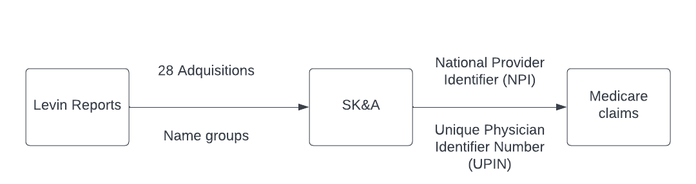
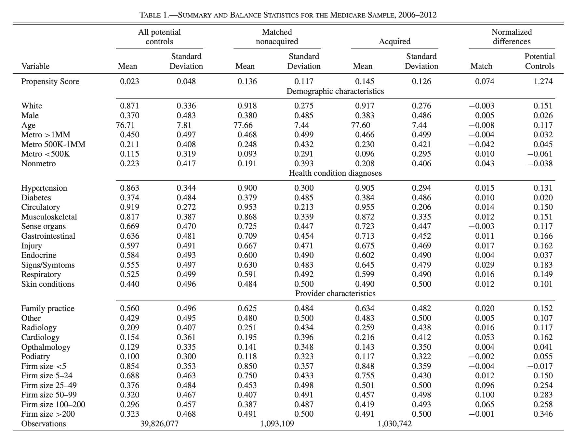
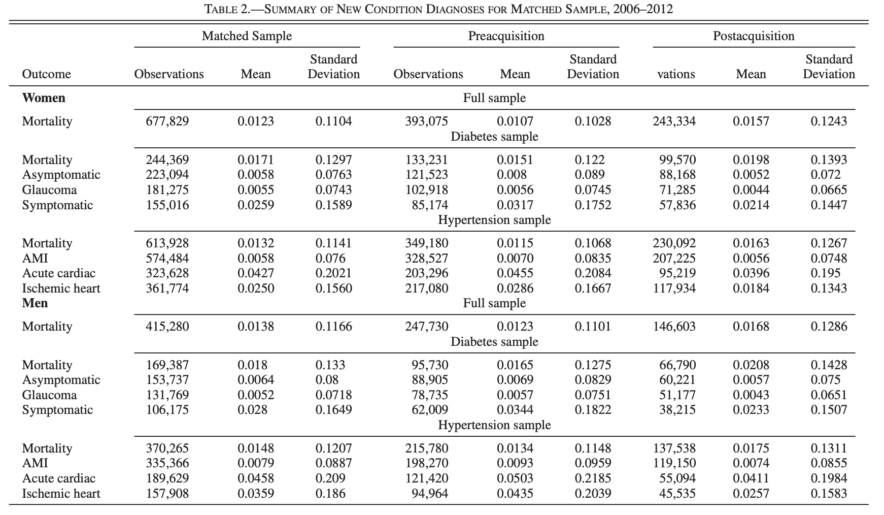
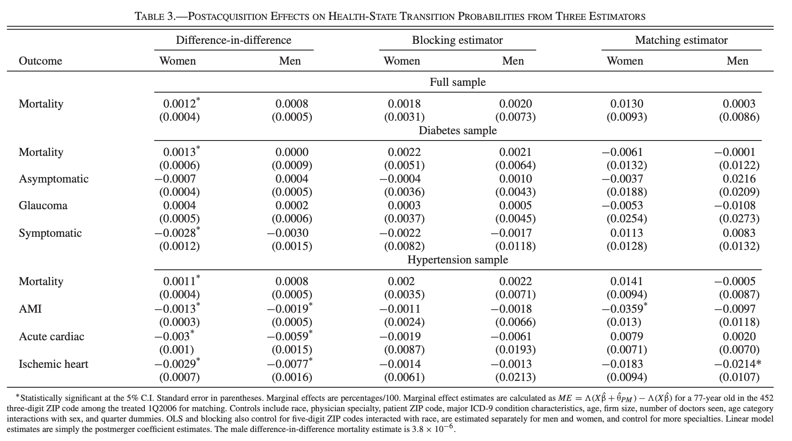
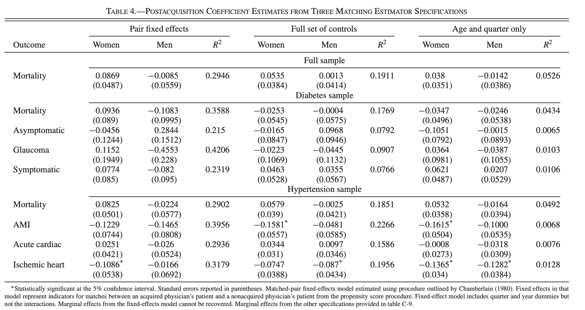
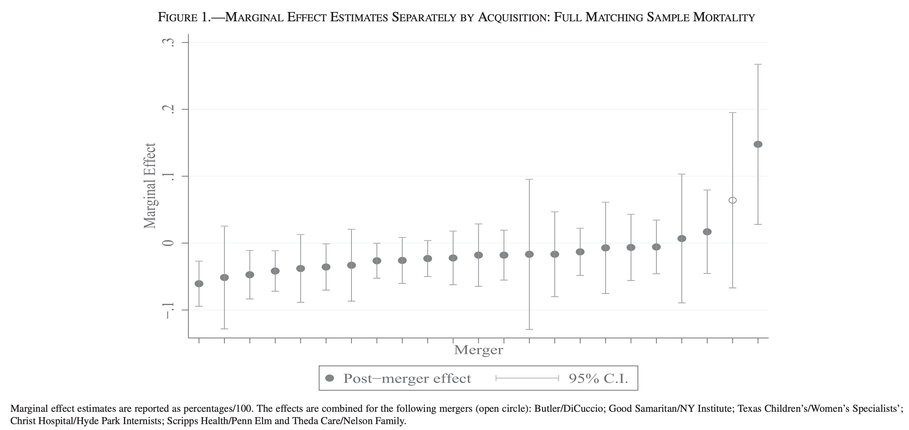
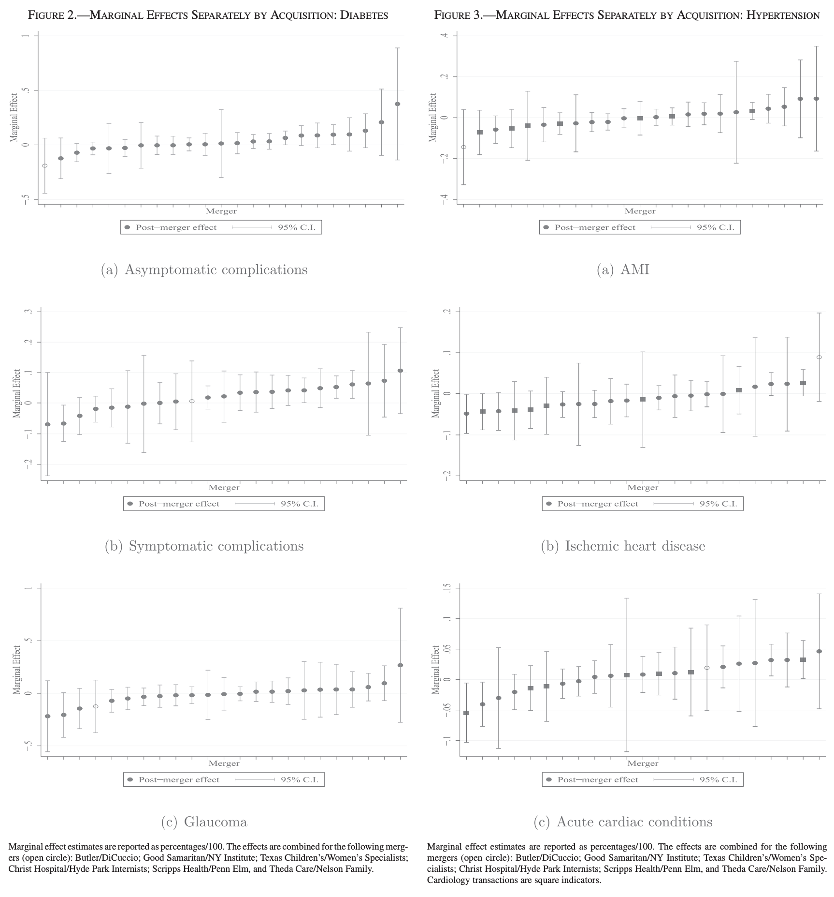
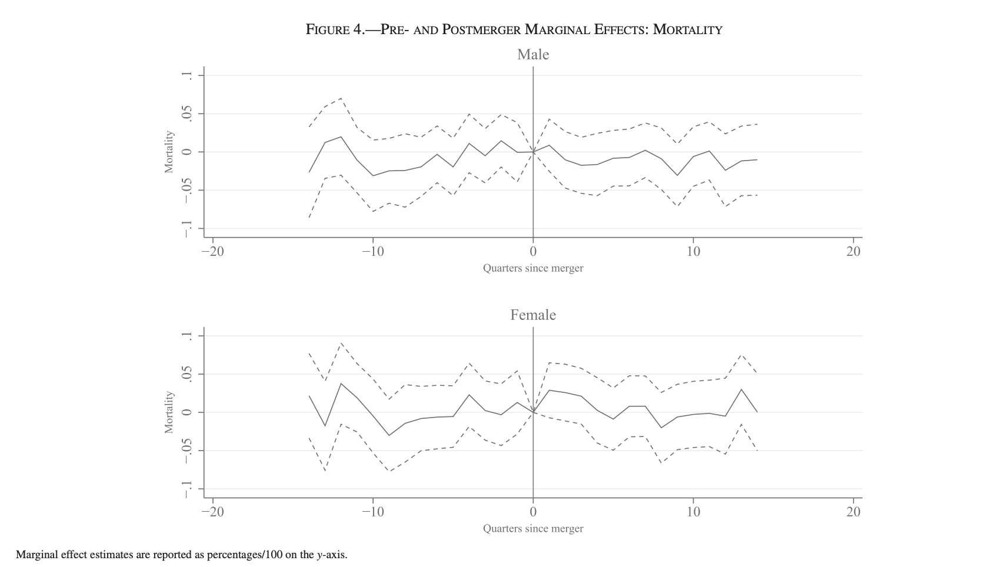
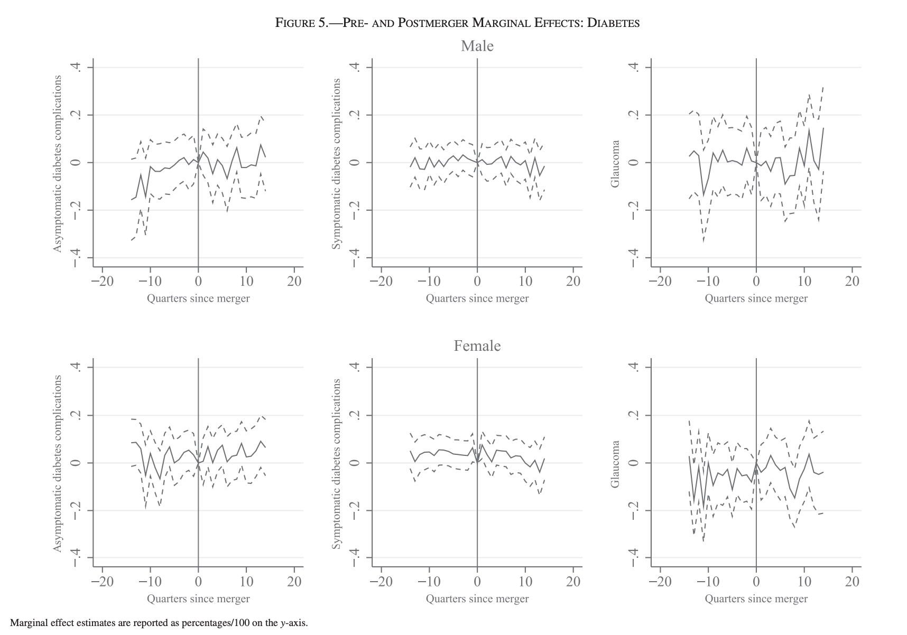
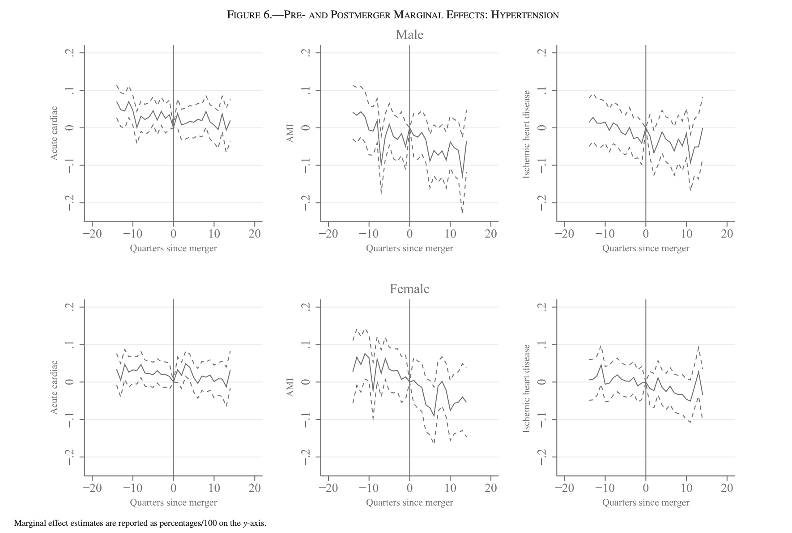

```{r setup, include=FALSE}
knitr::opts_chunk$set(echo = FALSE)
```

## Motivation {.incremental}

Existing theoretical literature on vertical integration in health care has shown ambiguity in their effects.

::: incremental
-   May result in more efficient care and service

-   Eliminates double marginalization

-   fosters quality
:::

::: incremental
-   Lower incentives to innovate

-   Higher prices
:::

## Motivation {.incremental}

This ambiguity has led to growth in empirical research analyzing the effects of integration in health care.

Key challenge:

-   Quality is difficult to measure and observe

-   Integration is difficult to measure

Existing literature has pointed out the absence of causal relationship studies between provider integration and quality.

*Thus, this paper aims to study the relationship between hospital and physician integration on the quality of care, broadly defined.*

## Research Question

::: incremental
-   Do hospital acquisitions of physicians lead to improved clinical outcomes for Medicare patients aged 65 and older?

    -   What are the effects of acquisitions on a set of health outcomes representing the progression of hypertension and diabetes into worse health states?
:::

## Contribution

::: incremental
-   Contributes to our understanding of the effects of vertical integration in health care.

-   Extends the empirical literature in the effects of providers integration on health care quality in three ways:

    ::: incremental
    1.  Identify effects of integration trough physician acquisitions by hospital systems associated with health outcomes of interest .

    2.  Measure health using **health states** outcomes rather than treatments or utilization-based measures such as re admissions.

    3.  Employ novel estimation procedures to control for potential confounding factors by a difference in difference and two different propensity score matching techniques.
    :::
:::

## Preview of Findings {.incremental}

-   Hospital acquisitions of existing physician practices have little effect on health outcomes of interest.

## Data

Period 2005 to 2012

-   Ambulatory and hospital claims from Medicare.
-   SK&A (Office-based Provider Database )
-   Levin Health Care Acquisition Reports.

Treatment group assignment  Control group assigment

-   Patients of other providers not identified as part of the acquisitions.

## Propensity Score Matching

\begin{block}{Logistic Probability Model}

$$
\operatorname{Pr}\left(A_i=1 \mid X ; \Theta_A\right)=f\left(\alpha+\beta_i X_i^i+\beta_d X_i^d+\beta_g X_i^g+\epsilon_i\right)
$$
\end{block}

-   $X_i^i$ are patient characteristics for patient $i$

-   $X_i^d$ are the characteristics of providers visited by patient $i$ (include number of physician visits)

-   $X_i^g$ are characteristics of the physician groups visited by patient $i$.


Account for patient heterogeneity, $X_i^i$, using the patient's birth cohort, race, sex, health condition, and urbanicity.

## 



## Health Outcomes Acquisition Effects

\begin{block}{Discrete-time Hazard Model}
$$
\begin{aligned}
\operatorname{Pr}\left(h_{i t}=1 \mid X_{i t}, \Theta\right)=& \Lambda\left(\alpha+\theta_{P M} P M_{i t}+\beta_M M_i+\delta_{Z I P}+\delta_t\right.\\
&\left.+\beta_x X_{i t}+\beta_{M * y}\left(M_i \times y r_{i t}\right)+u_{i t}\right) .
\end{aligned}
$$
\end{block}

This model considers the probability that we observe a
positive realization of our health outcome variable in the
contemporaneous period, $h_{it} = 1$.

$\theta_{PM}$ effect of interest, represents the clinical clinical benefits (or harm) attributable to the acquisition. 

$\Lambda(.)$ takes a linear functional form for the full sample and a proportional hazard model for the matched sample estimator.


## Health Outcomes Acquisition Effects

\begin{block}{Discrete-time Hazard Model}
$$
\begin{aligned}
\operatorname{Pr}\left(h_{i t}=1 \mid X_{i t}, \Theta\right)=& \Lambda\left(\alpha+\theta_{P M} P M_{i t}+\beta_M M_i+\delta_{Z I P}+\delta_t\right.\\
&\left.+\beta_x X_{i t}+\beta_{M * y}\left(M_i \times y r_{i t}\right)+u_{i t}\right) .
\end{aligned}
$$
\end{block}
* $M$, acquisition indicator variable
* $P M$, post acquisition indicator variable
* $X_{i t}$, patient and provider characteristics
* $\delta_t$, quarter-year fixed effects
* $\delta_{\text {ZIP }}$, three-digit ZIP code fixed effects
* $\beta_{M*y}$, acquisition-specific time trend

## 



## Results




## Results



## Robustness Check Heterogeneous Acquisition Effects

\begin{block}{Heterogenous group effects}
$$
\begin{aligned}
 \operatorname{Pr}\left(h_{i t}=1 \mid X_{i t}, \Theta\right) 
=& \Lambda\left(\alpha+\sum_{g \in G} \theta_p^g M_{i t}^g P_{o s t}^g+\sum_{g \in G} \theta_M^g M_{i t}^g+\beta_x X_{i t}\right.\\
&\left.+\beta_{M * y}\left(M_i \times y r_{i t}\right)+\delta_{Z I P}+\delta_t+u_{i t}\right)
\end{aligned}
$$
\end{block}


\begin{block}{Heterogenous time effects}
$$
\begin{aligned}
\operatorname{Pr}\left(h_{i t}=1 \mid X_{i t}, \Theta\right) 
=& \Lambda\left(\alpha+\sum_{l=-15}^{15} \theta_l l_{i t}+\sum_{l=-15}^{15} \theta_{f l}\left(l_{i t} \times f e m_i\right)+\beta_M M_i\right.\\
&+\beta_{f M}\left(f e m_i \times M_i\right)+\beta_x X_{i t}+\beta_{M * y}\left(M_i \times y r_{i t}\right) \\
&\left.+\delta_{Z I P}+\delta_t+u_{i t}\right)
\end{aligned}
$$
\end{block}


## Effects by Acquisition



## Effects by Acquisition

\centering



## Time-Specific Effects - Full Sample



## Time-Specific Effects by Gender - Diabetes Conditions



## Time-Specific Effects by Gender - Hypertension Conditions

 

## Threats

*   Full sample estimates might be biased given the Levin Reports likely miss some acquisitions, some physicians were unobservably acquired by hospitals during
the sample period. $\implies$ Matched sample estimator is driving the main conclusion.

*   Vertical acquisitions may also increase physician concentration. If so, horizontal concentration may lessen competition for quality and thus offset efficiencies
associated with vertical integration. *confounding
horizontal effects*. 

## Discussion and Conclusion.

*   It is possible that the transactions could lead to efficiencies for other health conditions or along other dimensions of performance (i.e., cost efficiencies)
that the authors do not consider.

*   There is little evidence that physician integration into hospital systems affect health outcomes (as the authors measure them).


